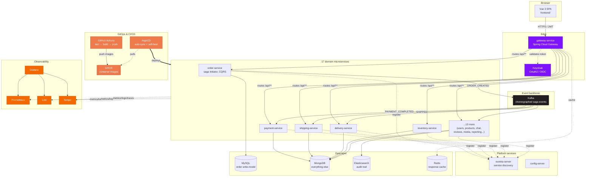
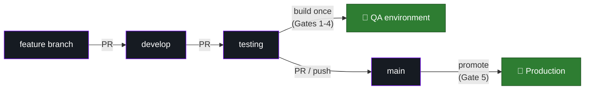
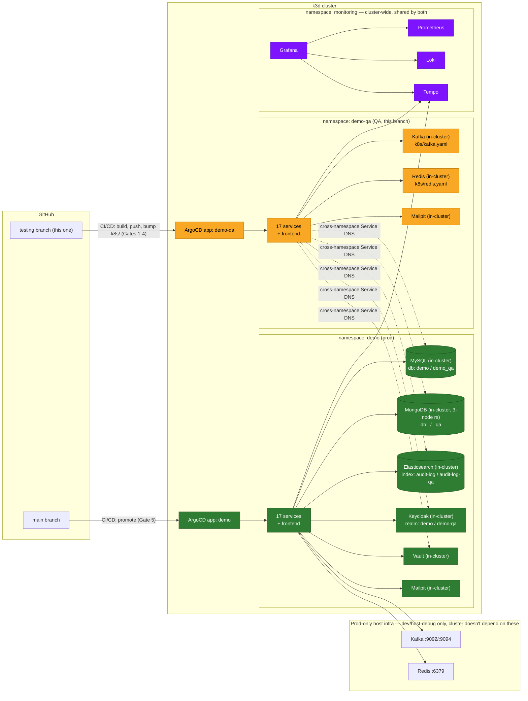
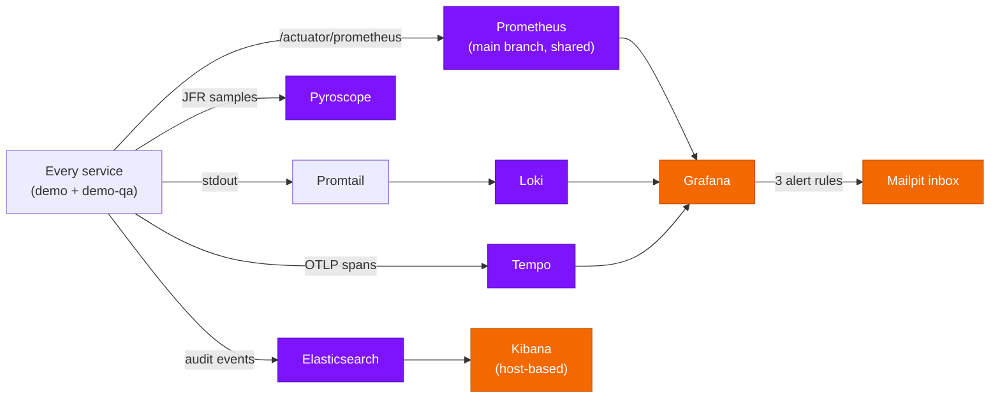

# Demo — Full-Stack Microservices Reference Architecture

**A monolith, deliberately taken apart — 17 Spring Boot services, a Vue 3 frontend, and the entire
production toolchain around them (CI/CD, GitOps, Kubernetes, observability) — built to show not just
*how* each piece works, but *why* it exists.**

[](https://github.com/wilbertjoosen/demo/actions/workflows/ci-cd.yml)


This is `testing` — the **QA environment**: the only branch that ever builds a container image
from source (see [The path to production](#the-path-to-production-every-gate-explained)). Two other
branches complete the picture: `develop` (day-to-day feature work, single local environment) and
`main` (production, which *promotes* whatever `testing` already validated rather than rebuilding).
See [Branch model & release flow](#branch-model--release-flow) for how a change moves between them.

---

## Who this README is for

<table>
<tr>
<td width="25%" valign="top">

### 🧑‍💻 Developers
Clone it, run it, break it. [Quick start](#quick-start) gets you a working stack in three different
ways depending on how much of the infrastructure you want to touch. Every pattern links to the exact
file that implements it — [Patterns, explained three ways](#patterns-explained-three-ways).

</td>
<td width="25%" valign="top">

### 🏗️ Architects
The interesting decisions are the tradeoffs, not the tech logos. [Why this stack](#the-stack--and-why-each-piece-is-here)
and [The path to production](#the-path-to-production-every-gate-explained) explain the *reasoning*
behind build-once/promote-many CI/CD, choreographed sagas over orchestration, and a shared
observability stack across two environments.

</td>
<td width="25%" valign="top">

### 🎯 Recruiters / hiring managers
This repo is the portfolio piece: a working system spanning backend, frontend, data, security,
CI/CD, GitOps, and observability — not a tutorial clone. The [tech stack table](#the-stack--and-why-each-piece-is-here)
doubles as a skills list; every row links to real, running code.

</td>
<td width="25%" valign="top">

### 📚 New to distributed systems?
Start with [Glossary — jargon, decoded](#glossary--jargon-decoded) for plain-English definitions of
every term used below, then [Patterns, explained three ways](#patterns-explained-three-ways) for the
"why would anyone do this" behind each pattern.

</td>
</tr>
</table>

---

## Table of contents

- [The big picture](#the-big-picture)
- [The stack — and why each piece is here](#the-stack--and-why-each-piece-is-here)
- [The services](#the-services)
- [Patterns, explained three ways](#patterns-explained-three-ways)
- [Quick start](#quick-start)
- [The path to production, every gate explained](#the-path-to-production-every-gate-explained)
- [Branch model & release flow](#branch-model--release-flow)
- [Kubernetes / GitOps](#kubernetes--gitops)
- [QA / testing environment](#qa--testing-environment)
- [Observability](#observability)
- [Config profiles: local / testing / production](#config-profiles-local--testing--production)
- [Default credentials](#default-credentials)
- [Useful URLs](#useful-urls)
- [Repo layout](#repo-layout)
- [Glossary — jargon, decoded](#glossary--jargon-decoded)

---

## The big picture



**The one-sentence version:** a browser talks to a gateway, the gateway routes to one of 17
independently-deployable services, those services choreograph a Kafka saga instead of calling each
other directly, everything ships through CI/CD to GHCR and gets pulled into Kubernetes by ArgoCD
without a human running `kubectl apply`, and every hop is observable end-to-end (metrics, logs,
traces, continuous profiling, alerting) across both a production and a QA environment.

---

## The stack — and why each piece is here

Nothing below is "because it's popular." Each row is a specific problem this project actually has,
and the tool picked to solve it — click through to the real file.

### Backend

| Technology | What it does here | Why this, not something else | Where |
|---|---|---|---|
|  **Java 26** | Runtime for every backend service | Latest LTS-track JDK — modern language features (records, pattern matching, virtual threads available) without legacy baggage | every service's `pom.xml` |
|  **Spring Boot 4** | Application framework | The de-facto standard for JVM microservices — auto-configuration, embedded Tomcat, and first-class support for everything else in this stack (Data, Security, Kafka, Actuator) | every service module |
|  **Spring Cloud Gateway** | API gateway / reverse proxy | One public entry point instead of 17 — routes `/api/**` by path, centralizes CORS, hides internal service topology from the browser | `gateway-service/` |
|  **Netflix Eureka** | Service discovery | Services register themselves and discover each other by name, not hardcoded IPs — essential once you have more than a couple of services that scale independently | `eureka-server/` |
|  **Spring Cloud Config** | Centralized configuration | One place for config that's shared across services (currently light use — most config is per-service, see [Config profiles](#config-profiles-local--testing--production)) | `config-server/` |
|  **Spring Data (JPA + MongoDB)** | Persistence abstraction | Repository pattern out of the box — service code never touches a driver or `EntityManager` directly | every service's `repository/` package |
|  **Spring Kafka + Kafka Streams** | Event-driven messaging & stream processing | The backbone of the choreographed saga (see [Patterns](#patterns-explained-three-ways)); Kafka Streams specifically powers `reporting-service`'s live materialized-view aggregates | every `saga/` package; `reporting-service/` |
|  **Spring Security (OAuth2 Resource Server)** | JWT validation | Every service independently validates the same Keycloak-issued JWT — no shared session state, no service trusting another service's say-so | `common-security/` |
| **Resilience4j** | Circuit breaker | Wraps the *one* synchronous inter-service call in the system (`order-service → inventory-service`) so a slow/down `inventory-service` can't cascade-fail the order flow | `order-service/.../config/Resilience4jConfig.java` |
| **AspectJ (AOP)** | Cross-cutting audit logging | One `@Around` advice captures every REST call's request/response across every service — no per-controller instrumentation | `common-audit/` |
|  **springdoc-openapi** | API documentation | Auto-generated Swagger UI per service, aggregated at the gateway into one browsable surface | every service; aggregated at `:8080/swagger-ui.html` |
| **Micrometer + Prometheus registry** | Metrics instrumentation | Every service exposes `/actuator/prometheus` for free — the entire [Observability](#observability) stack builds on this one dependency | every service |
| **Micrometer Tracing (OTel bridge)** | Distributed tracing | Auto-injects `[traceId,spanId]` into every log line and exports spans over OTLP — a request across 4 services becomes one traceable timeline | `common-security/`, `gateway-service/` |
| **Pyroscope Java agent** | Continuous profiling | Answers "where is the CPU actually going" without attaching a profiler by hand — always-on, low-overhead JFR sampling | see [Observability](#observability) |
| **spring-cloud-aws** | S3 + Secrets Manager client | `product-media-service`'s file storage backend | `product-media-service/` |

### Frontend

| Technology | What it does here | Why this, not something else | Where |
|---|---|---|---|
|  **Vue 3 (Composition API)** | SPA framework | Smaller learning curve than React for the same reactivity model, first-class TypeScript support | `frontend/src/` |
|  **TypeScript** | Type safety | Catches wiring mistakes (wrong DTO shape, typo'd prop) at build time instead of in a browser console | `frontend/` — `vue-tsc` runs in CI |
|  **Element Plus** | Component library | Production-grade tables/forms/modals without hand-building them — the admin screens (users, products, orders, reports) lean on this heavily | `frontend/src/` |
|  **Pinia** | State management | Vue's official Vuex successor — simpler API, full TypeScript inference | `frontend/src/stores/` |
| **Vue Router** | Client-side routing | Role-gated routes (finance/product_manager/shipping_manager/inventory_manager) map directly to Keycloak realm roles | `frontend/src/router/` |
| **vue-i18n** | Internationalization | Multi-language support baked in from the start, not retrofitted | `frontend/src/locales/` |
|  **ECharts (`vue-echarts`)** | Data visualization | Powers the reporting dashboard's charts (revenue, top products, saga health) — richer and faster than SVG-by-hand for real-time aggregates | `frontend/src/views/reports/` |
|  **Tailwind CSS** | Utility-first styling | Fast iteration without hand-rolled CSS files sprawling across components | `frontend/src/` |
|  **Vite** | Build tool / dev server | Near-instant HMR for the dev inner loop; production builds are what CI ships | `frontend/vite.config.ts` |
|  **keycloak-js** | Auth adapter | Handles the OAuth2/PKCE dance with Keycloak directly from the browser — no custom login-flow code | `frontend/src/auth/keycloak.ts` |

### Data & messaging

| Technology | Role | Why | Where |
|---|---|---|---|
|  **MySQL** | `order-service`'s write model | Orders need real ACID transactions (create order + reserve stock atomically) — the one place in the system that isn't eventually-consistent by design | `order-service/`, `k8s/mysql.yaml` |
|  **MongoDB** | Every other service's store, + `order-service`'s read model | Schema flexibility fits domain objects that evolve fast (product attributes, chat messages); the read-model side of CQRS doesn't need MySQL's guarantees, just fast reads | every other service, `k8s/mongo.yaml` |
|  **Apache Kafka** | Event backbone | Decouples the saga's steps completely — `payment-service` doesn't call `shipping-service`, it reacts to an event; consumer replay gives resilience largely for free | every `saga/` package, `k8s/kafka.yaml` |
|  **Redis** | Response caching | Backs Resilience4j's cache annotations for read-heavy, slow-changing data | `k8s/redis.yaml` |
|  **Elasticsearch** | Audit trail store | Full-text/structured search over every REST call ever made, across every service — a relational table would make this kind of ad-hoc querying painful | `audit-service/`, `k8s/elasticsearch.yaml` |

### Identity, infra & delivery

| Technology | Role | Why | Where |
|---|---|---|---|
|  **Keycloak** | OAuth2/OIDC identity provider | Centralized auth, roles, and (via its own Admin REST API) user management — services never store passwords | `k8s/keycloak.yaml`, `docker/keycloak/` |
|  **HashiCorp Vault** | Secrets management | Real secrets engine instead of plaintext env vars or committed `.env` files | `k8s/vault.yaml` |
|  **Docker Compose** | Local infra & full-stack dev | Fastest path to "everything running" without touching Kubernetes at all — see [Quick start](#quick-start) Option B | `docker-compose.yml` |
|  **k3d (Kubernetes in Docker)** | Local Kubernetes cluster | A real multi-node cluster on a laptop, no cloud account needed — every k8s concept below (Deployments, Services, Ingress, RBAC) behaves exactly like it would in production | [Quick start](#quick-start) Option C |
|  **ArgoCD** | GitOps continuous delivery | The cluster's actual state is *reconciled from git*, not pushed to by a human running `kubectl apply` — see [Kubernetes / GitOps](#kubernetes--gitops) | `k8s-argocd/` |
|  **GitHub Actions** | CI/CD | Free, tightly integrated with GHCR, no separate CI system to run — see [The path to production](#the-path-to-production-every-gate-explained) | `.github/workflows/ci-cd.yml` |
|  **GHCR (GitHub Container Registry)** | Image registry | Private, free for this project's usage, one less external account to manage | referenced in every `k8s/*.yaml`'s `image:` field |
|  **Rancher** | Kubernetes management UI | A GUI for the cluster (Secrets, pod logs, resource usage) alongside the CLI — runs in-cluster itself | `k8s-rancher/rancher.yaml` |

### Observability

| Technology | Signal | Why | Where |
|---|---|---|---|
|  **Prometheus** | Metrics | Pull-based scraping fits Kubernetes service discovery naturally — no per-service push config | `k8s/prometheus.yaml` |
|  **Grafana** | Dashboards + alerting | One pane of glass across metrics/logs/traces, plus file-provisioned alert rules (no UI clicking, git-reviewable) | `k8s/grafana.yaml` |
| **Loki** | Logs | Prometheus's label model applied to logs — cheap to run, and queries feel identical to PromQL | `k8s/loki.yaml` |
| **Tempo** | Distributed traces | Pairs natively with Grafana's `tracesToLogsV2` — click a trace, jump straight to its logs | `k8s/tempo.yaml` |
| **Pyroscope** | Continuous CPU profiling | Answers performance questions Prometheus metrics can't — literally which method is burning CPU, live | `k8s/pyroscope.yaml` |
| **kube-state-metrics + node-exporter** | Cluster/host metrics | Object-level (pod phase, PVC status) and host-level (CPU/disk) visibility Prometheus's own app-metrics scraping doesn't cover | `k8s/kube-state-metrics.yaml`, `k8s/node-exporter.yaml` |
|  **k6** | Load testing | Scriptable load generation that pushes results straight into the same Prometheus everything else uses | `k8s/k6.yaml` |
|  **Kibana** | Audit-trail search UI | Purpose-built for exploring Elasticsearch documents — the audit trail's natural home | `k8s/kibana.yaml` |
| **Mailpit** | Mock SMTP inbox | Catches every email the system sends (order confirmations, Grafana alerts) without a real mail provider | `k8s/mailpit.yaml` |

---

## The services

A choreographed Kafka saga drives an order through payment, shipping, and delivery. Every service
that isn't infrastructure is independently deployable — its own jar, its own Docker image, its own
k8s Deployment.

| Service | Port | Store | Responsibility |
|---|---|---|---|
| `gateway-service` | 8080 | — | Spring Cloud Gateway; routes `/api/**` to backend services by path, CORS |
| `eureka-server` | 8761 | — | Service discovery — every backend registers here |
| `config-server` | 8888 | — | Centralized config (currently minimal; most config is per-service `application.yaml`) |
| `user-service` | 8082 | MongoDB | User profiles; identity fields (username/email/name) are read live from Keycloak, not duplicated locally |
| `product-service` | 8083 | MongoDB | Product catalog; reserve/release stock; Spring Batch CSV bulk import |
| `order-service` | 8084 | MySQL (write) + MongoDB (read) | **Saga initiator** + **CQRS**: `POST /api/orders` hits MySQL directly (ACID), `GET /api/orders*` reads from a Mongo projection kept in sync by the same Kafka listeners the saga needs anyway |
| `payment-service` | 8086 | MongoDB | Saga participant: charges, refunds on downstream failure |
| `shipping-service` | 8088 | MongoDB | Saga participant: carrier selection (UPS/DHL), tracking |
| `delivery-service` | 8087 | MongoDB | Saga participant: last-mile delivery simulation |
| `inventory-service` | 8089 | MongoDB | Per-warehouse stock, called synchronously by `order-service` (the one sync inter-service call in the system, see [Circuit breaker](#circuit-breaker-the-safety-fuse)) |
| `notification-service` | 8085 | — | Kafka consumer on every topic → WebSocket broadcast (`/ws/notifications`) + email via Mailpit |
| `audit-service` | 8090 | Elasticsearch | Consumes the audit trail every service emits; reconstructs field-level diffs and full record history |
| `chat-service` | 8094 | MongoDB | Public per-product chat rooms **and** private user-to-user direct messages (JWT-authenticated WebSocket, delivery/read receipts, typing indicators) |
| `reporting-service` | 8095 | Kafka Streams (materialized state stores) | Consumes every domain event and maintains live aggregates (top products, order revenue, user growth, saga health) for the frontend's reporting dashboard |
| `product-comment-service` | 8091 | MongoDB | Product comments, ownership-enforced editing |
| `product-media-service` | 8092 | MongoDB + local disk | Product photos/videos/documents, file upload |
| `product-review-service` | 8093 | MongoDB | Product ratings/reviews |
| `common-service` | 8096 | MongoDB | Deployed reference-data service (countries today) shared by other services over REST — not to be confused with the `common-*` compile-time library modules below |
| `common-security` | — | — | Shared JWT resource-server config, reused by every service |
| `common-audit` | — | — | Shared aspect that captures every REST call's request/response for the audit trail |
| `common-model` | — | — | Shared DTOs (e.g. `Address`) |
| `frontend` | 5173 (dev) | — | Vue 3 SPA — the only thing that talks to the gateway; runs in the browser regardless of how the backend is deployed |

Kafka topics: `user-events`, `product-events`, `order-events`, `payment-events`, `shipping-events`,
`delivery-events`. Plain JSON, no schema registry — deliberate simplicity for a demo.

---

## Patterns, explained three ways

Every pattern below gets: **the plain-English version** (what problem, in everyday terms), **the
technical version** (what it actually is), and **where it lives** (the real file). Graded honestly —
some patterns below are a partial or pragmatic fit, not textbook, and that's called out directly
rather than glossed over.

### Distributed systems patterns

#### Saga (choreography) — the relay race with a rollback plan

> **Plain English:** Imagine four coworkers handling one customer order — one takes payment, one
> books shipping, one arranges delivery. Nobody's "in charge" barking orders; each person just
> watches for the previous person to finish their part, then does their own. If the shipping person
> hits a problem, they don't leave the payment person hanging — they signal back so the payment gets
> refunded automatically.

**Technical:** `order → payment → shipping → delivery`, each step reacting to the previous step's
Kafka event. No orchestrator (no central "saga coordinator" service). Compensation on failure always
flows back through `payment-service` (refund) and `product-service` (stock release), regardless of
which step failed. **Where:** every service's `saga/` package (Kafka listeners).

#### CQRS — different tools for reading vs. writing

> **Plain English:** Writing an order needs to be bulletproof (money is involved) — but *reading* a
> list of your last 20 orders just needs to be fast. Instead of forcing both jobs through the same
> slow, careful database, this system uses a strict one for writing and a fast one for reading, kept
> in sync automatically.

**Technical:** Scoped to `order-service` only — MySQL write model, Mongo read model, synced by the
saga's own Kafka listeners rather than a separate change-data-capture pipeline. **Where:**
`order-service/src/main/java/.../saga/` and `.../model/OrderView.java`.

#### Circuit breaker — the safety fuse

> **Plain English:** If one plug in your house short-circuits, you don't want your whole house to go
> dark — a fuse trips just for that one circuit. Same idea here: if one service is struggling, the
> caller should back off instead of piling on requests that will only make things worse.

**Technical:** `order-service → inventory-service` is the *only* synchronous call in the system;
everything else is async via Kafka, which gets resilience largely for free through consumer replay.
That's exactly why the one sync call is wrapped in Resilience4j. **Where:**
`order-service/.../config/Resilience4jConfig.java`.

#### Outbox / store-and-forward — don't lose the message

> **Plain English:** If you hand a letter to a courier and they drop it, you want to know — not
> silently lose it. Failed Kafka publishes are recorded and retried, not thrown away.

**Technical:** Kafka publish failures are persisted and retried rather than silently dropped or
blocking the request.

#### Sidecar — a helper riding along in the same car

> **Plain English:** A motorcycle sidecar travels everywhere the motorcycle does, without being part
> of the engine. `order-service`'s pod has a small nginx container riding alongside it purely to log
> access requests — it doesn't touch the app's own code at all.

**Technical:** An `nginx` access-log sidecar container in the same Kubernetes pod as `order-service`.
**Where:** `k8s/order-service.yaml`.

#### GitOps — the cluster reads its own instructions from git

> **Plain English:** Instead of someone typing commands to change the live system, the system
> constantly checks a git repo and makes itself match whatever's written there — like a thermostat
> reading a target temperature instead of someone manually flipping the heater on and off.

**Technical:** ArgoCD watches this repo's `k8s/` path; `kubectl apply` is not how deploys happen once
the cluster is bootstrapped. **Where:** [Kubernetes / GitOps](#kubernetes--gitops).

#### Audit trail without per-service instrumentation — one recorder for everyone

> **Plain English:** Instead of asking all 17 services to remember to write down what they did (and
> inevitably some forget), one shared piece of code silently watches every request/response for all
> of them and writes it down centrally.

**Technical:** `common-audit`'s `RestCallAuditAspect` captures every REST request/response
generically; `audit-service` reconstructs field-level diffs by comparing consecutive snapshots for
the same record ID, rather than requiring Envers-style per-entity setup. **Where:** `common-audit/`.

### Object-oriented & design patterns

#### Repository — a librarian in front of the data

> **Plain English:** You ask a librarian for "the book about dragons," not the exact shelf and row
> number — the librarian knows how to find it. Application code asks a Repository for "the user with
> this ID," never touching the database driver directly.

**Technical:** Every persistence-facing interface (17 `*Repository` interfaces across the reactor) is
a Spring Data abstraction over MongoDB or JPA. **Where:** every service's `repository/` package.

#### Adapter — a universal power plug

> **Plain English:** A travel plug adapter lets the same laptop charger work in different countries'
> sockets, without the laptop knowing or caring. `*ModelAssembler`s convert an internal database
> object into the shape the API promises the outside world, so storage format can change without the
> API contract changing.

**Technical:** One `*ModelAssembler` per resource (`UserModelAssembler`, `OrderViewModelAssembler`,
12 in total) converts a persistence/domain object into its HATEOAS-linked API representation.
**Where:** each service's `model/` package.

#### Template Method — a recipe with blanks to fill in

> **Plain English:** A recipe card says "1. preheat oven, 2. [your filling here], 3. bake 20 min" —
> the steps that never change are printed, the ones that vary are left blank for you to fill in.

**Technical:** `ChatWebSocketHandler`, `DirectMessageWebSocketHandler`, and
`NotificationWebSocketHandler` all extend Spring's `TextWebSocketHandler`, overriding only the
lifecycle hooks each one needs; the connection-bookkeeping skeleton stays in the base class.
**Where:** each service's `websocket/` package.

#### Interceptor — a bouncer checking IDs at the door

> **Plain English:** Before you get into the venue, someone checks your ID at the entrance — not
> once you're already inside dancing. Identity gets verified during the WebSocket handshake, before
> the actual chat handler ever sees the connection.

**Technical:** `ChatHandshakeInterceptor` / `DirectMessageHandshakeInterceptor` hook into the
WebSocket handshake to extract and (for direct messages) cryptographically verify identity before the
handler ever sees a session — the same shape as a servlet filter chain.

#### Factory Method — one door in, so nothing gets skipped

> **Plain English:** If there's only one way to check into a hotel (the front desk), nobody
> accidentally skips giving you a room key. `DomainEvent.of(...)` is the *only* way any saga event
> gets built, so a required field (like the timestamp) can never be forgotten at a call site.

**Technical:** `DomainEvent.of(eventType, orderId, payload)`. **Where:**
`common-security/.../events/DomainEvent.java`.

#### Aspect-Oriented Programming — a security camera, not a guard at every desk

> **Plain English:** Instead of training every single employee to also act as a security guard, you
> just install one camera system that watches everyone at once.

**Technical:** `common-audit`'s `RestCallAuditAspect` captures every REST call's request/response
with one `@Around` advice, instead of every controller method calling an audit helper by hand.

### SOLID principles — honestly graded

| Principle | Verdict | Why |
|---|---|---|
| **S**ingle Responsibility | ✅ Strong fit | Each service owns exactly one bounded context; within a service, controller/service/repository/assembler are separate classes, each with one reason to change |
| **D**ependency Inversion | ✅ Strong fit | Controllers depend on a `*Service` interface (`ConversationService`, `UserService`, ...), never the `*Impl` directly |
| **I**nterface Segregation | ✅ Strong fit | Service interfaces stay narrow and use-case-shaped — `ConversationService` is 7 methods, all conversation-lifecycle, nothing else |
| **O**pen/Closed | ⚠️ Weakest fit — called out on purpose | Extension mostly happens by adding an enum constant plus an `if`/`switch` (`PaymentMethod`, `MediaType`) rather than a polymorphic strategy class. Worth knowing as a real limitation of this codebase, not a pattern to go looking for |
| **L**iskov Substitution | *(not separately demonstrated — no deep inheritance hierarchies in the domain model to violate or satisfy it)* | |

### Domain-Driven Design

| Concept | Plain English | Where it shows up here |
|---|---|---|
| **Bounded contexts** | Different teams can use the same word to mean different things, and that's fine as long as each team's world stays self-consistent | Each microservice *is* a bounded context — `order-service` only knows a `Shipment` as an event payload field; `chat-service` only knows a `Product` as an opaque ID. The service boundary and the Maven module boundary are the same boundary |
| **Domain events** | A fact that already happened, broadcast to whoever cares | Every Kafka message is a `DomainEvent`, published after a state change and consumed to drive the next saga step |
| **Value objects** | Two things are "the same" if their values match — no ID needed | `Address` (`common-model`) has no identity of its own; shared *because* both services mean the literal same concept. Caveat: it's Lombok-`@Setter` mutable, not a textbook immutable VO — a pragmatic shortcut |
| **Aggregates** | The one object that's allowed to enforce a business rule for its own cluster of data | `Order` (MySQL) and `Conversation` (MongoDB) are each the aggregate root and consistency boundary for their own writes; `OrderView`/`ConversationSummary` are deliberately separate read models, not the aggregate leaking through the API |
| **Ubiquitous language** | Code and conversation use the same words | Event types (`ORDER_CREATED`, `PAYMENT_COMPLETED`, `SHIPPED`) and REST paths use the vocabulary a product owner would use — no translation layer between "the business" and "the code" |

---

## Quick start

| Option | Best for | What runs where |
|---|---|---|
| **A — local JVM + npm** | Fastest inner loop, debugging one service in an IDE | Infra in Docker, everything else runs directly on your machine |
| **B — full Docker Compose** | "Just show me the whole thing working" | Everything, containers only, one command |
| **C — Kubernetes (k3d) + GitOps** | Understanding how production actually deploys | The full production topology, locally |

### Option A — local JVM + npm (fastest inner loop)

```bash
docker compose up -d mysql mongodb kafka keycloak mailpit elasticsearch redis
./mvnw -pl user-service,product-service,order-service,payment-service,shipping-service,delivery-service,inventory-service,notification-service,gateway-service,eureka-server,config-server,audit-service,chat-service,product-comment-service,product-media-service,product-review-service -am install -DskipTests
# then in separate terminals, per service:
./mvnw -pl <service> spring-boot:run
cd frontend && npm install && npm run dev
```

Frontend: http://localhost:5173

### Option B — full Docker Compose stack

```bash
docker compose up -d --build
```

Everything (infra + all 19 backend services + frontend) runs in containers on one network.

### Option C — Kubernetes (k3d) + GitOps

```bash
k3d cluster create demo --servers 1 --agents 2 -p "18090:80@loadbalancer" -p "18453:443@loadbalancer" -p "8081:8081@loadbalancer" --api-port 6550
kubectl apply -f k8s/
```

App: http://demo.localhost:18090 — Kafka, Redis, MySQL, Keycloak, Mailpit, Vault, MongoDB, and
Elasticsearch all run in-cluster now: Kafka/Redis/Mailpit as their own instance per namespace
(`k8s/kafka.yaml`, `k8s/redis.yaml`, `k8s/mailpit.yaml`) — see
[QA / testing environment](#qa--testing-environment) — while MySQL/Keycloak/Vault/MongoDB/
Elasticsearch are shared cross-namespace from the `demo` (prod) namespace, matching how they were
already shared on the host. Only Grafana/Tempo/Kibana still run via Docker Compose on the host,
reached through `host.k3d.internal`. The `-p "8081:8081@loadbalancer"`
mapping is load-bearing, not optional: every service's `KEYCLOAK_ISSUER_URI` (and the frontend's)
is hardcoded to `http://localhost:8081`, so in-cluster Keycloak has to keep answering there too —
see `k8s/keycloak.yaml`'s comment (main branch) for the full reasoning. `kubectl apply -f k8s/`
here is a one-time bootstrap — from then on, ArgoCD watches the repo and CI/CD (see [The path to
production](#the-path-to-production-every-gate-explained)) handles building, pushing to GHCR, and
bumping the manifests ArgoCD syncs; there's no `k3d image import` step in the normal flow, since
images live in a real registry now. (`k3d image import` is still the right tool if you want to
test a *local, unpushed* code change without going through CI.)

Day-to-day cluster start/stop (the cluster plus the host infra it depends on) is wrapped by
`./k8s-local.sh {start|stop|restart|status}` — e.g. `./k8s-local.sh stop` runs `k3d cluster stop demo`
then `docker compose stop`; `./k8s-local.sh start` runs `docker compose up -d` then
`k3d cluster start demo` and tails `kubectl get pods -A -w` (pass `--no-watch` to skip the tail).
`start`/`stop` only touch the infra pods actually need now (just Grafana, Tempo, and Kibana) — not
docker-compose's own app containers (Option B, irrelevant when using k8s) and not the pieces that
are dev-only now that Kafka, Redis, MySQL, Keycloak, Mailpit, Vault, MongoDB, and Elasticsearch all
run in-cluster (docker-compose's own Prometheus/Loki/Promtail are dev-only too — k8s has its own
separate Prometheus and Loki, `k8s/prometheus.yaml`/`k8s/loki.yaml` on the main branch, and its own
Promtail, `k8s/promtail-daemonset.yaml`, all cluster-wide shared resources). Pass `--with-dev` to
also start/stop those, e.g. if `start-local.sh`'s host-JVM services are running against the same
docker-compose stack at the same time.

### Local dev scripts

`start-local.sh` / `stop-local.sh` wrap Option A above: `--infra` brings up (or tears down) just the
Docker Compose infra containers, `--services` builds and runs (or stops) the backend services and
frontend dev server, and running either script with no flags does both. `k8s-local.sh start|stop|restart|status`
manages the k3d cluster together with the host infra it depends on — `--no-watch` skips the
post-start `kubectl get pods -A -w` and returns immediately. `start`/`stop` only touch the infra
pods actually need now (just Mailpit's docker-compose copy, used for host-JVM debugging — k8s pods
reach their own in-cluster Mailpit instead) — not docker-compose's own app containers (Option B,
irrelevant when using k8s) and not the pieces that are dev-only now that Kafka, Redis, MySQL,
Keycloak, Vault, MongoDB, Elasticsearch, and Kibana all run in-cluster. Grafana, Prometheus, Loki,
Promtail, and Tempo aren't docker-compose services at all anymore — they're fully in-cluster
(`k8s/grafana.yaml`, `k8s/prometheus.yaml`, `k8s/loki.yaml`, `k8s/promtail-daemonset.yaml`,
`k8s/tempo.yaml`), a single shared instance for both prod and QA. Pass `--with-dev` to also
start/stop the dev-only pieces, e.g. if `start-local.sh`'s host-JVM services are running against
the same docker-compose stack at the same time.

---

## The path to production, every gate explained

```mermaid
flowchart LR
    DEV["👤 Developer\npushes code"] --> PR{"Pull Request\nto testing"}
    PR -->|"Gate 1"| TEST["🧪 Test\nMaven verify +\nfrontend lint/build"]
    TEST -->|fail| BLOCK1["❌ Blocked\nnothing downstream runs"]
    TEST -->|pass| DIFF["🔍 Gate 2\nDetect changed services\n(path-filter the diff)"]
    DIFF --> BUILD["📦 Gate 3\nBuild & push images\n→ GHCR, 3 tags each"]
    BUILD -->|"Gate 4"| MANIFEST["✏️ Update k8s/*.yaml\n(only if image exists in GHCR)"]
    MANIFEST --> COMMIT["📝 Commit back to testing\n[skip ci]"]
    COMMIT --> ARGOQA["🔄 ArgoCD: demo-qa\nauto-sync + self-heal"]
    ARGOQA --> QA["✅ Live in QA\nqa.demo.localhost"]

    QA -.->|"validated, ready to ship"| PROMOTE{"Push to main"}
    PROMOTE -->|"Gate 5"| COPY["📋 Promote job:\ncopy testing's exact\nimage tags into main"]
    COPY --> COMMIT2["📝 Commit to main\n[skip ci]"]
    COMMIT2 --> ARGOPROD["🔄 ArgoCD: demo\nauto-sync + self-heal"]
    ARGOPROD --> PROD["✅ Live in production\ndemo.localhost"]

    classDef gate fill:#7e14ff,color:#fff,stroke:#5c0fc7
    classDef block fill:#d32f2f,color:#fff,stroke:#8f1c1c
    classDef live fill:#2e7d32,color:#fff,stroke:#1b4d1e
    class TEST,DIFF,BUILD,MANIFEST,COPY gate
    class BLOCK1 block
    class QA,PROD live
```



**The core idea — build once, promote many:** `testing` is the *only* branch that ever builds an
image from source. A push to `main` never rebuilds anything; it copies whichever image tags
`testing` already validated in QA into `main`'s own manifests. Production always runs the exact
bits that were already tested in QA — never a fresh, unvalidated build of the same source.

| Gate | What happens | Why it exists | File |
|---|---|---|---|
| **1. Test** | Full Maven reactor `verify` (unit + Testcontainers-backed integration tests, Checkstyle, SpotBugs) + frontend `lint`/typecheck/build | Nothing downstream runs if this fails — a broken build never reaches an image, let alone a cluster | `.github/workflows/ci-cd.yml` |
| **2. Detect changed services** | Path-filters the diff between this push and the branch's own previous commit | Rebuilding all 17 services on every commit would be slow and wasteful — only touched services (or anything depending on a shared module) get rebuilt. A manual `workflow_dispatch` skips the filter when everything needs picking up | same file, `changes` job |
| **3. Build & push** | Each changed service's image → GHCR, tagged 3 ways: commit SHA, semver (from `pom.xml`/`package.json`), and `<version>-<sha>` combined | The combined tag guarantees every commit produces a real manifest diff (so a rollout always happens) while still showing the human-readable version at a glance — a version-only tag once left a service silently stale when someone forgot to bump it | same file, `build` job |
| **4. Update manifests** | Bumps the changed services' `image:` lines in `k8s/*.yaml`, commits back to `testing` | Gated behind the image actually existing in GHCR — ArgoCD's `selfHeal` never sees a manifest pointing at something unpullable | same file, `update-manifests` job |
| **5. Promote (main only)** | Copies `testing`'s exact `image:` lines into `main`'s manifests — no rebuild | This *is* the "promote-many" half — production gets the QA-validated artifact, bit-for-bit | same file, `promote-to-production` job |
| **6. ArgoCD sync** | Each Application (`demo`, `demo-qa`) notices the manifest commit and reconciles the cluster automatically | No human runs `kubectl apply` after bootstrap — the cluster's state is *pulled* from git, not pushed to it | [Kubernetes / GitOps](#kubernetes--gitops) |

GHCR packages are private, so every Deployment references `imagePullSecrets: ghcr-pull-secret` — a
`kubernetes.io/dockerconfigjson` Secret created directly in each namespace (`demo`, `demo-qa`) via
`kubectl create secret docker-registry`, never committed to git.

---

## Branch model & release flow

| Branch | Role | Deploys to |
|---|---|---|
| `develop` | Feature work, single local environment | Nothing automated (own copy of the pipeline, test-only) |
| `testing` | QA — the only branch that builds images from source | `demo-qa` namespace, `qa.demo.localhost` |
| `main` | Production — promotes `testing`'s already-validated images | `demo` namespace, `demo.localhost` |



---

## Kubernetes / GitOps

`k8s/` holds every application manifest for **production** (namespace `demo`, branch `main`); the same
path on the **`testing`** branch holds QA's manifests (namespace `demo-qa`) — see
[QA / testing environment](#qa--testing-environment). ArgoCD itself is installed once into an `argocd`
namespace
(`kubectl apply -n argocd -f https://raw.githubusercontent.com/argoproj/argo-cd/stable/manifests/install.yaml`),
then both `k8s-argocd/application.yaml` (tracks `main` → `demo`) and `k8s-argocd/application-qa.yaml`
(tracks `testing` → `demo-qa`) are applied, each with auto-sync + self-heal enabled. From there it's
push-to-deploy — CI/CD above handles the build/push/manifest-bump, ArgoCD picks up the commit on its
own. Rancher is bootstrapped the same manual, one-time way: `kubectl apply -f k8s-rancher/` brings
up an in-cluster Rancher in the `cattle-system` namespace (see `k8s-rancher/rancher.yaml`'s comment
for why it's plain YAML, not the Helm chart, and for the RBAC it needs to self-register the cluster
it's running in as "local"). `k8s-argocd/` and `k8s-rancher/` hold the manifests applied once by
hand, not GitOps-managed — a tool shouldn't be managed by the thing it manages, and (for ArgoCD
specifically) nothing can sync it into existence before it's already watching anything.

Kafka, Redis, MySQL, Keycloak, Mailpit, Vault, MongoDB, Elasticsearch, and Kibana all run
**in-cluster**, in their own `infra` namespace (`k8s/namespace-infra.yaml`) separate from the `demo`
app tier (`k8s/kafka.yaml`, `k8s/redis.yaml`, `k8s/mysql.yaml`, `k8s/keycloak.yaml`,
`k8s/mailpit.yaml`, `k8s/vault.yaml`, `k8s/mongo.yaml`, `k8s/elasticsearch.yaml`) — pods reach them
via fully-qualified cross-namespace DNS (`<service>.infra.svc.cluster.local`,
`k8s/configmap-common.yaml`) rather than via `host.k3d.internal`. The corresponding `demo-*`
containers in `docker-compose.yml` are still used by the local mvnw/IDE dev flow and by
docker-compose's own containerized app services, but the cluster itself no longer depends on any of
them. Prometheus, Loki, and Kibana similarly run in-cluster, but in their own shared `monitoring`
namespace (`k8s/namespace-monitoring.yaml`) rather than `infra` or `demo` — see
[QA / testing environment](#qa--testing-environment) for why.

`Dockerfile.service` (repo root) is a single parameterized Dockerfile (`--build-arg SERVICE=<module>`) shared
by every backend service — build context is the repo root so the multi-module Maven build can see
sibling modules. Its build stage is pinned to `--platform=$BUILDPLATFORM` (the jar it produces is
architecture-independent bytecode) so cross-compiling for the cluster's arm64 nodes on an amd64 CI
runner needs no QEMU emulation — only the final runtime layer (`COPY`, no execution) is actually
arm64.

---
## QA / testing environment

You're looking at it. A second, fully independent deploy target — same cluster, same shared
stateful infra, separate namespace and separate ArgoCD Application from production:



- **Branch model**: `main` is production (bugfixes branch from here); `develop` is where feature
  branches merge; `testing` is the QA environment itself — merging `develop` → `testing` and pushing
  deploys to QA the same way pushing to `main` deploys to prod.
- **k8s**: namespace `demo-qa`, ArgoCD Application `demo-qa` (tracks this branch's own `k8s/` path),
  ingress at `qa.demo.localhost` — same port (`18090`) as prod, routed by hostname.
- **Infra**: MySQL, MongoDB, Elasticsearch, Keycloak, and Vault now run **in-cluster in the `infra`
  namespace** (main branch's `k8s/mysql.yaml`, `k8s/mongo.yaml`, `k8s/elasticsearch.yaml`,
  `k8s/keycloak.yaml`, `k8s/vault.yaml`) — QA reaches them **cross-namespace**
  (`mysql.infra.svc.cluster.local` etc. — k8s Services are reachable across namespaces by default,
  no NetworkPolicy restricting it here) instead of getting duplicate containers, same "one shared
  instance, environment-scoped by name" reasoning as before (QA gets its own `demo_qa` database /
  `<service>_qa` Mongo databases / `audit-log-qa` index / `demo-qa` Keycloak realm). Kafka, Redis,
  and Mailpit run **in-cluster and genuinely separate per namespace** (`k8s/kafka.yaml`,
  `k8s/redis.yaml`, `k8s/mailpit.yaml`) — Kafka/Redis because shared topics would mean QA test
  traffic triggering production's saga, Mailpit because it was always a separate instance per
  environment even on the host. Grafana, Prometheus, Loki, and Tempo run **in-cluster in their own
  `monitoring` namespace**, shared by both `demo` and `demo-qa` (main branch's `k8s/grafana.yaml`,
  `k8s/prometheus.yaml`, `k8s/loki.yaml`, `k8s/tempo.yaml`) — see [Observability](#observability).
  `docker-compose.yml`/`docker-compose.qa.yml`'s equivalent containers for everything now in-cluster
  still exist for host-JVM debugging (`kcat`, `redis-cli`, a mysql client, a local IDE run) — the
  k8s namespaces themselves just don't depend on them anymore.
- **One frontend image, two Keycloak realms**: Vite bakes `VITE_KEYCLOAK_REALM` in at build time, but
  the same built image is deployed to both `demo` and `demo-qa` — a build-time value can't vary per
  environment. `frontend/src/auth/keycloak.ts` instead resolves the realm at runtime from the
  hostname (`qa.` prefix → `demo-qa`, anything else → the build-time default), matching the
  `demo.localhost` / `qa.demo.localhost` ingress split above.
- **`demo_qa` database creation** on the shared in-cluster MySQL is handled automatically by a Job
  (`mysql-create-qa-db` in main's `k8s/mysql.yaml`) rather than a manual step now. The equivalent
  manual command still applies if you're instead running the shared MySQL on the host (see
  `docker-compose.qa.yml`'s header comment) — e.g. for the plain host-JVM/`start-local.sh` flow.
  MongoDB and Elasticsearch need no equivalent step — both auto-create on first write.
- **Excluded from QA on purpose**: `promtail-daemonset.yaml`, `prometheus.yaml`, `loki.yaml`,
  `grafana.yaml`, and `tempo.yaml` are cluster-wide, single-shared-instance resources (see
  [Observability](#observability)) — duplicating them per environment would just make the `demo`
  and `demo-qa` Applications fight over the same ClusterRole/ClusterRoleBinding names
  (`promtail-daemonset.yaml`, `prometheus.yaml`) or the same `monitoring` Namespace object.

## Observability



- **Metrics**: every service exposes `/actuator/prometheus`. A single Prometheus runs *inside* the
  k3d cluster (`k8s/prometheus.yaml`, namespace `monitoring`, main branch), covering the
  k8s-deployed services in **both** `demo` and `demo-qa`, discovered via `kubernetes_sd_configs`
  (`role: pod`, opted in by the `monitored: "true"` label most manifests already carry) and labeled
  by `namespace`. `docker-compose.yml` has no Prometheus of its own — pod IPs on the k3d overlay
  network aren't reachable from outside the cluster at all, so a host-side instance couldn't scrape
  them anyway. Grafana (`k8s/grafana.yaml`, same namespace, also the only Grafana) has this as its
  default datasource, plus two pre-provisioned dashboards (embedded directly in the manifest):
  "Services Overview" and **"Kubernetes Overview (prod vs QA)"** — the latter has a `namespace`
  filter variable and puts prod/QA side by side in the top row (Services Up/Down for each), so
  environment health is a single glance, not two separate dashboards. The same shared instance also
  runs **alerting** (three rules: instance-down, high-5xx-rate, pvc-disk-pressure — delivered by
  email through Mailpit), scrapes **cluster-level metrics** (`kube-state-metrics`, `node-exporter`),
  and receives every service's **continuous-profiling** data (Pyroscope — toggle per-namespace via
  the `PYROSCOPE_AGENT_ENABLED` key in that namespace's `pyroscope-agent` Secret) — all `main`
  branch manifests, since this is one shared `monitoring` namespace for both environments; see
  main's own README for the details.
- **Load testing**: a k6 smoke-test script exists as a suspended `CronJob` template
  (`k8s/k6.yaml`, main branch, shared `monitoring` namespace) — trigger on demand with
  `kubectl create job --from=cronjob/k6-load-test <name> -n monitoring`, results push to the
  shared Prometheus.
- **Logs**: services log to stdout; in k8s, Promtail (`k8s/promtail-daemonset.yaml`, one shared
  instance, not per-environment) ships every pod's logs — from both namespaces — to the in-cluster
  Loki (`k8s/loki.yaml`, namespace `monitoring`), labeled by `namespace`. Query through Grafana's
  Explore tab against the **Loki** datasource, e.g. `{namespace="demo-qa"}` to see QA only.
- **Traces**: every service exports spans over OTLP to the in-cluster Tempo (`k8s/tempo.yaml`, same
  namespace, same single-shared-instance pattern) — Spring Boot auto-adds `[traceId,spanId]` to
  every log line once `micrometer-tracing` is on the classpath, and since Grafana, Loki, and Tempo
  are all the same in-cluster instances for both environments, a trace's `tracesToLogsV2` jump
  always resolves against the exact Loki that received its originating service's logs. **Every
  JWT-authenticated request's span is also tagged with the OTel semantic convention `enduser.id`** —
  this is the one piece of observability that's unique to *this* branch, not shared from `main`
  (the Keycloak subject claim, `common-security`'s `EndUserIdTracingFilter`, not yet ported to
  `main`/`develop`) — filter Tempo search with `{ span.enduser.id = "<user-id>" }` to pull every
  trace for one user across every service. Keycloak's own OTel tracing (`KC_TRACING_ENABLED`,
  `main` branch's `k8s/keycloak.yaml`) covers the same shared instance both realms use, so
  `demo-qa` logins are traced too even though that config lives on `main`.
- **Audit trail**: every REST call across every service is captured (who, what, when, request/response
  bodies with secrets redacted) and shipped to Elasticsearch — index `audit-log` for prod, `audit-log-qa`
  for QA (same shared in-cluster ES instance, `k8s/elasticsearch.yaml`, see
  [QA / testing environment](#qa--testing-environment)). The admin UI's history icons (Users,
  Products, Media, Chat) show the full change timeline with before/after diffs per field, powered by
  `audit-service`'s `RecordHistoryService`. Three Kibana dashboards cover the same data for ad-hoc
  querying — **Kibana itself stays host-based** (`docker-compose.yml`), pointed at
  `docker-compose.yml`'s own dev-only Elasticsearch, not the in-cluster one — same "host copy is its
  own independent dev-flow instance" pattern as MySQL/Mongo/etc. now, not a live view into k8s
  environment data. All auto-imported on startup (`kibana-dashboard-init` in
  `docker-compose.yml`): **"Audit Trail"** (`audit-trail-dashboard.ndjson`, the original — index
  pattern `audit-log*`, both environments together, for cross-environment searching), and
  **"Audit Trail — Production"** / **"Audit Trail — QA"** (`audit-trail-dashboard-{prod,qa}.ndjson`),
  each pinned to its own exact index instead of relying on a filter — matches the Grafana dashboard's
  approach of making the environment split a first-class view, not something the reader has to
  remember to filter for.

## Config profiles: local / testing / production

Every service's bundled `application.yaml` carries only its **local** defaults (single-instance
Mongo, `keycloak.localhost:8181`) — the values that make Option A/B host-JVM dev work with zero
env vars set. Each service also ships `application-testing.yaml` and `application-production.yaml`
next to it, holding the QA/prod-shaped defaults (3-node replica-set Mongo URI, `localhost:8081`
Keycloak) that used to live baked directly into the `testing`/`main` branches' own copies of
`application.yaml` — the exact values a hand-merge between branches had to reconcile line-by-line
every time.

**This does not change anything about how QA or production actually run today.** Both
`k8s/configmap-common.yaml` (per namespace) already inject `MONGO_HOST`, `MONGO_REPLICA_SET_PARAM`,
`KEYCLOAK_ISSUER_URI`, etc. directly as env vars on every Deployment, and an explicit env var always
wins over a YAML default regardless of which profile is active — so `SPRING_PROFILES_ACTIVE` is
never set anywhere in `k8s/`, and doesn't need to be. The profile files exist so the three branches
can carry one identical `application.yaml`, with the environment-specific values isolated
somewhere a merge never has to touch — and so `SPRING_PROFILES_ACTIVE=testing` is available if you
ever want to run a service host-JVM style against QA-shaped defaults (there's no `docker-compose`
QA-flavored Mongo today, so this is currently a documented capability more than a used one).

## Default credentials

| User | Password | Realm role |
|---|---|---|
| `demo` | `demo` | `user` |
| `admin` | `admin` | `user`, `admin` |
| `manager` | `manager` | `finance`, `product_manager`, `shipping_manager`, `inventory_manager` |

Realm: `demo` (prod) / `demo-qa` (QA) — same users/passwords in both. Client: `demo-spa` (public, PKCE).

The login page itself uses a custom "demo" theme (`docker/keycloak/themes/demo`) instead of stock
Keycloak branding — purple accent/button matching the frontend's own palette, realm `displayName`
("Demo" / "Demo QA") shown in place of the Keycloak wordmark. See the theme's own `styles.css`
comment for why it extends `keycloak.v2` via `@import` rather than the more obvious-looking
`styles=` override (the latter silently drops the base theme's layout rules).

## Useful URLs

| Tool | URL | Credentials |
|---|---|---|
| Frontend (dev) | http://localhost:5173 | — |
| Frontend (k8s, prod) | http://demo.localhost:18090 | — |
| Frontend (k8s, QA) | http://qa.demo.localhost:18090 | — (realm `demo-qa`, same users as above) |
| Keycloak admin | http://localhost:8081 | `admin` / `admin` (realm: **`demo`** for prod, **`demo-qa`** for QA — not `master`, see note below) |
| Swagger UI (aggregated) | http://localhost:8080/swagger-ui.html | — |
| Grafana (prod + QA) | http://grafana.demo.localhost:18090 | Secret `grafana-admin` in the `monitoring` namespace (main branch, shared by both) — datasources: **Prometheus**, **Loki**, **Tempo** |
| Prometheus (prod + QA) | http://prometheus.demo.localhost:18090 | — |
| Loki (prod + QA) | http://loki.demo.localhost:18090 | — |
| Tempo (prod + QA) | http://tempo.demo.localhost:18090 | — |
| Kibana | http://localhost:5601 | — |
| Kafka UI | http://localhost:8099 | prod Kafka only — QA's Kafka has no UI wired up |
| Mailpit (SMTP inbox, prod) | http://localhost:8025 | — |
| Mailpit (SMTP inbox, QA) | http://localhost:8026 | — |
| Rancher (k8s, in-cluster) | https://localhost:9443 | bootstrap password `rancherdemo123` (set via `CATTLE_BOOTSTRAP_PASSWORD` in main branch's `k8s-rancher/rancher.yaml`) |
| ArgoCD | http://argocd.localhost:18090 (via `k8s-argocd/ingress.yaml`) | `admin` / `kubectl -n argocd get secret argocd-initial-admin-secret -o jsonpath='{.data.password}' \| base64 -d` — manages two Applications, `demo` (prod) and `demo-qa` |

> **Keycloak gotcha:** the admin console defaults to the `master` realm, which only ever contains the
> bootstrap admin. Application users (`demo`, `admin`, `manager`, everyone created through the app)
> live in the **`demo`** realm (prod) or **`demo-qa`** realm (QA) — switch realms via the dropdown in
> the top-left before looking for them. Same one Keycloak server hosts both.

### Infrastructure connection ports

For connecting a DB client, `redis-cli`, `kcat`, etc. directly rather than through a UI. All of the
rows below marked **dev-only** are host containers that k8s no longer depends on — QA and prod k8s
pods use their own in-cluster instances instead (`k8s/kafka.yaml`, `k8s/redis.yaml`,
`k8s/mysql.yaml`, `k8s/keycloak.yaml`, `k8s/mailpit.yaml`, `k8s/vault.yaml`, `k8s/mongo.yaml`,
`k8s/elasticsearch.yaml`); the host containers still exist purely for host-JVM/`start-local.sh`
debugging.

| Service | Host:Port | Notes |
|---|---|---|
| MySQL (host / dev) | `localhost:3306` | `demo-mysql` — `order-service`'s write model, db `demo` (prod) / `demo_qa` (QA), user/pass `demo`/`demo`; **dev-only**, in-cluster instance is shared cross-namespace from the `infra` namespace (`mysql.infra.svc.cluster.local`) |
| MongoDB (host / dev) | `localhost:27017` | `demo-mongo1/2/3` — every other service's store, `_qa`-suffixed for QA; **dev-only**, in-cluster is a proper 3-node replica set (`k8s/mongo.yaml`) shared cross-namespace |
| Kafka (host clients / dev, prod) | `localhost:9092` | `PLAINTEXT` listener for local JVM services / host tools — **dev-only**; QA and prod k8s pods use their own in-cluster Kafka (`kafka:9092` inside the cluster, `k8s/kafka.yaml`), not this container |
| Kafka (host clients / dev, QA) | `localhost:9192` | separate broker — shared topics would mean QA test traffic triggering prod's saga; host-JVM debugging only, same in-cluster-Kafka caveat as above |
| Redis (host / dev, prod) | `localhost:6379` | `demo-redis` — Resilience4j response caching for the local `mvnw`/IDE flow; **dev-only**, QA and prod k8s pods use their own in-cluster Redis (`redis:6379` inside the cluster, `k8s/redis.yaml`) |
| Redis (host / dev, QA) | `localhost:6380` | same caveat — host-JVM debugging only, QA's k8s namespace has its own in-cluster Redis |
| Elasticsearch (host / dev) | `localhost:9200` | `demo-elasticsearch` — `audit-service`'s store, index `audit-log` (prod) / `audit-log-qa` (QA); **dev-only**, in-cluster instance is shared cross-namespace |
| Mailpit SMTP (host / dev, prod) | `localhost:1025` | `demo-mailpit`; **dev-only**, prod's in-cluster Mailpit (`k8s/mailpit.yaml`, `demo` namespace) is what `notification-service` actually sends to when running in k8s |
| Mailpit SMTP (host / dev, QA) | `localhost:1026` | same caveat — QA's k8s namespace has its own in-cluster Mailpit |
| Vault (host / dev) | `localhost:8200` | `demo-vault`, fixed dev root token; **dev-only**, in-cluster instance is shared cross-namespace the same way MySQL is |

k3d cluster ports (`k3d cluster create`, see [Kubernetes / GitOps](#kubernetes--gitops)): `18090` →
Traefik HTTP (routes every `*.demo.localhost` ingress by hostname — frontend, ArgoCD, Prometheus, both
environments), `18453` → Traefik HTTPS, `8081` → in-cluster Keycloak specifically (load-bearing, not
a convenience port — see `k8s/keycloak.yaml`'s comment on the main branch), `6550` → the k8s API
server (`kubectl` uses this automatically via your kubeconfig context, not something you visit
directly).

## Repo layout

```
demo/
├── common-security/, common-audit/, common-model/   # shared library modules
├── eureka-server/, config-server/, gateway-service/  # platform services
├── user-service/, product-service/, order-service/, payment-service/,
│   shipping-service/, delivery-service/, inventory-service/,
│   notification-service/, audit-service/, chat-service/,
│   product-comment-service/, product-media-service/, product-review-service/
├── frontend/                # Vue 3 SPA
├── docker/                  # Keycloak realms (demo + demo-qa), Grafana/Kibana/Prometheus provisioning
├── k8s/                     # Kubernetes manifests — prod content on main, QA content on testing
│                             #   (includes kafka.yaml/redis.yaml — in-cluster infra, QA namespace)
├── k8s-argocd/              # ArgoCD Application CRs + ingress, applied once by hand, not GitOps-synced
├── docker-compose.yml       # full local stack (dev-only Kafka/Redis + every service + frontend)
├── docker-compose.qa.yml    # QA host-debug infra (Kafka/Redis/Mailpit) — Mailpit's real dependency;
│                             #   Kafka/Redis here are for host-JVM debugging only, not used by k8s
├── start-local.sh, stop-local.sh  # host-JVM/npm dev flow — each takes --infra and/or --services
├── k8s-local.sh              # k3d cluster + its host infra: start/stop/restart/status
├── .github/workflows/       # CI/CD: test -> build & push to GHCR -> bump k8s manifests
└── pom.xml                  # Maven reactor parent
```

Each backend service module follows the same internal package layout under its base package
(`com.example.<service>`): `config/` (Spring `@Configuration`/security config), `controller/`
(REST endpoints), `enums/` (status/type enums), `model/` (entities, DTOs, `*ModelAssembler`s),
`repository/` (Spring Data repositories), `saga/` (`@KafkaListener` domain-event consumers,
including the choreographed-saga participants), `service/` (business logic, external clients).
Modules with a WebSocket surface (`chat-service`, `notification-service`) add a `websocket/`
package for handlers/interceptors; `gateway-service` adds a `filter/` package for its servlet
filter. The `*ServiceApplication` bootstrap class stays directly in the base package, not in any
sub-package.

## Glossary — jargon, decoded

Plain-English definitions for every term used above, for anyone landing here without a distributed
systems background.

| Term | In one sentence |
|---|---|
| **Microservice** | A small, independently-deployable application that owns one piece of the business (e.g. just orders, or just payments) instead of one giant program doing everything |
| **Monolith** | The opposite of microservices — one single application containing all the logic, deployed as one unit |
| **API Gateway** | The single "front door" that every external request goes through before being routed to the right internal service |
| **Service discovery** | How services find each other's network address automatically, instead of that address being hardcoded |
| **Event-driven architecture** | Services communicate by announcing "this happened" (an event) rather than directly calling each other and waiting for a response |
| **Saga** | A way to keep data consistent across multiple services without a single database transaction spanning all of them — each step reacts to the previous one, and failures trigger compensating actions (refunds, releases) |
| **Choreography vs. orchestration** | Choreography: each service reacts independently to events, no one's in charge (used here). Orchestration: one central coordinator tells every other service what to do next |
| **CQRS** (Command Query Responsibility Segregation) | Using a different, optimized data model for writing data than for reading it |
| **Circuit breaker** | A safety mechanism that stops calling a struggling downstream service for a while, instead of hammering it with requests that will just fail anyway |
| **Eventual consistency** | Different parts of the system will agree on the current state *eventually*, not necessarily the instant something changes — the tradeoff microservices make in exchange for independence |
| **JWT (JSON Web Token)** | A signed, tamper-proof token that proves who a user is and what they're allowed to do, without the server needing to look anything up |
| **OAuth2 / OIDC** | Industry-standard protocols for "let a user log in once, and have every service trust that login" |
| **GitOps** | Deploying software by having a system continuously match a live environment to what's declared in a git repository, instead of a human running deploy commands |
| **CI/CD** (Continuous Integration / Continuous Delivery) | Automatically testing every code change (CI) and automatically getting validated changes into an environment (CD), instead of manual builds and deploys |
| **Container** | A packaged application plus everything it needs to run, isolated from the host machine — the same container runs identically anywhere |
| **Kubernetes (k8s)** | A system that runs and manages containers across a cluster of machines — restarting crashed ones, scaling up/down, routing traffic |
| **Namespace (k8s)** | A way to partition one Kubernetes cluster into isolated sections — this project uses separate namespaces for production vs. QA |
| **Pod (k8s)** | The smallest deployable unit in Kubernetes — usually one container, sometimes a container plus a small helper ("sidecar") |
| **Observability** | The general ability to understand what's happening inside a running system from the outside — usually broken into metrics, logs, and traces |
| **Metrics** | Numbers over time (request count, CPU usage, error rate) — good for "is something wrong right now" |
| **Logs** | Timestamped text records of what a program did — good for "what exactly happened" |
| **Distributed tracing** | Following a single request as it travels across multiple services, to see where time was spent |
| **Continuous profiling** | Always-on sampling of exactly which code is consuming CPU, without manually attaching a profiler |
| **Load testing** | Deliberately sending a lot of traffic at a system to see how it behaves under pressure |
