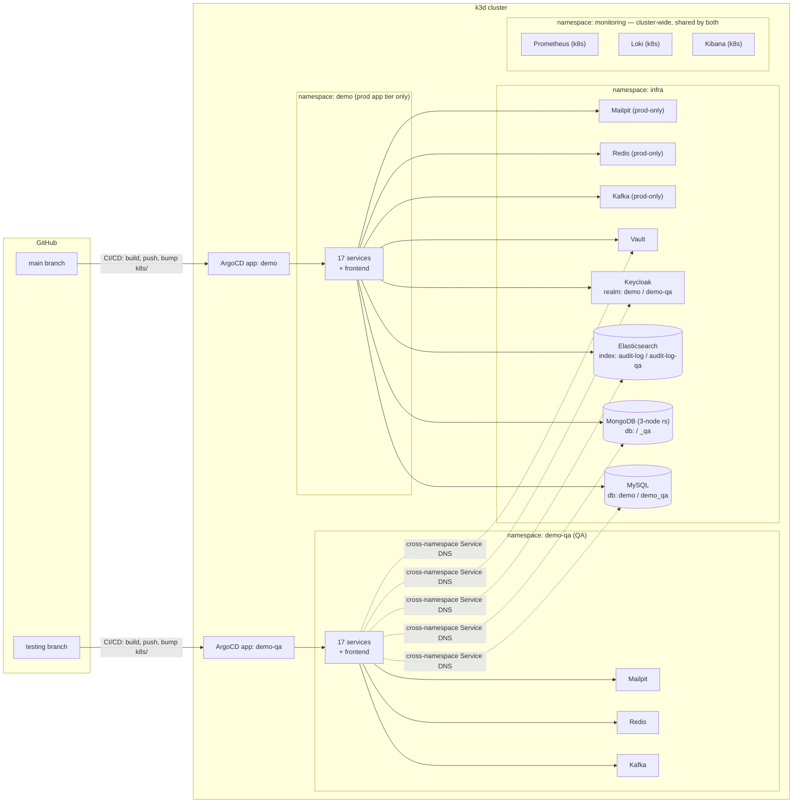

# Demo — Microservices Architecture Playground

A from-scratch rebuild of a single Spring Boot monolith into a full microservices system, built as a
hands-on reference for *why* you'd reach for a given distributed-systems pattern, not just *how* to
wire it up. Every pattern below exists because a concrete problem in this domain needed it — see
[Patterns demonstrated](#patterns-demonstrated) for the reasoning behind each one.

**Stack:** Spring Boot 4 / Java 26 backend (19 modules), Vue 3 + TypeScript + Element Plus frontend,
MySQL + MongoDB + Kafka + Redis + Elasticsearch, Keycloak (OAuth2/OIDC), Eureka + Spring Cloud Gateway,
Prometheus + Grafana + Loki + Kibana, Docker Compose for local infra, k3d + ArgoCD for a local
Kubernetes/GitOps loop, GitHub Actions → GHCR for CI/CD across a production and a QA environment.

## Architecture

A choreographed Kafka saga drives an order through payment, shipping, and delivery. Every service
that isn't infrastructure is independently deployable — its own jar, its own Docker image, its own k8s
Deployment.

| Service | Port | Store | Responsibility |
|---|---|---|---|
| `gateway-service` | 8080 | — | Spring Cloud Gateway; routes `/api/**` to backend services by path, CORS |
| `eureka-server` | 8761 | — | Service discovery — every backend registers here |
| `config-server` | 8888 | — | Centralized config (currently minimal; most config is per-service `application.yaml`) |
| `user-service` | 8082 | MongoDB | User profiles; identity fields (username/email/name) are read live from Keycloak, not duplicated locally |
| `product-service` | 8083 | MongoDB | Product catalog; reserve/release stock; Spring Batch CSV bulk import |
| `order-service` | 8084 | MySQL (write) + MongoDB (read) | **Saga initiator** + **CQRS**: `POST /api/orders` hits MySQL directly (ACID), `GET /api/orders*` reads from a Mongo projection kept in sync by the same Kafka listeners the saga needs anyway |
| `payment-service` | 8086 | MongoDB | Saga participant: charges, refunds on downstream failure |
| `shipping-service` | 8088 | MongoDB | Saga participant: carrier selection (UPS/DHL), tracking |
| `delivery-service` | 8087 | MongoDB | Saga participant: last-mile delivery simulation |
| `inventory-service` | 8089 | MongoDB | Per-warehouse stock, called synchronously by `order-service` (the one sync inter-service call in the system, see [Circuit breaker](#circuit-breaker)) |
| `notification-service` | 8085 | — | Kafka consumer on every topic → WebSocket broadcast (`/ws/notifications`) + email via Mailpit |
| `audit-service` | 8090 | Elasticsearch | Consumes the audit trail every service emits; reconstructs field-level diffs and full record history |
| `chat-service` | 8094 | MongoDB | Public per-product chat rooms **and** private user-to-user direct messages (JWT-authenticated WebSocket, delivery/read receipts, typing indicators) |
| `product-comment-service` | 8091 | MongoDB | Product comments, ownership-enforced editing |
| `product-media-service` | 8092 | MongoDB + local disk | Product photos/videos/documents, file upload |
| `product-review-service` | 8093 | MongoDB | Product ratings/reviews |
| `common-security` | — | — | Shared JWT resource-server config, reused by every service |
| `common-audit` | — | — | Shared aspect that captures every REST call's request/response for the audit trail |
| `common-model` | — | — | Shared DTOs (e.g. `Address`) |
| `frontend` | 5173 (dev) | — | Vue 3 SPA — the only thing that talks to the gateway; runs in the browser regardless of how the backend is deployed |

Kafka topics: `user-events`, `product-events`, `order-events`, `payment-events`, `shipping-events`,
`delivery-events`. Plain JSON, no schema registry — deliberate simplicity for a demo.

## Patterns demonstrated

### Distributed systems

- **Saga (choreography)** — `order → payment → shipping → delivery`, each step reacting to the
  previous step's Kafka event. No orchestrator. Compensation on failure always flows back through
  `payment-service` (refund) and `product-service` (stock release), regardless of which step failed.
- **CQRS** — scoped to `order-service` only: MySQL write model, Mongo read model, synced by the saga's
  own Kafka listeners rather than a separate change-data-capture pipeline.
- **Circuit breaker** — `order-service → inventory-service` is the *only* synchronous call in the
  system; everything else is async via Kafka, which gets resilience largely for free through consumer
  replay. That's exactly why the one sync call is wrapped in Resilience4j.
- **Outbox / store-and-forward** — Kafka publish failures are persisted and retried rather than
  silently dropped or blocking the request.
- **Sidecar** — demonstrated on `order-service`'s k8s pod (`k8s/order-service.yaml`): an `nginx`
  access-log sidecar in the same pod.
- **GitOps** — ArgoCD watches this repo's `k8s/` path; `kubectl apply` is not how deploys happen once
  the cluster is bootstrapped (see [Kubernetes / GitOps](#kubernetes--gitops)).
- **Audit trail without per-service instrumentation** — `common-audit`'s `RestCallAuditAspect` captures
  every REST request/response generically; `audit-service` reconstructs field-level diffs by comparing
  consecutive snapshots for the same record ID, rather than requiring Envers-style per-entity setup.

### Object-oriented & domain design

These are graded honestly below — only claiming what's actually in the code, including where a pattern
is a partial or pragmatic fit rather than textbook.

**Design patterns**

- **Repository** — every persistence-facing interface (16 `*Repository` interfaces across the reactor)
  is a Spring Data abstraction over MongoDB or JPA; service code never touches a driver or
  `EntityManager` directly.
- **Adapter** — one `*ModelAssembler` per service (`UserModelAssembler`, `OrderViewModelAssembler`, 11
  in total) converts a persistence/domain object into its HATEOAS-linked API representation, keeping
  wire format decoupled from storage format.
- **Template Method** — `ChatWebSocketHandler`, `DirectMessageWebSocketHandler`, and
  `NotificationWebSocketHandler` all extend Spring's `TextWebSocketHandler`, overriding only the
  lifecycle hooks each one needs (`afterConnectionEstablished`, `handleTextMessage`); the
  connection-bookkeeping skeleton stays in the base class.
- **Interceptor** — `ChatHandshakeInterceptor` / `DirectMessageHandshakeInterceptor` hook into the
  WebSocket handshake to extract and (for direct messages) cryptographically verify identity before
  the handler ever sees a session — the same shape as a servlet filter chain.
- **Factory Method** — `DomainEvent.of(eventType, orderId, payload)` is the only way any saga event
  gets constructed, so the timestamp can't be forgotten at a call site.
- **Aspect-Oriented Programming** — `common-audit`'s `RestCallAuditAspect` captures every REST call's
  request/response with one `@Around` advice, instead of every controller method calling an audit
  helper by hand.

**SOLID**

- **SRP** — each service owns exactly one bounded context (see DDD below); within a service,
  controller/service/repository/assembler are separate classes, each with one reason to change.
- **DIP** — controllers depend on a `*Service` interface (`ConversationService`, `ChatService`,
  `UserService`, ...), never the `*Impl` directly, so an alternate implementation could swap in
  without touching any caller.
- **ISP** — those service interfaces stay narrow and use-case-shaped rather than one god interface per
  service — `ConversationService` is 7 methods, all conversation-lifecycle operations, nothing else.
- **OCP is the weakest fit here, honestly** — extension mostly happens by adding an enum constant plus
  an `if`/`switch` (`PaymentMethod`, `MediaType`) rather than a polymorphic strategy class per variant.
  Worth knowing as a limitation of this codebase, not a pattern to go looking for.

**Domain-Driven Design**

- **Bounded contexts** — each microservice *is* a bounded context: `order-service` only knows a
  `Shipment` as an event payload field, `chat-service` only knows a `Product` as an opaque ID. The
  service boundary and the Maven module boundary are the same boundary.
- **Domain events** — every Kafka message is a `DomainEvent` (`common-security/.../events/DomainEvent.java`),
  published after a state change and consumed to drive the next saga step — closer to a true DDD domain
  event than to a generic message-bus payload.
- **Value objects** — `Address` (`common-model`) has no identity of its own and is embedded wherever
  needed (a user's default address, an order's shipping snapshot); it's shared *because* both services
  mean the literal same concept, not out of laziness. Caveat: it's Lombok-`@Setter` mutable, not a
  textbook immutable VO — a pragmatic shortcut, not a purist one.
- **Aggregates** — `Order` (order-service, MySQL) and `Conversation` (chat-service, MongoDB) are each
  the aggregate root and consistency boundary for their own writes; `OrderView` and
  `ConversationSummary` are deliberately separate read models, not the aggregate leaking out through
  the API.
- **Ubiquitous language** — service names, event types (`ORDER_CREATED`, `PAYMENT_COMPLETED`,
  `SHIPPED`), and REST paths all use the vocabulary a product owner would use — no translation layer
  between "the business" and "the code."

## Quick start

### Option A — local JVM + npm (fastest inner loop)

Bring up infra only, then run services directly:

```bash
docker compose up -d mysql mongodb kafka keycloak mailpit elasticsearch redis
./mvnw -pl user-service,product-service,order-service,payment-service,shipping-service,delivery-service,inventory-service,notification-service,gateway-service,eureka-server,config-server,audit-service,chat-service,product-comment-service,product-media-service,product-review-service -am install -DskipTests
# then in separate terminals, per service:
./mvnw -pl <service> spring-boot:run
cd frontend && npm install && npm run dev
```

Frontend: http://localhost:5173

### Option B — full Docker Compose stack

```bash
docker compose up -d --build
```

Everything (infra + all 19 backend services + frontend) runs in containers on one network.

### Option C — Kubernetes (k3d) + GitOps

```bash
k3d cluster create demo --servers 1 --agents 2 -p "18090:80@loadbalancer" -p "18453:443@loadbalancer" -p "8081:8081@loadbalancer" -p "9080:9080@loadbalancer" -p "9443:9443@loadbalancer" --api-port 6550
kubectl apply -f k8s/
```

> If you already have a local `demo` cluster from before Rancher moved in-cluster, the two new
> `9080`/`9443` port mappings can only be set at cluster creation — `k3d cluster delete demo` and
> recreate with the command above (this re-seeds all in-cluster PVC data).

App: http://demo.localhost:18090 — Kafka, Redis, MySQL, Keycloak, Mailpit, Vault, MongoDB,
Elasticsearch, and Kibana all run in-cluster now (see [Kubernetes / GitOps](#kubernetes--gitops)),
all in a separate `infra` namespace (`k8s/namespace-infra.yaml`) from the app microservices in
`demo` — app services reach infra via fully-qualified cross-namespace DNS
(`<service>.infra.svc.cluster.local`, see `k8s/configmap-common.yaml`), same pattern already used
to reach Loki/Prometheus in `monitoring`. Rancher now runs in-cluster too
(`k8s-rancher/rancher.yaml`, `cattle-system` namespace — see its own comment for why it's plain
YAML generated via `helm template`, not a live Helm install, and for the RBAC it needs to
self-register the cluster it's running in as "local"). Only Grafana and Tempo still run via Docker
Compose on the host, reached through `host.k3d.internal`. The `-p
"8081:8081@loadbalancer"` mapping is load-bearing, not optional: every service's
`KEYCLOAK_ISSUER_URI` (and the frontend's) is hardcoded to `http://localhost:8081`, so in-cluster
Keycloak has to keep answering there too — see `k8s/keycloak.yaml`'s comment for the full
reasoning. `kubectl apply -f k8s/` here is a one-time bootstrap — from then on, ArgoCD watches the
repo and CI/CD (see [CI/CD & versioning](#cicd--versioning)) handles building, pushing to GHCR, and
bumping the manifests ArgoCD syncs; there's no `k3d image import` step in the normal flow, since
images live in a real registry now. (`k3d image import` is still the right tool if you want to
test a *local, unpushed* code change without going through CI — tag it with that service's own
real version, e.g. `demo/order-service:1.0.3` from its `pom.xml`, not a placeholder like `:local`;
CI's own bootstrap-correction step rewrites it to the real `ghcr.io` SHA tag automatically the
first time that service's pipeline runs afterward.)

### Local dev scripts

`start-local.sh` / `stop-local.sh` wrap Option A above: `--infra` brings up (or tears down) just the
Docker Compose infra containers, `--services` builds and runs (or stops) the backend services and
frontend dev server, and running either script with no flags does both. `k8s-local.sh start|stop|restart|status`
manages the k3d cluster together with the host infra it depends on — `--no-watch` skips the
post-start `kubectl get pods -A -w` and returns immediately. `start`/`stop` only touch the infra
pods actually need now (just Grafana and Tempo) — not docker-compose's own app containers
(Option B, irrelevant when using k8s) and not the pieces that are dev-only now that Kafka, Redis,
MySQL, Keycloak, Mailpit, Vault, MongoDB, Elasticsearch, and Kibana all run in-cluster
(docker-compose's own Prometheus/Loki/Promtail are dev-only too — k8s has its own separate
Prometheus and Loki, `k8s/prometheus.yaml`/`k8s/loki.yaml`, and its own Promtail,
`k8s/promtail-daemonset.yaml`). Pass `--with-dev` to also start/stop those, e.g. if
`start-local.sh`'s host-JVM services are running against the same docker-compose stack at the same
time.

## Default credentials

| User | Password | Realm role |
|---|---|---|
| `demo` | `demo` | `user` |
| `admin` | `admin` | `user`, `admin` |
| `manager` | `manager` | `finance`, `product_manager`, `shipping_manager`, `inventory_manager` |

Realm: `demo` (prod) / `demo-qa` (QA) — same users/passwords in both. Client: `demo-spa` (public, PKCE).

## Useful URLs

| Tool | URL | Credentials |
|---|---|---|
| Frontend (dev) | http://localhost:5173 | — |
| Frontend (k8s, prod) | http://demo.localhost:18090 | — |
| Frontend (k8s, QA) | http://qa.demo.localhost:18090 | — (realm `demo-qa`, same users as above) |
| Keycloak admin | http://localhost:8081 | `admin` / `admin` (realm: **`demo`** for prod, **`demo-qa`** for QA — not `master`, see note below) |
| Swagger UI (aggregated) | http://localhost:8080/swagger-ui.html | — |
| Grafana | http://localhost:3000 | `admin` / `admin` — datasources: **Prometheus**/**Loki** (host-JVM/compose flow), **Prometheus (k8s)**/**Loki (k8s)** (both k8s namespaces), **Tempo** (traces from both flows — trace-to-logs jump only resolves for host-JVM/compose-originated traces, see `k8s/loki.yaml`'s comment) |
| Prometheus (host-JVM/compose) | http://localhost:9090 | — |
| Prometheus (k8s, prod + QA) | http://prometheus.demo.localhost:18090 | — |
| Loki (k8s, prod + QA) | http://loki.demo.localhost:18090 | — |
| Kibana (host-JVM/compose) | http://localhost:5601 | — |
| Kibana (k8s, prod + QA) | http://kibana.demo.localhost:18090 | — |
| Kafka UI | http://localhost:8095 | prod Kafka only — QA's Kafka has no UI wired up |
| Mailpit (SMTP inbox, prod) | http://localhost:8025 | — |
| Mailpit (SMTP inbox, QA) | http://localhost:8026 | — |
| Rancher (k8s, in-cluster) | https://localhost:9443 | bootstrap password `rancherdemo123` (set via `CATTLE_BOOTSTRAP_PASSWORD` in `k8s-rancher/rancher.yaml`) |
| ArgoCD | http://argocd.localhost:18090 (via `k8s-argocd/ingress.yaml`) | `admin` / `kubectl -n argocd get secret argocd-initial-admin-secret -o jsonpath='{.data.password}' \| base64 -d` — manages two Applications, `demo` (prod) and `demo-qa` |

> **Keycloak gotcha:** the admin console defaults to the `master` realm, which only ever contains the
> bootstrap admin. Application users (`demo`, `admin`, `manager`, everyone created through the app)
> live in the **`demo`** realm (prod) or **`demo-qa`** realm (QA) — switch realms via the dropdown in
> the top-left before looking for them. Same one Keycloak server hosts both.

### Infrastructure connection ports

For connecting a DB client, `redis-cli`, `kcat`, etc. directly rather than through a UI. Rows below
marked **dev-only** are host containers that k8s no longer depends on (its own in-cluster instances
took over — see [Kubernetes / GitOps](#kubernetes--gitops)); the host containers still exist purely
for host-JVM/`start-local.sh` debugging.

| Service | Host:Port | Notes |
|---|---|---|
| MySQL (host / dev) | `localhost:3306` | `demo-mysql` — `order-service`'s write model, db `demo` (prod) / `demo_qa` (QA), user/pass `demo`/`demo`; **dev-only**, in-cluster instance is shared cross-namespace from the `infra` namespace (`mysql.infra.svc.cluster.local`) |
| MongoDB (host / dev) | `localhost:27017` | `demo-mongo1/2/3` — every other service's store, `_qa`-suffixed for QA; **dev-only**, in-cluster is a proper 3-node replica set (`k8s/mongo.yaml`) shared cross-namespace, now in the `infra` namespace |
| Kafka (host clients / dev, prod) | `localhost:9092` | **dev-only**; prod k8s pods use their own in-cluster Kafka (`kafka.infra.svc.cluster.local:9092`, `k8s/kafka.yaml`) |
| Kafka (host clients / dev, QA) | `localhost:9192` | **dev-only**; QA k8s pods use their own separate in-cluster Kafka (`demo-qa` namespace) — shared topics would mean QA test traffic triggering prod's saga |
| Redis (host / dev, prod) | `localhost:6379` | **dev-only**; prod k8s pods use their own in-cluster Redis (`k8s/redis.yaml`, `infra` namespace) |
| Redis (host / dev, QA) | `localhost:6380` | **dev-only**; QA's own separate in-cluster Redis (`demo-qa` namespace) |
| Elasticsearch (host / dev) | `localhost:9200` | `demo-elasticsearch` — `audit-service`'s store, index `audit-log` (prod) / `audit-log-qa` (QA); **dev-only**, in-cluster instance is shared cross-namespace, now in the `infra` namespace |
| Loki (host / dev) | `localhost:3100` | `demo-loki`; **dev-only** for k8s — query via Grafana's Explore tab; k8s pods' logs go to the separate in-cluster Loki instead (see the Loki (k8s) row in Useful URLs above) |
| Mailpit SMTP (host / dev, prod) | `localhost:1025` | `demo-mailpit`; **dev-only**, prod's in-cluster Mailpit (`k8s/mailpit.yaml`, `infra` namespace) is what `notification-service` sends to in k8s |
| Mailpit SMTP (host / dev, QA) | `localhost:1026` | **dev-only**; QA's own in-cluster Mailpit (`demo-qa` namespace) |
| Vault (host / dev) | `localhost:8200` | `demo-vault`, fixed dev root token; **dev-only**, in-cluster instance is shared cross-namespace, now in the `infra` namespace |

k3d cluster ports (`k3d cluster create`, see [Kubernetes / GitOps](#kubernetes--gitops)): `18090` →
Traefik HTTP (routes every `*.demo.localhost` ingress by hostname — frontend, ArgoCD, Prometheus,
Kibana, both environments), `18453` → Traefik HTTPS, `9080`/`9443` → in-cluster Rancher
specifically, same hostPort/nodeSelector reasoning as Keycloak's `8081` — see
`k8s-rancher/rancher.yaml`'s comment, `6550` → the k8s API server (`kubectl` uses this
automatically via your kubeconfig context, not something you visit directly).

## CI/CD & versioning

`.github/workflows/ci-cd.yml` runs on every push to `main` or `testing`:

1. **Test** — full Maven reactor `verify` (unit + Testcontainers-backed integration tests, Checkstyle,
   SpotBugs) and the frontend's `lint` + typecheck + build. Nothing downstream runs if this fails.
2. **Detect changed services** — path-filters the diff between this push and the branch's own previous
   commit (`base: github.event.before`, not the default branch — `main` and `testing` differ
   permanently in QA-only files and namespace-specific manifests, so diffing against `main` would make
   almost every `testing` push look like "everything changed") so only services that actually changed
   get rebuilt (a shared module or `Dockerfile.service` changing forces a full rebuild, since every
   image build is `mvnw -pl <service> -am`). A manual `workflow_dispatch` run (Actions tab → "Run
   workflow") skips the filter and rebuilds everything — useful after a change that doesn't touch any
   single service's own path but every service still needs picking up.
3. **Build & push** — each changed service's image goes to GHCR (`ghcr.io/<owner>/demo-<service>`),
   tagged with both the commit SHA and that service's own `pom.xml`/`package.json` version (each
   service versions independently, starting at `1.0.0` — bump it by hand when you want to mark a
   release). Images are `linux/arm64` only, matching this k3d cluster's nodes.
4. **Update manifests** — bumps the changed services' `image:` lines in `k8s/*.yaml` to the new commit
   SHA tag and commits straight back to whichever branch triggered the run, gated behind the images
   already existing in GHCR — ArgoCD's `selfHeal` never sees a manifest pointing at an unpullable
   image. Deploying by the immutable SHA (not the semver tag) means every commit that touches a
   service produces a genuinely new tag and a real manifest diff, so a rollout always happens —
   nothing depends on remembering to bump that service's version. The semver tag still rides along on
   the same image purely for human-readable release tracking.

GHCR packages are private, so every Deployment references `imagePullSecrets: ghcr-pull-secret` — a
`kubernetes.io/dockerconfigjson` Secret created directly in each namespace (`demo`, `demo-qa`) via
`kubectl create secret docker-registry`, never committed to git.

## Kubernetes / GitOps

`k8s/` holds every application manifest for **production** (namespace `demo`, branch `main`); the same
path on the **`testing`** branch holds QA's manifests (namespace `demo-qa`) — see
[QA / testing environment](#qa--testing-environment). ArgoCD itself is installed once into an `argocd`
namespace
(`kubectl apply -n argocd -f https://raw.githubusercontent.com/argoproj/argo-cd/stable/manifests/install.yaml`),
then both `k8s-argocd/application.yaml` (tracks `main` → `demo`) and `k8s-argocd/application-qa.yaml`
(tracks `testing` → `demo-qa`) are applied, each with auto-sync + self-heal enabled. From there it's
push-to-deploy — CI/CD above handles the build/push/manifest-bump, ArgoCD picks up the commit on its
own. Rancher is bootstrapped the same manual, one-time way: `kubectl apply -f k8s-rancher/` brings
up an in-cluster Rancher in the `cattle-system` namespace (see `k8s-rancher/rancher.yaml`'s comment
for why it's plain YAML, not the Helm chart, and for the RBAC it needs to self-register the cluster
it's running in as "local"). `k8s-argocd/` and `k8s-rancher/` hold the manifests applied once by
hand, not GitOps-managed — a tool shouldn't be managed by the thing it manages, and (for ArgoCD
specifically) nothing can sync it into existence before it's already watching anything.

Kafka, Redis, MySQL, Keycloak, Mailpit, Vault, MongoDB, Elasticsearch, and Kibana all run
**in-cluster**, in their own `infra` namespace (`k8s/namespace-infra.yaml`) separate from the `demo`
app tier (`k8s/kafka.yaml`, `k8s/redis.yaml`, `k8s/mysql.yaml`, `k8s/keycloak.yaml`,
`k8s/mailpit.yaml`, `k8s/vault.yaml`, `k8s/mongo.yaml`, `k8s/elasticsearch.yaml`) — pods reach them
via fully-qualified cross-namespace DNS (`<service>.infra.svc.cluster.local`,
`k8s/configmap-common.yaml`) rather than via `host.k3d.internal`. The corresponding `demo-*`
containers in `docker-compose.yml` are still used by the local mvnw/IDE dev flow and by
docker-compose's own containerized app services, but the cluster itself no longer depends on any of
them. Prometheus, Loki, and Kibana similarly run in-cluster, but in their own shared `monitoring`
namespace (`k8s/namespace-monitoring.yaml`) rather than `infra` or `demo` — see
[QA / testing environment](#qa--testing-environment) for why.

`Dockerfile.service` (repo root) is a single parameterized Dockerfile (`--build-arg SERVICE=<module>`) shared
by every backend service — build context is the repo root so the multi-module Maven build can see
sibling modules. Its build stage is pinned to `--platform=$BUILDPLATFORM` (the jar it produces is
architecture-independent bytecode) so cross-compiling for the cluster's arm64 nodes on an amd64 CI
runner needs no QEMU emulation — only the final runtime layer (`COPY`, no execution) is actually
arm64.

## QA / testing environment

A second, fully independent deploy target — same cluster, same shared stateful infra, separate
namespace and separate ArgoCD Application from production:



- **Branch model**: `main` is production (bugfixes branch from here); `develop` is where feature
  branches merge; `testing` is the QA environment itself — merging `develop` → `testing` and pushing
  deploys to QA the same way pushing to `main` deploys to prod.
- **k8s**: namespace `demo-qa`, ArgoCD Application `demo-qa` (tracks the `testing` branch's own
  `k8s/` path), ingress at `qa.demo.localhost` — same port (`18090`) as prod, routed by hostname.
- **Infra**: MySQL, MongoDB, Elasticsearch, Keycloak, and Vault run **in-cluster in their own `infra`
  namespace** (`k8s/namespace-infra.yaml`; `k8s/mysql.yaml`, `k8s/mongo.yaml`,
  `k8s/elasticsearch.yaml`, `k8s/keycloak.yaml`, `k8s/vault.yaml`) — QA reaches them
  **cross-namespace** (`mysql.infra.svc.cluster.local` etc. — k8s Services are reachable across
  namespaces by default, no NetworkPolicy restricting it here) instead of getting duplicate
  containers, same "one shared instance, environment-scoped by name" reasoning as before (QA gets
  its own `demo_qa` database / `<service>_qa` Mongo databases / `audit-log-qa` index / `demo-qa`
  Keycloak realm). Kafka, Redis, and Mailpit run **in-cluster and genuinely separate per
  environment** — prod's own copies also live in `infra` now (`k8s/kafka.yaml`, `k8s/redis.yaml`,
  `k8s/mailpit.yaml`), while QA's stay in `demo-qa` itself, matching how they were never
  meant to be shared in the first place: Kafka/Redis because shared topics would mean QA test
  traffic triggering production's saga, Mailpit because it was always a separate instance per
  environment even on the host — `infra` is just where MySQL/Mongo/ES/Keycloak/Vault's genuine
  cross-environment sharing pulled everything else along with it. Prometheus, Loki, and Kibana run
  **in-cluster in their own `monitoring` namespace**, shared by both `demo` and `demo-qa`
  (`k8s/namespace-monitoring.yaml`; `k8s/prometheus.yaml`, `k8s/loki.yaml`, `k8s/kibana.yaml`) — see
  [Observability](#observability). Every one of these has a host-based equivalent in
  `docker-compose.yml`/`docker-compose.qa.yml` still, kept purely for host-JVM debugging (`kcat`,
  `redis-cli`, a mysql client, a local IDE run) — the k8s namespaces themselves don't depend on any
  of them anymore.
- **One frontend image, two Keycloak realms**: Vite bakes `VITE_KEYCLOAK_REALM` in at build time, but
  the same built image is deployed to both `demo` and `demo-qa` — a build-time value can't vary per
  environment. `frontend/src/auth/keycloak.ts` instead resolves the realm at runtime from the
  hostname (`qa.` prefix → `demo-qa`, anything else → the build-time default), matching the
  `demo.localhost` / `qa.demo.localhost` ingress split above.
- **`demo_qa` database creation** on the shared in-cluster MySQL is handled automatically by a Job
  (`mysql-create-qa-db` in `k8s/mysql.yaml`) rather than a manual step. MongoDB and Elasticsearch
  need no equivalent step — both auto-create on first write.
- **Excluded from QA on purpose**: `promtail-daemonset.yaml`, `prometheus.yaml`, `loki.yaml`, and
  `kibana.yaml` are cluster-wide, single-shared-instance resources (see
  [Observability](#observability)) — duplicating them per environment would just make the `demo`
  and `demo-qa` Applications fight over the same ClusterRole/ClusterRoleBinding names
  (`promtail-daemonset.yaml`, `prometheus.yaml`) or the same `infra`/`monitoring` Namespace objects
  (`namespace-infra.yaml`, `namespace-monitoring.yaml`).

## Observability

- **Metrics**: every service exposes `/actuator/prometheus`. Two separate Prometheus instances cover
  two separate deploy modes — `docker-compose.yml`'s (static targets, `host.docker.internal:<port>`)
  covers the host-JVM/docker-compose dev flow; a second one runs *inside* the k3d cluster
  (`k8s/prometheus.yaml`, namespace `monitoring`) covering the k8s-deployed services in **both**
  `demo` and `demo-qa`, discovered via `kubernetes_sd_configs` (`role: pod`, opted in by the
  `monitored: "true"` label most manifests already carry) and labeled by `namespace`. Pod IPs on the
  k3d overlay network aren't reachable from outside the cluster at all, which is why this one has to
  run in-cluster rather than as a third docker-compose static-target job. Grafana has both as
  datasources, plus two pre-provisioned dashboards (`docker/grafana/dashboards/`): "Services Overview"
  (the docker-compose/host-JVM Prometheus) and **"Kubernetes Overview (prod vs QA)"** (the in-cluster
  one) — the latter has a `namespace` filter variable and puts prod/QA side by side in the top row
  (Services Up/Down for each), so environment health is a single glance, not two separate dashboards.
- **Logs**: services log to stdout; in Docker Compose that's `docker logs <container>`. In k8s,
  Promtail (`k8s/promtail-daemonset.yaml`, one shared instance, not per-environment) ships every pod's
  logs — from both namespaces — to the separate in-cluster Loki (`k8s/loki.yaml`, namespace
  `monitoring`, mirroring `k8s/prometheus.yaml`'s host/cluster split), labeled by `namespace`. Query
  through Grafana's Explore tab against the **Loki (k8s)** datasource, e.g. `{namespace="demo-qa"}`
  to see QA only; the plain **Loki** datasource is the host-JVM/docker-compose flow's own instance —
  Tempo's trace-to-logs jump only resolves against that one, so it stops finding logs for
  k8s-originated traces (accepted tradeoff — see `k8s/loki.yaml`'s comment).
- **Audit trail**: every REST call across every service is captured (who, what, when, request/response
  bodies with secrets redacted) and shipped to Elasticsearch — index `audit-log` for prod, `audit-log-qa`
  for QA (same shared in-cluster ES instance, `k8s/elasticsearch.yaml`, see
  [QA / testing environment](#qa--testing-environment)). The admin UI's history icons (Users,
  Products, Media, Chat) show the full change timeline with before/after diffs per field, powered by
  `audit-service`'s `RecordHistoryService`. Three Kibana dashboards cover the same data for ad-hoc
  querying, now available both ways: **Kibana (k8s)** (`k8s/kibana.yaml`, `monitoring` namespace)
  points at the in-cluster Elasticsearch (`infra` namespace) — same shared instance both `demo` and
  `demo-qa` write to, so both environments' dashboards are visible there. **Kibana (host-JVM/compose)**
  stays as its own separate instance too, pointed at `docker-compose.yml`'s own dev-only
  Elasticsearch, not the in-cluster one — same "host copy is its own independent dev-flow instance"
  pattern as MySQL/Mongo/etc. Both auto-import the same three dashboards on startup
  (`kibana-dashboard-init`, a Job in k8s / a container in `docker-compose.yml`):
  **"Audit Trail"** (`audit-trail-dashboard.ndjson`, the original — index pattern `audit-log*`, both
  environments together, for cross-environment searching), and **"Audit Trail — Production"** /
  **"Audit Trail — QA"** (`audit-trail-dashboard-{prod,qa}.ndjson`), each pinned to its own exact
  index instead of relying on a filter — matches the Grafana dashboard's approach of making the
  environment split a first-class view, not something the reader has to remember to filter for.

## Repo layout

```
demo/
├── common-security/, common-audit/, common-model/   # shared library modules
├── eureka-server/, config-server/, gateway-service/  # platform services
├── user-service/, product-service/, order-service/, payment-service/,
│   shipping-service/, delivery-service/, inventory-service/,
│   notification-service/, audit-service/, chat-service/,
│   product-comment-service/, product-media-service/, product-review-service/
├── frontend/                # Vue 3 SPA
├── docker/                  # Keycloak realms (demo + demo-qa), Grafana/Kibana/Prometheus provisioning
├── k8s/                     # Kubernetes manifests — prod content on main, QA content on testing
├── k8s-argocd/              # ArgoCD Application CRs + ingress, applied once by hand, not GitOps-synced
├── docker-compose.yml       # full local stack (prod infra + every service + frontend)
├── docker-compose.qa.yml    # QA-only infra (Kafka/Redis/Mailpit); MySQL/Mongo/ES/Keycloak are shared
├── .github/workflows/       # CI/CD: test -> build & push to GHCR -> bump k8s manifests
└── pom.xml                  # Maven reactor parent
```

Each backend service module follows the same internal package layout under its base package
(`com.example.<service>`): `config/` (Spring `@Configuration`/security config), `controller/`
(REST endpoints), `enums/` (status/type enums), `model/` (entities, DTOs, `*ModelAssembler`s),
`repository/` (Spring Data repositories), `saga/` (`@KafkaListener` domain-event consumers,
including the choreographed-saga participants), `service/` (business logic, external clients).
Modules with a WebSocket surface (`chat-service`, `notification-service`) add a `websocket/`
package for handlers/interceptors; `gateway-service` adds a `filter/` package for its servlet
filter. The `*ServiceApplication` bootstrap class stays directly in the base package, not in any
sub-package.
