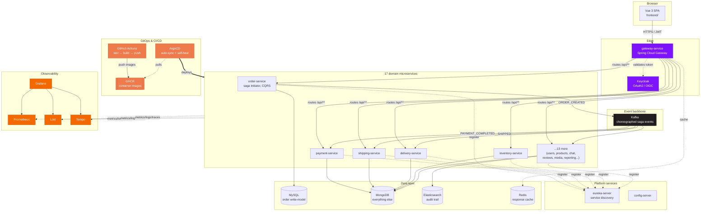
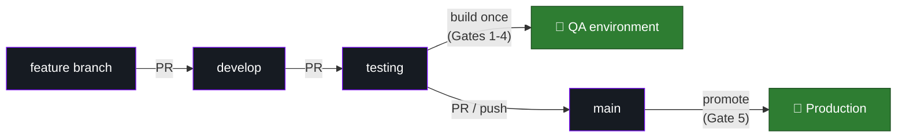
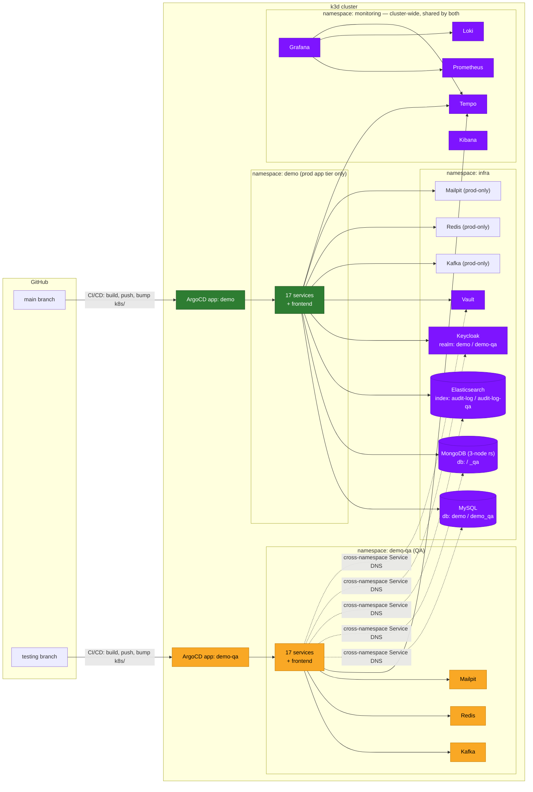
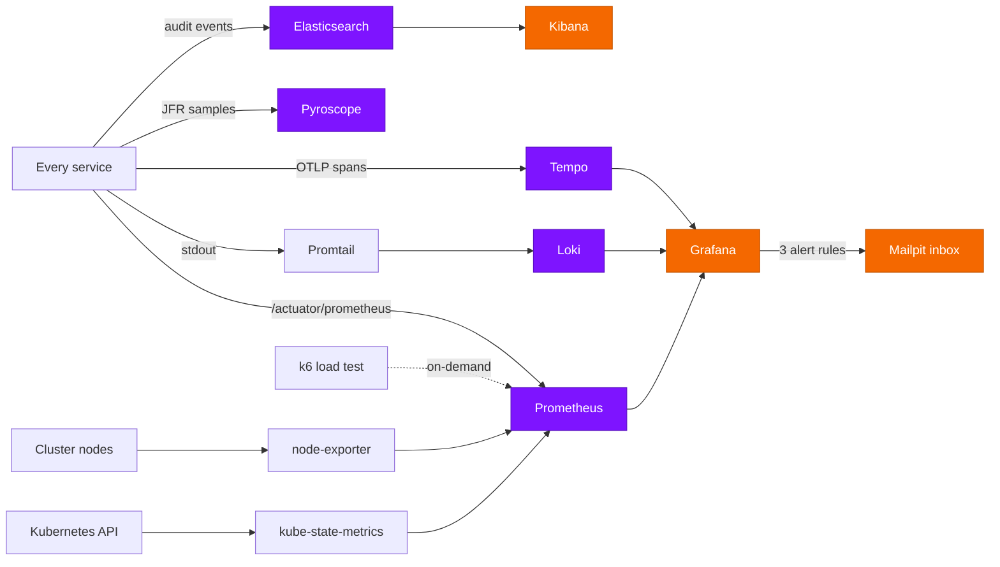

# Demo — Full-Stack Microservices Reference Architecture

**A monolith, deliberately taken apart — 17 Spring Boot services, a Vue 3 frontend, and the entire
production toolchain around them (CI/CD, GitOps, Kubernetes, observability) — built to show not just
*how* each piece works, but *why* it exists.**

[](https://github.com/wilbertjoosen/demo/actions/workflows/ci-cd.yml)


This is `main` — **production**. Two other branches complete the picture: `develop` (day-to-day
feature work, single local environment) and `testing` (the QA environment, one hop before
production). See [Branch model & release flow](#branch-model--release-flow) for how a change moves
between them.

---

## Table of contents

- [The big picture](#the-big-picture)
- [The stack — and why each piece is here](#the-stack--and-why-each-piece-is-here)
- [The services](#the-services)
- [Patterns demonstrated](#patterns-demonstrated)
- [Quick start](#quick-start)
- [The path to production, every gate explained](#the-path-to-production-every-gate-explained)
- [Branch model & release flow](#branch-model--release-flow)
- [Kubernetes / GitOps](#kubernetes--gitops)
- [QA / testing environment](#qa--testing-environment)
- [Observability](#observability)
- [Config profiles: local / testing / production](#config-profiles-local--testing--production)
- [Default credentials](#default-credentials)
- [Useful URLs](#useful-urls)
- [Repo layout](#repo-layout)
- [Glossary — jargon, decoded](#glossary--jargon-decoded)

---

## The big picture



**The one-sentence version:** a browser talks to a gateway, the gateway routes to one of 17
independently-deployable services, those services choreograph a Kafka saga instead of calling each
other directly, everything ships through CI/CD to GHCR and gets pulled into Kubernetes by ArgoCD
without a human running `kubectl apply`, and every hop is observable end-to-end (metrics, logs,
traces, continuous profiling, alerting) across both a production and a QA environment.

---

## The stack — and why each piece is here

Nothing below is "because it's popular." Each row is a specific problem this project actually has,
and the tool picked to solve it — click through to the real file.

### Backend

| Technology | What it does here | Why this, not something else | Where |
|---|---|---|---|
|  **Java&nbsp;26** | Runtime for every backend service | Latest LTS-track JDK — modern language features (records, pattern matching, virtual threads available) without legacy baggage | every service's `pom.xml` |
|  **Spring&nbsp;Boot&nbsp;4** | Application framework | The de-facto standard for JVM microservices — auto-configuration, embedded Tomcat, and first-class support for everything else in this stack (Data, Security, Kafka, Actuator) | every service module |
|  **Spring&nbsp;Cloud&nbsp;Gateway** | API gateway / reverse proxy | One public entry point instead of 17 — routes `/api/**` by path, centralizes CORS, hides internal service topology from the browser | `gateway-service/` |
|  **Netflix&nbsp;Eureka** | Service discovery | Services register themselves and discover each other by name, not hardcoded IPs — essential once you have more than a couple of services that scale independently | `eureka-server/` |
|  **Spring&nbsp;Cloud&nbsp;Config** | Centralized configuration | One place for config that's shared across services (currently light use — most config is per-service, see [Config profiles](#config-profiles-local--testing--production)) | `config-server/` |
|  **Spring&nbsp;Data** | Persistence abstraction (JPA + MongoDB) | Repository pattern out of the box — service code never touches a driver or `EntityManager` directly | every service's `repository/` package |
|  **Spring&nbsp;Kafka** | Event-driven messaging & stream processing (+ Kafka Streams) | The backbone of the choreographed saga (see [Patterns demonstrated](#patterns-demonstrated)); Kafka Streams specifically powers `reporting-service`'s live materialized-view aggregates | every `saga/` package; `reporting-service/` |
|  **Spring&nbsp;Security** | JWT validation (OAuth2 Resource Server) | Every service independently validates the same Keycloak-issued JWT — no shared session state, no service trusting another service's say-so | `common-security/` |
| **Resilience4j** | Circuit breaker | Wraps the *one* synchronous inter-service call in the system (`order-service → inventory-service`) so a slow/down `inventory-service` can't cascade-fail the order flow | `order-service/.../config/Resilience4jConfig.java` |
| **AspectJ** | Cross-cutting audit logging (AOP) | One `@Around` advice captures every REST call's request/response across every service — no per-controller instrumentation | `common-audit/` |
|  **springdoc-openapi** | API documentation | Auto-generated Swagger UI per service, aggregated at the gateway into one browsable surface | every service; aggregated at `:8080/swagger-ui.html` |
| **Micrometer** | Metrics instrumentation (+ Prometheus registry) | Every service exposes `/actuator/prometheus` for free — the entire [Observability](#observability) stack builds on this one dependency | every service |
| **Micrometer&nbsp;Tracing** | Distributed tracing (OTel bridge) | Auto-injects `[traceId,spanId]` into every log line and exports spans over OTLP — a request across 4 services becomes one traceable timeline | `common-security/`, `gateway-service/` |
| **Pyroscope&nbsp;Agent** | Continuous profiling (Java agent) | Answers "where is the CPU actually going" without attaching a profiler by hand — always-on, low-overhead JFR sampling | see [Observability](#observability) |
| **spring-cloud-aws** | S3 + Secrets Manager client | `product-media-service`'s file storage backend | `product-media-service/` |

### Frontend

| Technology | What it does here | Why this, not something else | Where |
|---|---|---|---|
|  **Vue&nbsp;3** | SPA framework (Composition API) | Smaller learning curve than React for the same reactivity model, first-class TypeScript support | `frontend/src/` |
|  **TypeScript** | Type safety | Catches wiring mistakes (wrong DTO shape, typo'd prop) at build time instead of in a browser console | `frontend/` — `vue-tsc` runs in CI |
|  **Element&nbsp;Plus** | Component library | Production-grade tables/forms/modals without hand-building them — the admin screens (users, products, orders, reports) lean on this heavily | `frontend/src/` |
|  **Pinia** | State management | Vue's official Vuex successor — simpler API, full TypeScript inference | `frontend/src/stores/` |
| **Vue&nbsp;Router** | Client-side routing | Role-gated routes (finance/product_manager/shipping_manager/inventory_manager) map directly to Keycloak realm roles | `frontend/src/router/` |
| **vue-i18n** | Internationalization | Multi-language support baked in from the start, not retrofitted | `frontend/src/locales/` |
|  **ECharts** | Data visualization (`vue-echarts`) | Powers the reporting dashboard's charts (revenue, top products, saga health) — richer and faster than SVG-by-hand for real-time aggregates | `frontend/src/views/reports/` |
|  **Tailwind&nbsp;CSS** | Utility-first styling | Fast iteration without hand-rolled CSS files sprawling across components | `frontend/src/` |
|  **Vite** | Build tool / dev server | Near-instant HMR for the dev inner loop; production builds are what CI ships | `frontend/vite.config.ts` |
|  **keycloak-js** | Auth adapter | Handles the OAuth2/PKCE dance with Keycloak directly from the browser — no custom login-flow code | `frontend/src/auth/keycloak.ts` |

### Data & messaging

| Technology | Role | Why | Where |
|---|---|---|---|
|  **MySQL** | `order-service`'s write model | Orders need real ACID transactions (create order + reserve stock atomically) — the one place in the system that isn't eventually-consistent by design | `order-service/`, `k8s/mysql.yaml` |
|  **MongoDB** | Every other service's store, + `order-service`'s read model | Schema flexibility fits domain objects that evolve fast (product attributes, chat messages); the read-model side of CQRS doesn't need MySQL's guarantees, just fast reads | every other service, `k8s/mongo.yaml` |
|  **Apache&nbsp;Kafka** | Event backbone | Decouples the saga's steps completely — `payment-service` doesn't call `shipping-service`, it reacts to an event; consumer replay gives resilience largely for free | every `saga/` package, `k8s/kafka.yaml` |
|  **Redis** | Response caching | Backs Resilience4j's cache annotations for read-heavy, slow-changing data | `k8s/redis.yaml` |
|  **Elasticsearch** | Audit trail store | Full-text/structured search over every REST call ever made, across every service — a relational table would make this kind of ad-hoc querying painful | `audit-service/`, `k8s/elasticsearch.yaml` |

### Identity, infra & delivery

| Technology | Role | Why | Where |
|---|---|---|---|
|  **Keycloak** | OAuth2/OIDC identity provider | Centralized auth, roles, and (via its own Admin REST API) user management — services never store passwords | `k8s/keycloak.yaml`, `docker/keycloak/` |
|  **HashiCorp&nbsp;Vault** | Secrets management | Real secrets engine instead of plaintext env vars or committed `.env` files | `k8s/vault.yaml` |
|  **Docker&nbsp;Compose** | Local infra & full-stack dev | Fastest path to "everything running" without touching Kubernetes at all — see [Quick start](#quick-start) Option B | `docker-compose.yml` |
|  **k3d** | Local Kubernetes cluster (Kubernetes in Docker) | A real multi-node cluster on a laptop, no cloud account needed — every k8s concept below (Deployments, Services, Ingress, RBAC) behaves exactly like it would in production | [Quick start](#quick-start) Option C |
|  **ArgoCD** | GitOps continuous delivery | The cluster's actual state is *reconciled from git*, not pushed to by a human running `kubectl apply` — see [Kubernetes / GitOps](#kubernetes--gitops) | `k8s-argocd/` |
|  **GitHub&nbsp;Actions** | CI/CD | Free, tightly integrated with GHCR, no separate CI system to run — see [The path to production](#the-path-to-production-every-gate-explained) | `.github/workflows/ci-cd.yml` |
|  **GHCR** | Image registry (GitHub Container Registry) | Private, free for this project's usage, one less external account to manage | referenced in every `k8s/*.yaml`'s `image:` field |
|  **Rancher** | Kubernetes management UI | A GUI for the cluster (Secrets, pod logs, resource usage) alongside the CLI — runs in-cluster itself | `k8s-rancher/rancher.yaml` |

### Observability

| Technology | Signal | Why | Where |
|---|---|---|---|
|  **Prometheus** | Metrics | Pull-based scraping fits Kubernetes service discovery naturally — no per-service push config | `k8s/prometheus.yaml` |
|  **Grafana** | Dashboards + alerting | One pane of glass across metrics/logs/traces, plus file-provisioned alert rules (no UI clicking, git-reviewable) | `k8s/grafana.yaml` |
| **Loki** | Logs | Prometheus's label model applied to logs — cheap to run, and queries feel identical to PromQL | `k8s/loki.yaml` |
| **Tempo** | Distributed traces | Pairs natively with Grafana's `tracesToLogsV2` — click a trace, jump straight to its logs | `k8s/tempo.yaml` |
| **Pyroscope** | Continuous CPU profiling | Answers performance questions Prometheus metrics can't — literally which method is burning CPU, live | `k8s/pyroscope.yaml` |
| **kube-state-metrics**&nbsp;+&nbsp;**node-exporter** | Cluster/host metrics | Object-level (pod phase, PVC status) and host-level (CPU/disk) visibility Prometheus's own app-metrics scraping doesn't cover | `k8s/kube-state-metrics.yaml`, `k8s/node-exporter.yaml` |
|  **k6** | Load testing | Scriptable load generation that pushes results straight into the same Prometheus everything else uses | `k8s/k6.yaml` |
|  **Kibana** | Audit-trail search UI | Purpose-built for exploring Elasticsearch documents — the audit trail's natural home | `k8s/kibana.yaml` |
| **Mailpit** | Mock SMTP inbox | Catches every email the system sends (order confirmations, Grafana alerts) without a real mail provider | `k8s/mailpit.yaml` |

---

## The services

A choreographed Kafka saga drives an order through payment, shipping, and delivery. Every service
that isn't infrastructure is independently deployable — its own jar, its own Docker image, its own
k8s Deployment.

| Service | Port | Store | Responsibility |
|---|---|---|---|
| `gateway-service` | 8080 | — | Spring Cloud Gateway; routes `/api/**` to backend services by path, CORS |
| `eureka-server` | 8761 | — | Service discovery — every backend registers here |
| `config-server` | 8888 | — | Centralized config (currently minimal; most config is per-service `application.yaml`) |
| `user-service` | 8082 | MongoDB | User profiles; identity fields (username/email/name) are read live from Keycloak, not duplicated locally |
| `product-service` | 8083 | MongoDB | Product catalog; reserve/release stock; Spring Batch CSV bulk import |
| `order-service` | 8084 | MySQL (write) + MongoDB (read) | **Saga initiator** + **CQRS**: `POST /api/orders` hits MySQL directly (ACID), `GET /api/orders*` reads from a Mongo projection kept in sync by the same Kafka listeners the saga needs anyway |
| `payment-service` | 8086 | MongoDB | Saga participant: charges, refunds on downstream failure |
| `shipping-service` | 8088 | MongoDB | Saga participant: carrier selection (UPS/DHL), tracking |
| `delivery-service` | 8087 | MongoDB | Saga participant: last-mile delivery simulation |
| `inventory-service` | 8089 | MongoDB | Per-warehouse stock, called synchronously by `order-service` (the one sync inter-service call in the system, see [Circuit breaker](#circuit-breaker)) |
| `notification-service` | 8085 | — | Kafka consumer on every topic → WebSocket broadcast (`/ws/notifications`) + email via Mailpit |
| `audit-service` | 8090 | Elasticsearch | Consumes the audit trail every service emits; reconstructs field-level diffs and full record history |
| `chat-service` | 8094 | MongoDB | Public per-product chat rooms **and** private user-to-user direct messages (JWT-authenticated WebSocket, delivery/read receipts, typing indicators) |
| `reporting-service` | 8095 | Kafka Streams (materialized state stores) | Consumes every domain event and maintains live aggregates (top products, order revenue, user growth, saga health) for the frontend's reporting dashboard |
| `product-comment-service` | 8091 | MongoDB | Product comments, ownership-enforced editing |
| `product-media-service` | 8092 | MongoDB + local disk | Product photos/videos/documents, file upload |
| `product-review-service` | 8093 | MongoDB | Product ratings/reviews |
| `common-service` | 8096 | MongoDB | Deployed reference-data service (countries today) shared by other services over REST — not to be confused with the `common-*` compile-time library modules below |
| `common-security` | — | — | Shared JWT resource-server config, reused by every service |
| `common-audit` | — | — | Shared aspect that captures every REST call's request/response for the audit trail |
| `common-model` | — | — | Shared DTOs (e.g. `Address`) |
| `frontend` | 5173 (dev) | — | Vue 3 SPA — the only thing that talks to the gateway; runs in the browser regardless of how the backend is deployed |

Kafka topics: `user-events`, `product-events`, `order-events`, `payment-events`, `shipping-events`,
`delivery-events`. Plain JSON, no schema registry — deliberate simplicity for a demo.

---

## Patterns demonstrated

### Distributed systems

- **Saga (choreography)** — `order → payment → shipping → delivery`, each step reacting to the
  previous step's Kafka event. No orchestrator. Compensation on failure always flows back through
  `payment-service` (refund) and `product-service` (stock release), regardless of which step failed.
- **CQRS** — scoped to `order-service` only: MySQL write model, Mongo read model, synced by the saga's
  own Kafka listeners rather than a separate change-data-capture pipeline.
- **Circuit breaker** — `order-service → inventory-service` is the *only* synchronous call in the
  system; everything else is async via Kafka, which gets resilience largely for free through consumer
  replay. That's exactly why the one sync call is wrapped in Resilience4j.
- **Outbox / store-and-forward** — Kafka publish failures are persisted and retried rather than
  silently dropped or blocking the request.
- **Sidecar** — demonstrated on `order-service`'s k8s pod (`k8s/order-service.yaml`): an `nginx`
  access-log sidecar in the same pod.
- **GitOps** — ArgoCD watches this repo's `k8s/` path; `kubectl apply` is not how deploys happen once
  the cluster is bootstrapped (see [Kubernetes / GitOps](#kubernetes--gitops)).
- **Audit trail without per-service instrumentation** — `common-audit`'s `RestCallAuditAspect` captures
  every REST request/response generically; `audit-service` reconstructs field-level diffs by comparing
  consecutive snapshots for the same record ID, rather than requiring Envers-style per-entity setup.

### Object-oriented & domain design

These are graded honestly below — only claiming what's actually in the code, including where a pattern
is a partial or pragmatic fit rather than textbook.

**Design patterns**

- **Repository** — every persistence-facing interface (17 `*Repository` interfaces across the reactor)
  is a Spring Data abstraction over MongoDB or JPA; service code never touches a driver or
  `EntityManager` directly.
- **Adapter** — one `*ModelAssembler` per service (`UserModelAssembler`, `OrderViewModelAssembler`, 12
  in total) converts a persistence/domain object into its HATEOAS-linked API representation, keeping
  wire format decoupled from storage format.
- **Template Method** — `ChatWebSocketHandler`, `DirectMessageWebSocketHandler`, and
  `NotificationWebSocketHandler` all extend Spring's `TextWebSocketHandler`, overriding only the
  lifecycle hooks each one needs (`afterConnectionEstablished`, `handleTextMessage`); the
  connection-bookkeeping skeleton stays in the base class.
- **Interceptor** — `ChatHandshakeInterceptor` / `DirectMessageHandshakeInterceptor` hook into the
  WebSocket handshake to extract and (for direct messages) cryptographically verify identity before
  the handler ever sees a session — the same shape as a servlet filter chain.
- **Factory Method** — `DomainEvent.of(eventType, orderId, payload)` is the only way any saga event
  gets constructed, so the timestamp can't be forgotten at a call site.
- **Aspect-Oriented Programming** — `common-audit`'s `RestCallAuditAspect` captures every REST call's
  request/response with one `@Around` advice, instead of every controller method calling an audit
  helper by hand.

**SOLID**

- **SRP** — each service owns exactly one bounded context (see DDD below); within a service,
  controller/service/repository/assembler are separate classes, each with one reason to change.
- **DIP** — controllers depend on a `*Service` interface (`ConversationService`, `ChatService`,
  `UserService`, ...), never the `*Impl` directly, so an alternate implementation could swap in
  without touching any caller.
- **ISP** — those service interfaces stay narrow and use-case-shaped rather than one god interface per
  service — `ConversationService` is 7 methods, all conversation-lifecycle operations, nothing else.
- **OCP is the weakest fit here, honestly** — extension mostly happens by adding an enum constant plus
  an `if`/`switch` (`PaymentMethod`, `MediaType`) rather than a polymorphic strategy class per variant.
  Worth knowing as a limitation of this codebase, not a pattern to go looking for.

**Domain-Driven Design**

- **Bounded contexts** — each microservice *is* a bounded context: `order-service` only knows a
  `Shipment` as an event payload field, `chat-service` only knows a `Product` as an opaque ID. The
  service boundary and the Maven module boundary are the same boundary.
- **Domain events** — every Kafka message is a `DomainEvent` (`common-security/.../events/DomainEvent.java`),
  published after a state change and consumed to drive the next saga step — closer to a true DDD domain
  event than to a generic message-bus payload.
- **Value objects** — `Address` (`common-model`) has no identity of its own and is embedded wherever
  needed (a user's default address, an order's shipping snapshot); it's shared *because* both services
  mean the literal same concept, not out of laziness. Caveat: it's Lombok-`@Setter` mutable, not a
  textbook immutable VO — a pragmatic shortcut, not a purist one.
- **Aggregates** — `Order` (order-service, MySQL) and `Conversation` (chat-service, MongoDB) are each
  the aggregate root and consistency boundary for their own writes; `OrderView` and
  `ConversationSummary` are deliberately separate read models, not the aggregate leaking out through
  the API.
- **Ubiquitous language** — service names, event types (`ORDER_CREATED`, `PAYMENT_COMPLETED`,
  `SHIPPED`), and REST paths all use the vocabulary a product owner would use — no translation layer
  between "the business" and "the code."

---

## Quick start

| Option | Best for | What runs where |
|---|---|---|
| **A — local JVM + npm** | Fastest inner loop, debugging one service in an IDE | Infra in Docker, everything else runs directly on your machine |
| **B — full Docker Compose** | "Just show me the whole thing working" | Everything, containers only, one command |
| **C — Kubernetes (k3d) + GitOps** | Understanding how production actually deploys | The full production topology, locally |

### Option A — local JVM + npm (fastest inner loop)

```bash
docker compose up -d mysql mongodb kafka keycloak mailpit elasticsearch redis
./mvnw -pl user-service,product-service,order-service,payment-service,shipping-service,delivery-service,inventory-service,notification-service,gateway-service,eureka-server,config-server,audit-service,chat-service,product-comment-service,product-media-service,product-review-service -am install -DskipTests
# then in separate terminals, per service:
./mvnw -pl <service> spring-boot:run
cd frontend && npm install && npm run dev
```

Frontend: http://localhost:5173

### Option B — full Docker Compose stack

```bash
docker compose up -d --build
```

Everything (infra + all 19 backend services + frontend) runs in containers on one network.

### Option C — Kubernetes (k3d) + GitOps

```bash
k3d cluster create demo --servers 1 --agents 2 -p "18090:80@loadbalancer" -p "18453:443@loadbalancer" -p "8081:8081@loadbalancer" -p "9080:9080@loadbalancer" -p "9443:9443@loadbalancer" --api-port 6550
kubectl apply -f k8s/
```

> If you already have a local `demo` cluster from before Rancher moved in-cluster, the two new
> `9080`/`9443` port mappings can only be set at cluster creation — `k3d cluster delete demo` and
> recreate with the command above (this re-seeds all in-cluster PVC data).

App: http://demo.localhost:18090. Here's what's actually running where:

| Runs | Where | Namespace |
|---|---|---|
| Kafka, Redis, MySQL, Keycloak, Mailpit, Vault, MongoDB, Elasticsearch, Kibana | In-cluster | `infra` |
| App microservices + frontend | In-cluster | `demo` |
| Rancher (cluster management UI) | In-cluster | `cattle-system` |
| Grafana, Tempo | Still on host (Docker Compose), reached via `host.k3d.internal` | — |

App services reach `infra` via cross-namespace DNS (`<service>.infra.svc.cluster.local`, see
`k8s/configmap-common.yaml`) — same pattern used to reach Loki/Prometheus in `monitoring`.

<details>
<summary><b>Why the port mapping and image-import details matter</b> (click to expand)</summary>

- **`-p "8081:8081@loadbalancer"` is load-bearing, not optional**: every service's
  `KEYCLOAK_ISSUER_URI` (and the frontend's) is hardcoded to `http://localhost:8081`, so in-cluster
  Keycloak has to keep answering there too — see `k8s/keycloak.yaml`'s comment for the full reasoning.
- **`kubectl apply -f k8s/` here is a one-time bootstrap** — from then on, ArgoCD watches the repo
  and CI/CD (see [The path to production](#the-path-to-production-every-gate-explained)) handles
  building, pushing to GHCR, and bumping the manifests ArgoCD syncs. There's no `k3d image import`
  step in the normal flow, since images live in a real registry now.
- **`k3d image import` is still the right tool** if you want to test a *local, unpushed* code change
  without going through CI — tag it with that service's own real version, e.g.
  `demo/order-service:1.0.3` from its `pom.xml`, not a placeholder like `:local`; CI's own
  bootstrap-correction step rewrites it to the real `ghcr.io` SHA tag automatically the first time
  that service's pipeline runs afterward.
- **Rancher runs in-cluster** (`k8s-rancher/rancher.yaml`) — see its own comment for why it's plain
  YAML generated via `helm template`, not a live Helm install, and for the RBAC it needs to
  self-register the cluster it's running in as "local".

</details>

### Local dev scripts

| Script | Flag | What it does |
|---|---|---|
| `start-local.sh` / `stop-local.sh` | *(none)* | Build + start (or stop) every service and infra container — Option A, end to end |
| | `--infra` | Just the Docker Compose infra containers |
| | `--services` | Just the backend services + frontend dev server |
| `k8s-local.sh start\|stop\|restart\|status` | *(none)* | The k3d cluster together with the host infra it depends on |
| | `--no-watch` | Skip the post-start `kubectl get pods -A -w` tail, return immediately |
| | `--with-dev` | Also start/stop dev-only pieces (e.g. running `start-local.sh`'s host-JVM services against the same docker-compose stack at the same time) |

`start`/`stop` only touch the infra pods actually still needed on the host now — just Mailpit's
docker-compose copy (used for host-JVM debugging; k8s pods reach their own in-cluster Mailpit
instead). Not docker-compose's own app containers (Option B, irrelevant when using k8s), and not
Grafana/Prometheus/Loki/Promtail/Tempo — those aren't docker-compose services at all anymore, they're
fully in-cluster (`k8s/grafana.yaml`, `k8s/prometheus.yaml`, `k8s/loki.yaml`,
`k8s/promtail-daemonset.yaml`, `k8s/tempo.yaml`), a single shared instance for both prod and QA.

---

## The path to production, every gate explained

```mermaid
flowchart LR
    DEV["👤 Developer\npushes code"] --> PR{"Pull Request\nto testing"}
    PR -->|"Gate 1"| TEST["🧪 Test\nMaven verify +\nfrontend lint/build"]
    TEST -->|fail| BLOCK1["❌ Blocked\nnothing downstream runs"]
    TEST -->|pass| DIFF["🔍 Gate 2\nDetect changed services\n(path-filter the diff)"]
    DIFF --> BUILD["📦 Gate 3\nBuild & push images\n→ GHCR, 3 tags each"]
    BUILD -->|"Gate 4"| MANIFEST["✏️ Update k8s/*.yaml\n(only if image exists in GHCR)"]
    MANIFEST --> COMMIT["📝 Commit back to testing\n[skip ci]"]
    COMMIT --> ARGOQA["🔄 ArgoCD: demo-qa\nauto-sync + self-heal"]
    ARGOQA --> QA["✅ Live in QA\nqa.demo.localhost"]

    QA -.->|"validated, ready to ship"| PROMOTE{"Push to main"}
    PROMOTE -->|"Gate 5"| COPY["📋 Promote job:\ncopy testing's exact\nimage tags into main"]
    COPY --> COMMIT2["📝 Commit to main\n[skip ci]"]
    COMMIT2 --> ARGOPROD["🔄 ArgoCD: demo\nauto-sync + self-heal"]
    ARGOPROD --> PROD["✅ Live in production\ndemo.localhost"]

    classDef gate fill:#7e14ff,color:#fff,stroke:#5c0fc7
    classDef block fill:#d32f2f,color:#fff,stroke:#8f1c1c
    classDef live fill:#2e7d32,color:#fff,stroke:#1b4d1e
    class TEST,DIFF,BUILD,MANIFEST,COPY gate
    class BLOCK1 block
    class QA,PROD live
```



**The core idea — build once, promote many:** `testing` is the *only* branch that ever builds an
image from source. A push to `main` never rebuilds anything; it copies whichever image tags
`testing` already validated in QA into `main`'s own manifests. Production always runs the exact
bits that were already tested in QA — never a fresh, unvalidated build of the same source.

| Gate | What happens | Why it exists | File |
|---|---|---|---|
| **1. Test** | Full Maven reactor `verify` (unit + Testcontainers-backed integration tests, Checkstyle, SpotBugs) + frontend `lint`/typecheck/build | Nothing downstream runs if this fails — a broken build never reaches an image, let alone a cluster | `.github/workflows/ci-cd.yml` |
| **2. Detect changed services** | Path-filters the diff between this push and the branch's own previous commit | Rebuilding all 17 services on every commit would be slow and wasteful — only touched services (or anything depending on a shared module) get rebuilt. A manual `workflow_dispatch` skips the filter when everything needs picking up | same file, `changes` job |
| **3. Build & push** | Each changed service's image → GHCR, tagged 3 ways: commit SHA, semver (from `pom.xml`/`package.json`), and `<version>-<sha>` combined | The combined tag guarantees every commit produces a real manifest diff (so a rollout always happens) while still showing the human-readable version at a glance — a version-only tag once left a service silently stale when someone forgot to bump it | same file, `build` job |
| **4. Update manifests** | Bumps the changed services' `image:` lines in `k8s/*.yaml`, commits back to `testing` | Gated behind the image actually existing in GHCR — ArgoCD's `selfHeal` never sees a manifest pointing at something unpullable | same file, `update-manifests` job |
| **5. Promote (main only)** | Copies `testing`'s exact `image:` lines into `main`'s manifests — no rebuild | This *is* the "promote-many" half — production gets the QA-validated artifact, bit-for-bit | same file, `promote-to-production` job |
| **6. ArgoCD sync** | Each Application (`demo`, `demo-qa`) notices the manifest commit and reconciles the cluster automatically | No human runs `kubectl apply` after bootstrap — the cluster's state is *pulled* from git, not pushed to it | [Kubernetes / GitOps](#kubernetes--gitops) |

GHCR packages are private, so every Deployment references `imagePullSecrets: ghcr-pull-secret` — a
`kubernetes.io/dockerconfigjson` Secret created directly in each namespace (`demo`, `demo-qa`) via
`kubectl create secret docker-registry`, never committed to git.

---

## Branch model & release flow

| Branch | Role | Deploys to |
|---|---|---|
| `develop` | Feature work, single local environment | Nothing automated (own copy of the pipeline, test-only) |
| `testing` | QA — the only branch that builds images from source | `demo-qa` namespace, `qa.demo.localhost` |
| `main` | Production — promotes `testing`'s already-validated images | `demo` namespace, `demo.localhost` |



---

## Kubernetes / GitOps

`k8s/` holds every application manifest for **production** (namespace `demo`, branch `main`); the same
path on the **`testing`** branch holds QA's manifests (namespace `demo-qa`) — see
[QA / testing environment](#qa--testing-environment). Once bootstrapped, it's push-to-deploy: CI/CD
handles build/push/manifest-bump, ArgoCD picks up the commit on its own — no one runs `kubectl apply`
day to day.

**Where everything lives:**

| Namespace | What's there | Shared across environments? |
|---|---|---|
| `demo` | Production app microservices + frontend | No — prod only |
| `demo-qa` | QA app microservices + frontend | No — QA only (`testing` branch) |
| `infra` | Kafka, Redis, MySQL, Keycloak, Mailpit, Vault, MongoDB, Elasticsearch | Yes — one instance, both environments |
| `monitoring` | Prometheus, Loki, Kibana, Grafana, Tempo, Pyroscope | Yes — one instance, both environments |
| `argocd` | ArgoCD itself | Manages both `demo` and `demo-qa` Applications |
| `cattle-system` | Rancher | Cluster-wide management UI |

Pods reach `infra`/`monitoring` via cross-namespace DNS (`<service>.infra.svc.cluster.local`, see
`k8s/configmap-common.yaml`) rather than `host.k3d.internal`. The corresponding `demo-*` containers
in `docker-compose.yml` are still used by the local mvnw/IDE dev flow, but the cluster itself no
longer depends on them.

<details>
<summary><b>Bootstrap mechanics and why ArgoCD/Rancher aren't GitOps-managed themselves</b> (click to expand)</summary>

ArgoCD itself is installed once
(`kubectl apply -n argocd -f https://raw.githubusercontent.com/argoproj/argo-cd/stable/manifests/install.yaml`),
then both `k8s-argocd/application.yaml` (tracks `main` → `demo`) and `k8s-argocd/application-qa.yaml`
(tracks `testing` → `demo-qa`) are applied, each with auto-sync + self-heal enabled. Rancher is
bootstrapped the same manual, one-time way: `kubectl apply -f k8s-rancher/` (see
`k8s-rancher/rancher.yaml`'s comment for why it's plain YAML, not the Helm chart, and for the RBAC it
needs to self-register the cluster it's running in as "local"). `k8s-argocd/` and `k8s-rancher/` hold
the manifests applied once by hand, not GitOps-managed — a tool shouldn't be managed by the thing it
manages, and (for ArgoCD specifically) nothing can sync it into existence before it's already
watching anything.

`Dockerfile.service` (repo root) is a single parameterized Dockerfile (`--build-arg SERVICE=<module>`)
shared by every backend service — build context is the repo root so the multi-module Maven build can
see sibling modules. Its build stage is pinned to `--platform=$BUILDPLATFORM` (the jar it produces is
architecture-independent bytecode) so cross-compiling for the cluster's arm64 nodes on an amd64 CI
runner needs no QEMU emulation — only the final runtime layer (`COPY`, no execution) is actually
arm64.

</details>

---

## QA / testing environment

A second, fully independent deploy target — same cluster, same shared stateful infra, separate
namespace and separate ArgoCD Application from production:



- **Branch model**: `main` is production (bugfixes branch from here); `develop` is where feature
  branches merge; `testing` is the QA environment itself — merging `develop` → `testing` and pushing
  deploys to QA the same way pushing to `main` deploys to prod.
- **k8s**: namespace `demo-qa`, ArgoCD Application `demo-qa` (tracks the `testing` branch's own
  `k8s/` path), ingress at `qa.demo.localhost` — same port (`18090`) as prod, routed by hostname.
- **Infra**: which stateful pieces are shared between `demo`/`demo-qa` vs. genuinely separate:

  | Shared (one instance, both environments) | Separate per environment |
  |---|---|
  | MySQL, MongoDB, Elasticsearch, Keycloak, Vault | Kafka, Redis, Mailpit |
  | QA reaches these cross-namespace (`mysql.infra.svc.cluster.local`, etc.) | Each namespace has its own — `k8s/kafka.yaml`, `k8s/redis.yaml`, `k8s/mailpit.yaml` |
  | QA is scoped by name instead: `demo_qa` database, `<service>_qa` Mongo databases, `audit-log-qa` index, `demo-qa` Keycloak realm | Kafka/Redis: shared topics would mean QA traffic triggering prod's saga. Mailpit: was always separate, even on the host |

  Prometheus, Loki, and Kibana also run in-cluster, shared by both environments in their own
  `monitoring` namespace — see [Observability](#observability). Every one of these has a host-based
  equivalent in `docker-compose.yml`/`docker-compose.qa.yml` still, kept purely for host-JVM
  debugging — the k8s namespaces themselves don't depend on any of them.
- **One frontend image, two Keycloak realms**: Vite bakes `VITE_KEYCLOAK_REALM` in at build time, but
  the same built image is deployed to both `demo` and `demo-qa` — a build-time value can't vary per
  environment. `frontend/src/auth/keycloak.ts` instead resolves the realm at runtime from the
  hostname (`qa.` prefix → `demo-qa`, anything else → the build-time default), matching the
  `demo.localhost` / `qa.demo.localhost` ingress split above.
- **`demo_qa` database creation** on the shared in-cluster MySQL is handled automatically by a Job
  (`mysql-create-qa-db` in `k8s/mysql.yaml`) rather than a manual step. MongoDB and Elasticsearch
  need no equivalent step — both auto-create on first write.
- **Excluded from QA on purpose**: `promtail-daemonset.yaml`, `prometheus.yaml`, `loki.yaml`,
  `grafana.yaml`, `tempo.yaml`, and `kibana.yaml` are cluster-wide, single-shared-instance resources
  (see [Observability](#observability)) — duplicating them per environment would just make the
  `demo` and `demo-qa` Applications fight over the same ClusterRole/ClusterRoleBinding names
  (`promtail-daemonset.yaml`, `prometheus.yaml`) or the same `infra`/`monitoring` Namespace objects
  (`namespace-infra.yaml`, `namespace-monitoring.yaml`).

---

## Observability



| Signal | Source → Sink | Key fact |
|---|---|---|
| **Metrics** | Every service's `/actuator/prometheus` → Prometheus → Grafana | One shared instance for both `demo`/`demo-qa`; "Kubernetes Overview" dashboard puts them side by side |
| **Alerting** | Prometheus rules → Grafana → Mailpit inbox | 3 rules: instance-down, high-5xx-rate, pvc-disk-pressure |
| **Continuous profiling** | Pyroscope Java agent (JFR) → Pyroscope server | Toggle per-namespace via `PYROSCOPE_AGENT_ENABLED` Secret key |
| **Load testing** | k6 script → Prometheus | Suspended `CronJob` template — trigger on demand |
| **Logs** | stdout → Promtail → Loki | Query via Grafana Explore, e.g. `{namespace="demo-qa"}` |
| **Traces** | OTLP spans → Tempo | `enduser.id` span tag exists on `testing` only (not yet on `main`/`develop`) |
| **Audit trail** | Every REST call → Elasticsearch → Kibana | Index `audit-log` (prod) / `audit-log-qa` (QA) |

<details>
<summary><b>Metrics & alerting — the full detail</b> (click to expand)</summary>

A single Prometheus runs *inside* the k3d cluster (`k8s/prometheus.yaml`, namespace `monitoring`),
covering the k8s-deployed services in **both** `demo` and `demo-qa`, discovered via
`kubernetes_sd_configs` (`role: pod`, opted in by the `monitored: "true"` label most manifests
already carry) and labeled by `namespace`. Cluster-level metrics come from `kube-state-metrics`
(object state: deployment replica counts, pod phases, PVC status) and `node-exporter` (host-level
CPU/memory/disk), both scraped as their own jobs; a `kubelet`/cAdvisor scrape job for per-node
`container_*`/`kubelet_volume_stats_*` metrics exists in the same file but is currently commented
out (it monopolized the control-plane node's CPU during a mass-restart incident — see the comment
above it for the re-enable condition). `docker-compose.yml` has no Prometheus of its own — pod IPs
on the k3d overlay network aren't reachable from outside the cluster at all. Grafana has Prometheus
as its default datasource, plus two pre-provisioned dashboards: "Services Overview" and
**"Kubernetes Overview (prod vs QA)"** — the latter has a `namespace` filter variable and puts
prod/QA side by side in the top row.

Grafana's unified alerting (`grafana-alerting` ConfigMap, file-provisioned — no UI clicking, and it
does **not** hot-reload on ConfigMap changes, a full pod restart is needed) fires three rules against
Prometheus: `instance-down` (`up == 0` for 2m), `high-5xx-rate` (5xx ratio > 5% for 5m), and
`pvc-disk-pressure` (PVC usage > 85% for 5m). Delivery is by email through Mailpit
(http://mailpit.demo.localhost:18090) — a real inbox to check, not a webhook you have to trust fired
correctly.

</details>

<details>
<summary><b>Continuous profiling & load testing — the full detail</b> (click to expand)</summary>

Every service ships an embedded Pyroscope Java agent (JFR-based, not async-profiler — the latter
SIGSEGVs on JDK 26/arm64, see the agent's own comment in `k8s/configmap-common.yaml`) to the
in-cluster Pyroscope (single shared instance for both environments) —
http://pyroscope.demo.localhost:18090. Toggle per-environment via the `PYROSCOPE_AGENT_ENABLED` key
in each namespace's `pyroscope-agent` Secret (pod restart required to pick up a change) — useful to
disable under CPU pressure, since profiling isn't free. Ingestion is rate-limited server-side
generously above a full mass-restart's simultaneous JFR-snapshot burst, after the default limits
caused a client-side retry storm during exactly that scenario.

`k8s/k6.yaml` ships a k6 script (`smoke-test.js`, 5 VUs / 30s against `/actuator/health/readiness`)
as a `CronJob` with `schedule: "0 0 1 1 *"` and `suspend: true` — it never runs on its own, it's a
git-committed, ready-to-trigger template. Run it on demand with `kubectl create job
--from=cronjob/k6-load-test <name> -n monitoring`; results push to Prometheus via
`--out experimental-prometheus-rw`.

</details>

<details>
<summary><b>Logs & traces — the full detail</b> (click to expand)</summary>

Promtail (one shared instance, not per-environment) ships every pod's logs — from both namespaces —
to the in-cluster Loki, labeled by `namespace`. Query through Grafana's Explore tab against the
**Loki** datasource.

Every service exports spans over OTLP to the in-cluster Tempo — Spring Boot auto-adds
`[traceId,spanId]` to every log line once `micrometer-tracing` is on the classpath, and since
Grafana, Loki, and Tempo are all the same in-cluster instances for both environments, a trace's
`tracesToLogsV2` jump always resolves against the exact Loki that received its originating service's
logs. Keycloak itself also exports native OTel traces (`KC_TRACING_ENABLED`, sourced from the
`keycloak-tracing` Secret) — its own spans use `kc.clientId`/`kc.realmName`/`kc.sessionId`, not a
per-user tag. The `testing` branch additionally tags every JWT-authenticated request's spans with
the OTel semantic convention `enduser.id` via `common-security`'s `EndUserIdTracingFilter` —
`{ span.enduser.id = "<user-id>" }` in Tempo search — but that hasn't been ported to `main`/`develop`
yet.

</details>

<details>
<summary><b>Audit trail — the full detail</b> (click to expand)</summary>

Every REST call across every service is captured (who, what, when, request/response bodies with
secrets redacted) and shipped to Elasticsearch — index `audit-log` for prod, `audit-log-qa` for QA
(same shared in-cluster ES instance). The admin UI's history icons (Users, Products, Media, Chat)
show the full change timeline with before/after diffs per field, powered by `audit-service`'s
`RecordHistoryService`. Three Kibana dashboards cover the same data for ad-hoc querying, available
both ways: **Kibana (k8s)** points at the in-cluster Elasticsearch — same shared instance both `demo`
and `demo-qa` write to. **Kibana (host-JVM/compose)** stays as its own separate instance, pointed at
`docker-compose.yml`'s own dev-only Elasticsearch. Both auto-import the same three dashboards on
startup: **"Audit Trail"** (both environments together, for cross-environment searching), and
**"Audit Trail — Production"** / **"Audit Trail — QA"**, each pinned to its own exact index instead
of relying on a filter.

</details>

---

## Config profiles: local / testing / production

Every service's bundled `application.yaml` carries this branch's own real defaults — production's
`MONGO_HOST`/`MONGO_PORT`/`KEYCLOAK_ISSUER_URI` values are already what's baked in, unlike
`develop`'s bundled defaults, which are shaped for a bare host-JVM run against local docker-compose
infra. Each service also ships `application-testing.yaml` and `application-production.yaml` next to
it — currently identical to the base file's own values, since this branch's defaults already are
the QA/prod-shaped ones — so that a future consolidation of `develop`/`testing`/`main` onto one
shared `application.yaml` has somewhere to move the environment-specific values without
reintroducing the hand-reconciliation these branches used to need on every merge.

**This does not change anything about how QA or production actually run today.**
`k8s/configmap-common.yaml` (per namespace) already injects `MONGO_HOST`, `KEYCLOAK_ISSUER_URI`,
etc. directly as env vars on every Deployment, and an explicit env var always wins over a YAML
default regardless of which profile is active — so `SPRING_PROFILES_ACTIVE` is never set anywhere
in `k8s/`, and doesn't need to be.

---

## Default credentials

| User | Password | Realm role |
|---|---|---|
| `demo` | `demo` | `user` |
| `admin` | `admin` | `user`, `admin` |
| `manager` | `manager` | `finance`, `product_manager`, `shipping_manager`, `inventory_manager` |

Realm: `demo` (prod) / `demo-qa` (QA) — same users/passwords in both. Client: `demo-spa` (public, PKCE).

The login page itself uses a custom "demo" theme (`docker/keycloak/themes/demo`) instead of stock
Keycloak branding — purple accent/button matching the frontend's own palette, realm `displayName`
("Demo" / "Demo QA") shown in place of the Keycloak wordmark. See the theme's own `styles.css`
comment for why it extends `keycloak.v2` via `@import` rather than the more obvious-looking
`styles=` override (the latter silently drops the base theme's layout rules).

## Useful URLs

| Tool | URL | Credentials |
|---|---|---|
| Frontend (dev) | http://localhost:5173 | — |
| Frontend (k8s, prod) | http://demo.localhost:18090 | — |
| Frontend (k8s, QA) | http://qa.demo.localhost:18090 | — (realm `demo-qa`, same users as above) |
| Keycloak admin | http://localhost:8081 | `admin` / `admin` (realm: **`demo`** for prod, **`demo-qa`** for QA — not `master`, see note below) |
| Swagger UI (aggregated) | http://localhost:8080/swagger-ui.html | — |
| Grafana (prod + QA) | http://grafana.demo.localhost:18090 | Secret `grafana-admin` in the `monitoring` namespace (create it yourself, see `k8s/grafana.yaml`'s comment) — datasources: **Prometheus**, **Loki**, **Tempo** (traces from both namespaces, trace-to-logs jump always resolves — no more host/cluster split) |
| Prometheus (prod + QA) | http://prometheus.demo.localhost:18090 | — |
| Loki (prod + QA) | http://loki.demo.localhost:18090 | — |
| Tempo (prod + QA) | http://tempo.demo.localhost:18090 | — |
| Kibana (host-JVM/compose) | http://localhost:5601 | — |
| Kibana (k8s, prod + QA) | http://kibana.demo.localhost:18090 | — |
| Pyroscope (prod + QA) | http://pyroscope.demo.localhost:18090 | — continuous profiling, toggle per-env via `PYROSCOPE_AGENT_ENABLED` |
| Kafka UI | http://localhost:8095 | prod Kafka only — QA's Kafka has no UI wired up |
| Mailpit (SMTP inbox, prod) | http://localhost:8025 / http://mailpit.demo.localhost:18090 | — also where Grafana alert emails land |
| Mailpit (SMTP inbox, QA) | http://localhost:8026 | — |
| Rancher (k8s, in-cluster) | https://localhost:9443 | bootstrap password `rancherdemo123` (set via `CATTLE_BOOTSTRAP_PASSWORD` in `k8s-rancher/rancher.yaml`) |
| ArgoCD | http://argocd.localhost:18090 (via `k8s-argocd/ingress.yaml`) | `admin` / `kubectl -n argocd get secret argocd-initial-admin-secret -o jsonpath='{.data.password}' \| base64 -d` — manages two Applications, `demo` (prod) and `demo-qa` |

> **Keycloak gotcha:** the admin console defaults to the `master` realm, which only ever contains the
> bootstrap admin. Application users (`demo`, `admin`, `manager`, everyone created through the app)
> live in the **`demo`** realm (prod) or **`demo-qa`** realm (QA) — switch realms via the dropdown in
> the top-left before looking for them. Same one Keycloak server hosts both.

### Infrastructure connection ports

For connecting a DB client, `redis-cli`, `kcat`, etc. directly rather than through a UI. Rows below
marked **dev-only** are host containers that k8s no longer depends on (its own in-cluster instances
took over — see [Kubernetes / GitOps](#kubernetes--gitops)); the host containers still exist purely
for host-JVM/`start-local.sh` debugging.

| Service | Host:Port | Notes |
|---|---|---|
| MySQL (host / dev) | `localhost:3306` | `demo-mysql` — `order-service`'s write model, db `demo` (prod) / `demo_qa` (QA), user/pass `demo`/`demo`; **dev-only**, in-cluster instance is shared cross-namespace from the `infra` namespace (`mysql.infra.svc.cluster.local`) |
| MongoDB (host / dev) | `localhost:27017` | `demo-mongo1/2/3` — every other service's store, `_qa`-suffixed for QA; **dev-only**, in-cluster is a proper 3-node replica set (`k8s/mongo.yaml`) shared cross-namespace, now in the `infra` namespace |
| Kafka (host clients / dev, prod) | `localhost:9092` | **dev-only**; prod k8s pods use their own in-cluster Kafka (`kafka.infra.svc.cluster.local:9092`, `k8s/kafka.yaml`) |
| Kafka (host clients / dev, QA) | `localhost:9192` | **dev-only**; QA k8s pods use their own separate in-cluster Kafka (`demo-qa` namespace) — shared topics would mean QA test traffic triggering prod's saga |
| Redis (host / dev, prod) | `localhost:6379` | **dev-only**; prod k8s pods use their own in-cluster Redis (`k8s/redis.yaml`, `infra` namespace) |
| Redis (host / dev, QA) | `localhost:6380` | **dev-only**; QA's own separate in-cluster Redis (`demo-qa` namespace) |
| Elasticsearch (host / dev) | `localhost:9200` | `demo-elasticsearch` — `audit-service`'s store, index `audit-log` (prod) / `audit-log-qa` (QA); **dev-only**, in-cluster instance is shared cross-namespace, now in the `infra` namespace |
| Mailpit SMTP (host / dev, prod) | `localhost:1025` | `demo-mailpit`; **dev-only**, prod's in-cluster Mailpit (`k8s/mailpit.yaml`, `infra` namespace) is what `notification-service` sends to in k8s |
| Mailpit SMTP (host / dev, QA) | `localhost:1026` | **dev-only**; QA's own in-cluster Mailpit (`demo-qa` namespace) |
| Vault (host / dev) | `localhost:8200` | `demo-vault`, fixed dev root token; **dev-only**, in-cluster instance is shared cross-namespace, now in the `infra` namespace |

k3d cluster ports (`k3d cluster create`, see [Kubernetes / GitOps](#kubernetes--gitops)): `18090` →
Traefik HTTP (routes every `*.demo.localhost` ingress by hostname — frontend, ArgoCD, Prometheus,
Kibana, both environments), `18453` → Traefik HTTPS, `9080`/`9443` → in-cluster Rancher
specifically, same hostPort/nodeSelector reasoning as Keycloak's `8081` — see
`k8s-rancher/rancher.yaml`'s comment, `6550` → the k8s API server (`kubectl` uses this
automatically via your kubeconfig context, not something you visit directly).

---

## Repo layout

```
demo/
├── common-security/, common-audit/, common-model/   # shared library modules
├── eureka-server/, config-server/, gateway-service/  # platform services
├── user-service/, product-service/, order-service/, payment-service/,
│   shipping-service/, delivery-service/, inventory-service/,
│   notification-service/, audit-service/, chat-service/,
│   product-comment-service/, product-media-service/, product-review-service/
├── frontend/                # Vue 3 SPA
├── docker/                  # Keycloak realms (demo + demo-qa), Grafana/Kibana/Prometheus provisioning
├── k8s/                     # Kubernetes manifests — prod content on main, QA content on testing
├── k8s-argocd/              # ArgoCD Application CRs + ingress, applied once by hand, not GitOps-synced
├── docker-compose.yml       # full local stack (prod infra + every service + frontend)
├── docker-compose.qa.yml    # QA-only infra (Kafka/Redis/Mailpit); MySQL/Mongo/ES/Keycloak are shared
├── .github/workflows/       # CI/CD: test -> build & push to GHCR -> bump k8s manifests
└── pom.xml                  # Maven reactor parent
```

Each backend service module follows the same internal package layout under its base package
(`com.example.<service>`): `config/` (Spring `@Configuration`/security config), `controller/`
(REST endpoints), `enums/` (status/type enums), `model/` (entities, DTOs, `*ModelAssembler`s),
`repository/` (Spring Data repositories), `saga/` (`@KafkaListener` domain-event consumers,
including the choreographed-saga participants), `service/` (business logic, external clients).
Modules with a WebSocket surface (`chat-service`, `notification-service`) add a `websocket/`
package for handlers/interceptors; `gateway-service` adds a `filter/` package for its servlet
filter. The `*ServiceApplication` bootstrap class stays directly in the base package, not in any
sub-package.

---

## Glossary — jargon, decoded

Plain-English definitions for every term used above, for anyone landing here without a distributed
systems background.

| Term | In one sentence |
|---|---|
| **Microservice** | A small, independently-deployable application that owns one piece of the business (e.g. just orders, or just payments) instead of one giant program doing everything |
| **Monolith** | The opposite of microservices — one single application containing all the logic, deployed as one unit |
| **API Gateway** | The single "front door" that every external request goes through before being routed to the right internal service |
| **Service discovery** | How services find each other's network address automatically, instead of that address being hardcoded |
| **Event-driven architecture** | Services communicate by announcing "this happened" (an event) rather than directly calling each other and waiting for a response |
| **Saga** | A way to keep data consistent across multiple services without a single database transaction spanning all of them — each step reacts to the previous one, and failures trigger compensating actions (refunds, releases) |
| **Choreography vs. orchestration** | Choreography: each service reacts independently to events, no one's in charge (used here). Orchestration: one central coordinator tells every other service what to do next |
| **CQRS** (Command Query Responsibility Segregation) | Using a different, optimized data model for writing data than for reading it |
| **Circuit breaker** | A safety mechanism that stops calling a struggling downstream service for a while, instead of hammering it with requests that will just fail anyway |
| **Eventual consistency** | Different parts of the system will agree on the current state *eventually*, not necessarily the instant something changes — the tradeoff microservices make in exchange for independence |
| **JWT (JSON Web Token)** | A signed, tamper-proof token that proves who a user is and what they're allowed to do, without the server needing to look anything up |
| **OAuth2 / OIDC** | Industry-standard protocols for "let a user log in once, and have every service trust that login" |
| **GitOps** | Deploying software by having a system continuously match a live environment to what's declared in a git repository, instead of a human running deploy commands |
| **CI/CD** (Continuous Integration / Continuous Delivery) | Automatically testing every code change (CI) and automatically getting validated changes into an environment (CD), instead of manual builds and deploys |
| **Container** | A packaged application plus everything it needs to run, isolated from the host machine — the same container runs identically anywhere |
| **Kubernetes (k8s)** | A system that runs and manages containers across a cluster of machines — restarting crashed ones, scaling up/down, routing traffic |
| **Namespace (k8s)** | A way to partition one Kubernetes cluster into isolated sections — this project uses separate namespaces for production vs. QA |
| **Pod (k8s)** | The smallest deployable unit in Kubernetes — usually one container, sometimes a container plus a small helper ("sidecar") |
| **Observability** | The general ability to understand what's happening inside a running system from the outside — usually broken into metrics, logs, and traces |
| **Metrics** | Numbers over time (request count, CPU usage, error rate) — good for "is something wrong right now" |
| **Logs** | Timestamped text records of what a program did — good for "what exactly happened" |
| **Distributed tracing** | Following a single request as it travels across multiple services, to see where time was spent |
| **Continuous profiling** | Always-on sampling of exactly which code is consuming CPU, without manually attaching a profiler |
| **Load testing** | Deliberately sending a lot of traffic at a system to see how it behaves under pressure |
