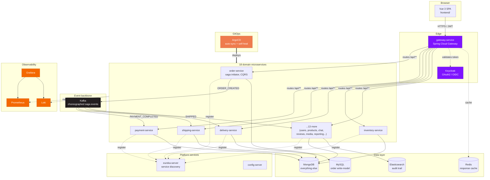
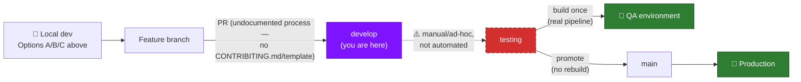

# Demo — Full-Stack Microservices Reference Architecture

**A monolith, deliberately taken apart — 17+ Spring Boot services, a Vue 3 frontend, and the entire
production toolchain around them (CI/CD, GitOps, Kubernetes, observability) — built to show not just
*how* each piece works, but *why* it exists.**

[](https://github.com/wilbertjoosen/demo/actions/workflows/ci-cd.yml)


This is `develop` — day-to-day feature work, on a single local environment. It isn't wired to any
deployed environment today; see [Release workflow: local → testing → production](#release-workflow-local--testing--production)
for the honest account of what's automated and what isn't. Two other branches complete the release
picture: `testing` (the QA environment, the only branch that builds a container image from source)
and `main` (production, which promotes whatever `testing` already validated rather than rebuilding).

---

## Table of contents

- [The big picture](#the-big-picture)
- [The stack — and why each piece is here](#the-stack--and-why-each-piece-is-here)
- [The services](#the-services)
- [Patterns demonstrated](#patterns-demonstrated)
- [Quick start](#quick-start)
- [Release workflow: local → testing → production](#release-workflow-local--testing--production)
- [CI/CD & versioning](#cicd--versioning)
- [Kubernetes / GitOps](#kubernetes--gitops)
- [Observability](#observability)
- [Config profiles: local / testing / production](#config-profiles-local--testing--production)
- [Default credentials](#default-credentials)
- [Useful URLs](#useful-urls)
- [Repo layout](#repo-layout)
- [Glossary — jargon, decoded](#glossary--jargon-decoded)

---

## The big picture



**The one-sentence version:** a browser talks to a gateway, the gateway routes to one of 18
independently-deployable services, those services choreograph a Kafka saga instead of calling each
other directly, and everything runs identically whether you launch it with a couple of `mvnw`
commands, one `docker compose up`, or a real (if locally-simulated) Kubernetes + GitOps loop.

---

## The stack — and why each piece is here

Nothing below is "because it's popular." Each row is a specific problem this project actually has,
and the tool picked to solve it — click through to the real file.

### Backend

| Technology | What it does here | Why this, not something else | Where |
|---|---|---|---|
|  **Java&nbsp;26** | Runtime for every backend service | Latest LTS-track JDK — modern language features without legacy baggage | every service's `pom.xml` |
|  **Spring&nbsp;Boot&nbsp;4** | Application framework | The de-facto standard for JVM microservices — auto-configuration, embedded Tomcat, first-class support for everything else in this stack | every service module |
|  **Spring&nbsp;Cloud&nbsp;Gateway** | API gateway / reverse proxy | One public entry point instead of 18 — routes `/api/**` by path, centralizes CORS | `gateway-service/` |
|  **Netflix&nbsp;Eureka** | Service discovery | Services register and discover each other by name, not hardcoded IPs | `eureka-server/` |
|  **Spring&nbsp;Cloud&nbsp;Config** | Centralized configuration | One place for config shared across services (currently light use) | `config-server/` |
|  **Spring&nbsp;Data** | Persistence abstraction (JPA + MongoDB) | Repository pattern out of the box — no service code touches a driver or `EntityManager` directly | every service's `repository/` package |
|  **Spring&nbsp;Kafka** | Event-driven messaging & stream processing (+ Kafka Streams) | The backbone of the choreographed saga; Kafka Streams powers `reporting-service`'s live aggregates | every `saga/` package; `reporting-service/` |
|  **Spring&nbsp;Security** | JWT validation (OAuth2 Resource Server) | Every service independently validates the same Keycloak-issued JWT — no shared session state | `common-security/` |
| **Resilience4j** | Circuit breaker | Wraps the *one* synchronous inter-service call in the system so a slow `inventory-service` can't cascade-fail order flow | `order-service/.../config/Resilience4jConfig.java` |
| **AspectJ (AOP)** | Cross-cutting audit logging | One `@Around` advice captures every REST call's request/response across every service | `common-audit/` |
|  **springdoc-openapi** | API documentation | Auto-generated Swagger UI per service, aggregated at the gateway | every service; `:8080/swagger-ui.html` |
| **Micrometer + Prometheus registry** | Metrics instrumentation | Every service exposes `/actuator/prometheus` for free | every service |
|  **spring-boot-devtools** | Fast local restarts | A rebuild while a service is running (from `start-local.sh` or an IDE run) triggers an in-process restart, not a full relaunch — the fastest inner loop this project has | every service module |
| **spring-cloud-aws** | S3 + Secrets Manager client | `product-media-service`'s file storage backend | `product-media-service/` |

### Frontend

| Technology | What it does here | Why this, not something else | Where |
|---|---|---|---|
|  **Vue&nbsp;3** | SPA framework (Composition API) | Smaller learning curve than React for the same reactivity model, first-class TypeScript support | `frontend/src/` |
|  **TypeScript** | Type safety | Catches wiring mistakes at build time instead of in a browser console | `frontend/` — `vue-tsc` runs in CI |
|  **Element&nbsp;Plus** | Component library | Production-grade tables/forms/modals without hand-building them | `frontend/src/` |
|  **Pinia** | State management | Vue's official Vuex successor — simpler API, full TypeScript inference | `frontend/src/stores/` |
| **Vue Router** | Client-side routing | Role-gated routes (`/admin` for `admin`, `/queues` for `admin`/`finance`/`warehouse`/`delivery_agent`) map directly to Keycloak realm roles | `frontend/src/router/` |
| **vue-i18n** | Internationalization | Multi-language support baked in from the start | `frontend/src/i18n/locales/` |
|  **ECharts** | Data visualization (`vue-echarts`) | Powers the reporting dashboard's charts (revenue, top products, saga health) | `frontend/src/components/admin/reports/` |
|  **Tailwind&nbsp;CSS** | Utility-first styling | Fast iteration without hand-rolled CSS sprawling across components | `frontend/src/` |
|  **Vite** | Build tool / dev server | Near-instant HMR for the dev inner loop | `frontend/vite.config.ts` |
|  **keycloak-js** | Auth adapter | Handles the OAuth2/PKCE dance with Keycloak directly from the browser | `frontend/src/auth/keycloak.ts` |

### Data & messaging

| Technology | Role | Why | Where |
|---|---|---|---|
|  **MySQL** | `order-service`'s write model | Orders need real ACID transactions — the one place in the system that isn't eventually-consistent by design | `order-service/`, `k8s/mysql.yaml` |
|  **MongoDB** | Every other service's store, + `order-service`'s read model | Schema flexibility fits domain objects that evolve fast | every other service, `k8s/mongo.yaml` |
|  **Apache&nbsp;Kafka** | Event backbone | Decouples the saga's steps completely — consumer replay gives resilience largely for free | every `saga/` package, `k8s/kafka.yaml` |
|  **Redis** | Response caching | Backs Resilience4j's cache annotations for read-heavy, slow-changing data | `k8s/redis.yaml` |
|  **Elasticsearch** | Audit trail store | Full-text/structured search over every REST call ever made | `audit-service/`, `k8s/elasticsearch.yaml` |

### Identity, infra & delivery

| Technology | Role | Why | Where |
|---|---|---|---|
|  **Keycloak** | OAuth2/OIDC identity provider | Centralized auth, roles, and user management — services never store passwords | `k8s/keycloak.yaml`, `docker/keycloak/` |
|  **Docker&nbsp;Compose** | Local infra & full-stack dev | Fastest path to "everything running" without touching Kubernetes at all | `docker-compose.yml` |
|  **k3d** | Local Kubernetes cluster (Kubernetes in Docker) | A real multi-node cluster on a laptop, no cloud account needed | [Quick start](#quick-start) Option C |
|  **ArgoCD** | GitOps continuous delivery | The cluster's actual state is *reconciled from git* — see [Kubernetes / GitOps](#kubernetes--gitops) | `k8s-argocd/` |
|  **GitHub&nbsp;Actions** | CI (test-only on this branch) | See [CI/CD & versioning](#cicd--versioning) for exactly what runs where | `.github/workflows/ci-cd.yml` |
|  **Rancher** | Kubernetes management UI | A GUI for the cluster (Secrets, pod logs, resource usage) alongside the CLI — runs in-cluster | `k8s-rancher/rancher.yaml` |

### Observability

| Technology | Signal | Why | Where |
|---|---|---|---|
|  **Prometheus** | Metrics | Pull-based scraping fits Kubernetes service discovery naturally | `k8s/prometheus.yaml` |
|  **Grafana** | Dashboards | One pane of glass over metrics and logs | `k8s/grafana.yaml` |
| **Loki** | Logs | Prometheus's label model applied to logs — cheap to run, PromQL-like queries | `k8s/loki.yaml` |
|  **Kibana** | Audit-trail search UI | Purpose-built for exploring Elasticsearch documents | `k8s/kibana.yaml` |
| **Mailpit** | Mock SMTP inbox | Catches every email the system sends without a real mail provider | `k8s/mailpit.yaml` |

> `main`/`testing` additionally run Grafana alerting, continuous profiling (Pyroscope), cluster-level
> metrics (kube-state-metrics/node-exporter), distributed tracing (Tempo), and k6 load testing — none
> of that exists on `develop` yet. See main's own README for those.

---

## The services

A choreographed Kafka saga drives an order through payment, shipping, and delivery. Every service
that isn't infrastructure is independently deployable — its own jar, its own Docker image, its own
k8s Deployment.

| Service | Port | Store | Responsibility |
|---|---|---|---|
| `gateway-service` | 8080 | — | Spring Cloud Gateway; routes `/api/**` to backend services by path, CORS |
| `eureka-server` | 8761 | — | Service discovery — every backend registers here |
| `config-server` | 8888 | — | Centralized config (currently minimal; most config is per-service `application.yaml`) |
| `user-service` | 8082 | MongoDB | User profiles; identity fields (username/email/name) are read live from Keycloak, not duplicated locally |
| `product-service` | 8083 | MongoDB | Product catalog; reserve/release stock; Spring Batch CSV bulk import |
| `order-service` | 8084 | MySQL (write) + MongoDB (read) | **Saga initiator** + **CQRS**: `POST /api/orders` hits MySQL directly (ACID), `GET /api/orders*` reads from a Mongo projection kept in sync by the same Kafka listeners the saga needs anyway |
| `payment-service` | 8086 | MongoDB | Saga participant: charges, refunds on downstream failure |
| `shipping-service` | 8088 | MongoDB | Saga participant: carrier selection (UPS/DHL), tracking |
| `delivery-service` | 8087 | MongoDB | Saga participant: last-mile delivery simulation |
| `inventory-service` | 8089 | MongoDB | Per-warehouse stock, called synchronously by `order-service` (the one sync inter-service call in the system, see [Circuit breaker](#circuit-breaker)) |
| `notification-service` | 8085 | — | Kafka consumer on every topic → WebSocket broadcast (`/ws/notifications`) + email via Mailpit |
| `audit-service` | 8090 | Elasticsearch | Consumes the audit trail every service emits; reconstructs field-level diffs and full record history |
| `chat-service` | 8094 | MongoDB | Public per-product chat rooms **and** private user-to-user direct messages (JWT-authenticated WebSocket, delivery/read receipts, typing indicators) |
| `product-comment-service` | 8091 | MongoDB | Product comments, ownership-enforced editing |
| `product-media-service` | 8092 | MongoDB + local disk | Product photos/videos/documents, file upload |
| `product-review-service` | 8093 | MongoDB | Product ratings/reviews |
| `common-service` | 8097 | MongoDB | Deployed reference-data service (countries today) shared by other services over REST — not to be confused with the `common-*` compile-time library modules below |
| `reporting-service` | 8096 | Kafka Streams (materialized state stores) | Consumes every domain event and maintains live aggregates (top products, order revenue, user growth, saga health) for the frontend's reporting dashboard. **Not fully wired into this branch's tooling yet**: absent from `docker-compose.yml`, absent from CI's build matrix, and its `k8s/reporting-service.yaml` still points at a hand-pushed image tag rather than the `ghcr.io`/commit-SHA pattern every other service uses. Runs fine via `./mvnw -pl reporting-service spring-boot:run` against the same Kafka/Eureka/config-server as everything else |
| `common-security` | — | — | Shared JWT resource-server config, reused by every service |
| `common-audit` | — | — | Shared aspect that captures every REST call's request/response for the audit trail |
| `common-model` | — | — | Shared DTOs (e.g. `Address`) |
| `frontend` | 5173 (dev) | — | Vue 3 SPA — the only thing that talks to the gateway; runs in the browser regardless of how the backend is deployed |

Kafka topics: `user-events`, `product-events`, `order-events`, `payment-events`, `shipping-events`,
`delivery-events`. Plain JSON, no schema registry — deliberate simplicity for a demo.

---

## Patterns demonstrated

### Distributed systems

- **Saga (choreography)** — `order → payment → shipping → delivery`, each step reacting to the
  previous step's Kafka event. No orchestrator. Compensation on failure always flows back through
  `payment-service` (refund) and `product-service` (stock release), regardless of which step failed.
- **CQRS** — scoped to `order-service` only: MySQL write model, Mongo read model, synced by the saga's
  own Kafka listeners rather than a separate change-data-capture pipeline.
- **Circuit breaker** — `order-service → inventory-service` is the *only* synchronous call in the
  system; everything else is async via Kafka, which gets resilience largely for free through consumer
  replay. That's exactly why the one sync call is wrapped in Resilience4j.
- **Outbox / store-and-forward** — Kafka publish failures are persisted and retried rather than
  silently dropped or blocking the request.
- **Sidecar** — demonstrated on `order-service`'s k8s pod (`k8s/order-service.yaml`): an `nginx`
  access-log sidecar in the same pod.
- **GitOps** — ArgoCD watches this repo's `k8s/` path; `kubectl apply` is not how deploys happen once
  the cluster is bootstrapped (see [Kubernetes / GitOps](#kubernetes--gitops)).
- **Audit trail without per-service instrumentation** — `common-audit`'s `RestCallAuditAspect` captures
  every REST request/response generically; `audit-service` reconstructs field-level diffs by comparing
  consecutive snapshots for the same record ID, rather than requiring Envers-style per-entity setup.

### Object-oriented & domain design

These are graded honestly below — only claiming what's actually in the code, including where a pattern
is a partial or pragmatic fit rather than textbook.

**Design patterns**

- **Repository** — every persistence-facing interface (17 `*Repository` interfaces across the reactor)
  is a Spring Data abstraction over MongoDB or JPA; service code never touches a driver or
  `EntityManager` directly.
- **Adapter** — one `*ModelAssembler` per resource (`UserModelAssembler`, `OrderViewModelAssembler`, 12
  in total, including `common-service`'s `CountryModelAssembler`) converts a persistence/domain object
  into its HATEOAS-linked API representation, keeping wire format decoupled from storage format.
- **Strategy** — `user-service`'s national-ID validation (`NationalIdStrategy`): one `@Component` per
  country (`BrazilianCpfStrategy`, `DutchBsnStrategy`, `GermanNationalIdStrategy`), collected by Spring
  into a `Map<countryCode, strategy>` and dispatched by `NationalIdValidationService`. Adding a country
  means adding a class, not editing the dispatcher — a genuine OCP win, see below.
- **Template Method** — `ChatWebSocketHandler`, `DirectMessageWebSocketHandler`, and
  `NotificationWebSocketHandler` all extend Spring's `TextWebSocketHandler`, overriding only the
  lifecycle hooks each one needs (`afterConnectionEstablished`, `handleTextMessage`); the
  connection-bookkeeping skeleton stays in the base class.
- **Interceptor** — `ChatHandshakeInterceptor` / `DirectMessageHandshakeInterceptor` hook into the
  WebSocket handshake to extract and (for direct messages) cryptographically verify identity before
  the handler ever sees a session — the same shape as a servlet filter chain.
- **Factory Method** — `DomainEvent.of(eventType, orderId, payload)` is the only way any saga event
  gets constructed, so the timestamp can't be forgotten at a call site.
- **Aspect-Oriented Programming** — `common-audit`'s `RestCallAuditAspect` captures every REST call's
  request/response with one `@Around` advice, instead of every controller method calling an audit
  helper by hand.

**SOLID**

- **SRP** — each service owns exactly one bounded context (see DDD below); within a service,
  controller/service/repository/assembler are separate classes, each with one reason to change.
- **DIP** — controllers depend on a `*Service` interface (`ConversationService`, `ChatService`,
  `UserService`, ...), never the `*Impl` directly, so an alternate implementation could swap in
  without touching any caller.
- **ISP** — those service interfaces stay narrow and use-case-shaped rather than one god interface per
  service — `ConversationService` is 7 methods, all conversation-lifecycle operations, nothing else.
- **OCP is a mixed fit here, honestly** — most extension still happens by adding an enum constant plus
  an `if`/`switch` (`PaymentMethod`, `MediaType`) rather than a polymorphic strategy class per variant.
  The clean counter-example is `user-service`'s `NationalIdStrategy` (see Strategy, above): don't
  assume the rest of the codebase follows that shape just because one corner of it does.

**Domain-Driven Design**

- **Bounded contexts** — each microservice *is* a bounded context: `order-service` only knows a
  `Shipment` as an event payload field, `chat-service` only knows a `Product` as an opaque ID. The
  service boundary and the Maven module boundary are the same boundary.
- **Domain events** — every Kafka message is a `DomainEvent` (`common-security/.../events/DomainEvent.java`),
  published after a state change and consumed to drive the next saga step — closer to a true DDD domain
  event than to a generic message-bus payload.
- **Value objects** — `Address` (`common-model`) has no identity of its own and is embedded wherever
  needed (a user's default address, an order's shipping snapshot); it's shared *because* both services
  mean the literal same concept, not out of laziness. Caveat: it's Lombok-`@Setter` mutable, not a
  textbook immutable VO — a pragmatic shortcut, not a purist one.
- **Aggregates** — `Order` (order-service, MySQL) and `Conversation` (chat-service, MongoDB) are each
  the aggregate root and consistency boundary for their own writes; `OrderView` and
  `ConversationSummary` are deliberately separate read models, not the aggregate leaking out through
  the API.
- **Ubiquitous language** — service names, event types (`ORDER_CREATED`, `PAYMENT_COMPLETED`,
  `SHIPPED`), and REST paths all use the vocabulary a product owner would use — no translation layer
  between "the business" and "the code."

---

## Quick start

| Option | Best for | What runs where |
|---|---|---|
| **A — local JVM + npm** | Fastest inner loop, debugging one service in an IDE | Infra in Docker, everything else runs directly on your machine |
| **B — full Docker Compose** | "Just show me the whole thing working" | Everything, containers only, one command |
| **C — Kubernetes (k3d) + GitOps** | Understanding how production actually deploys | The full topology, locally |

### Option A — local JVM + npm (fastest inner loop)

```bash
docker compose up -d mysql mongodb kafka keycloak mailpit elasticsearch redis
./mvnw -pl user-service,product-service,order-service,payment-service,shipping-service,delivery-service,inventory-service,notification-service,gateway-service,eureka-server,config-server,audit-service,chat-service,product-comment-service,product-media-service,product-review-service,common-service -am install -DskipTests
# then in separate terminals, per service:
./mvnw -pl <service> spring-boot:run
cd frontend && npm install && npm run dev
```

Frontend: http://localhost:5173

> **Startup ordering — matters when you launch services by hand (separate terminals or IDE run
> configs).** Bring them up in this order, waiting for each stage to be healthy before the next:
>
> 1. **Infra** (the `docker compose up -d` line above) — wait for the containers to be up.
> 2. **`eureka-server`** — wait for its dashboard at http://localhost:8761 to respond.
> 3. **`config-server`** (8888) — services read shared config (`config-repo/application.yml`) from
>    it; the `spring.config.import` is `optional:`, so they'll start without it but fall back to
>    their bundled `application.yaml` defaults.
> 4. **Everything else**, `gateway-service` last.
>
> If a business service starts before `eureka-server` is reachable you'll see
> `Connect to http://localhost:8761 failed: Connection refused` and, at the gateway,
> `503 Unable to find instance for <service>` / `No servers available for service: <service>` —
> the gateway routes purely by Eureka discovery (`uri: lb://<service>`). The Netflix client retries
> registration on a ~30s schedule so it can self-heal, but the reliable fix is to start
> `eureka-server` first and **restart any service that came up before it**.
>
> `./start-local.sh` already does this — it starts `eureka-server`, then `config-server`, then the
> rest, blocking on a health check between stages. The ordering caveat only applies when you bypass
> it.

`./start-local.sh` / `./stop-local.sh` automate the above (build, start every service + infra
container in the background, tear down again). Both take `--infra` and/or `--services` to start or
stop just one half. With no flags, both do everything. `stop-local.sh` also takes `-y` to skip its
"stop infra too?" prompt. Every backend module has `spring-boot-devtools` on the classpath, so a
rebuild while a service from these scripts (or an IDE run) is running triggers a fast in-process
restart instead of a full relaunch.

### Option B — full Docker Compose stack

```bash
docker compose up -d --build
```

Everything (infra + all 19 backend services + frontend) runs in containers on one network.

### Option C — Kubernetes (k3d) + GitOps

```bash
k3d cluster create demo --servers 1 --agents 2 -p "18090:80@loadbalancer" -p "18453:443@loadbalancer" -p "8081:8081@loadbalancer" -p "9080:9080@loadbalancer" -p "9443:9443@loadbalancer" --api-port 6550
kubectl apply -f k8s/
```

> If you already have a local `demo` cluster from before Rancher moved in-cluster, the two new
> `9080`/`9443` port mappings can only be set at cluster creation — `k3d cluster delete demo` and
> recreate with the command above (this re-seeds all in-cluster PVC data: MySQL, Mongo, Keycloak
> users, etc.).

**One-time secrets you have to create yourself after the first `kubectl apply -f k8s/`** — none of
these are committed (same "imperative, not in git" pattern as every other credential in this repo),
so every pod that needs one sits in `ImagePullBackOff`/`CreateContainerConfigError` until it exists.
Easiest done through Rancher's own **Storage → Secrets** UI (see [Useful URLs](#useful-urls) for the
login) once it's up, so the actual values never pass through a shell/AI session — or via `kubectl`
directly if you'd rather:

| Secret | Namespace | Type | Why | Details |
|---|---|---|---|---|
| `ghcr-pull-secret` | `demo` | Registry (`kubernetes.io/dockerconfigjson`) | all 17 app-service images are private `ghcr.io/wilbertjoosen/demo-*` packages | registry `ghcr.io`, your GitHub username, a PAT with `read:packages` scope as the password |
| `mysql-credentials` | `infra` | Opaque | `k8s/mysql.yaml`'s StatefulSet | keys `MYSQL_ROOT_PASSWORD`/`MYSQL_USER`/`MYSQL_PASSWORD`/`MYSQL_DATABASE` |
| `grafana-admin` | `monitoring` | Opaque | `k8s/grafana.yaml`'s Deployment | keys `GF_SECURITY_ADMIN_USER`/`GF_SECURITY_ADMIN_PASSWORD` |

No pod restart is required after creating `mysql-credentials`/`grafana-admin` (those pods are just
waiting to be scheduled). `ghcr-pull-secret` pods retry on their own kubelet backoff schedule too,
but `kubectl rollout restart deployment -n demo <name>` picks it up immediately instead of waiting
out the backoff.

App: http://demo.localhost:18090. Here's what's actually running where:

| Runs | Where | Namespace |
|---|---|---|
| Kafka, Redis, MySQL, Keycloak, Mailpit, MongoDB, Elasticsearch | In-cluster | `infra` |
| App microservices + frontend | In-cluster | `demo` |
| Grafana, Prometheus, Loki, Kibana | In-cluster | `monitoring` |

> The `-p "8081:8081@loadbalancer"` mapping is load-bearing, not optional: every service's
> `KEYCLOAK_ISSUER_URI` (and the frontend's) is hardcoded to `http://localhost:8081`. See
> [Kubernetes / GitOps](#kubernetes--gitops) for how ArgoCD takes over from here.

Day-to-day cluster start/stop is wrapped by `./k8s-local.sh {start|stop|restart|status}`.

---

## Release workflow: local → testing → production

The honest, step-by-step version of what happens to a change — deliberately not glossed over, even
where the answer is "this part isn't automated yet."



1. **Local dev** — Quick Start Options A/B/C above, entirely on your machine.
2. **Feature branch → `develop`** — genuinely undocumented, and not just here: there's no
   `CONTRIBUTING.md` or PR template anywhere in this repo. In practice this is "open a PR, get it
   merged," with no enforced process behind that.
3. **`develop` → `testing`** — also undocumented, and unlike step 2 this isn't just a missing-docs
   gap: `develop` isn't wired to any deployed environment at all. `main`'s own
   `.github/workflows/ci-cd.yml` says so directly, in its own comment: *"develop/feature branches
   aren't wired to any environment yet."* Work reaches `testing` by some manual/ad-hoc path, not a
   repeatable, documented one. **If you're picking this project back up, this is the actual gap to
   close, not a wording fix.**
4. **Push to `testing` → build once, deploy to QA** — `testing`'s copy of `.github/workflows/ci-cd.yml`
   (a different file than the one on `develop` — see [CI/CD & versioning](#cicd--versioning)) runs
   the real pipeline: test, detect changed services, build + push images to GHCR, bump `testing`'s
   own `k8s/*.yaml`, ArgoCD syncs the `demo-qa` namespace. This is the **only** branch that ever
   builds an image from source.
5. **`testing` → `main` (production)** — a push to `main` never rebuilds. A dedicated
   `promote-to-production` job instead copies the exact image tags `testing` is already running
   straight into `main`'s own `k8s/*.yaml` and commits — so whatever ships to production is
   bit-for-bit what was already validated in QA.
6. **ArgoCD takes it from there** — ArgoCD's own `selfHeal`/`automated` sync picks up the manifest
   commit from step 4 or 5 and reconciles the cluster; nothing further is manual once a commit lands
   on `testing` or `main`.

`develop` (this branch) sits entirely outside that automated chain — its own `ci-cd.yml` (see
[CI/CD & versioning](#cicd--versioning)) only tests and, on push to `main`, builds — a leftover from
before `testing`/`main` grew the promotion pipeline above, not something `develop` itself deploys
anywhere.

---

## CI/CD & versioning

`.github/workflows/ci-cd.yml` on **this branch** is single-environment, build-on-push: a push to
`main` runs the full pipeline straight from source — there's no `testing` → `main` promotion step
here (that more mature build-once/promote-many model exists on the `main`/`testing` branches' own
`ci-cd.yml` — see [Release workflow](#release-workflow-local--testing--production)). `develop` hasn't
picked that pipeline up yet; treat this section as "what actually runs if you push this branch's own
workflow file," not as a description of `main`'s.

On a push to `main` (or a PR against it, test-only — nothing downstream runs for a PR):

| Gate | What happens | File |
|---|---|---|
| **1. Test** | Full Maven reactor `verify` (Checkstyle, SpotBugs, Testcontainers-backed integration tests) + frontend `lint`/typecheck/build. Nothing downstream runs if this fails | `.github/workflows/ci-cd.yml` |
| **2. Detect changed services** | Path-filters the diff against the previous commit on `main` (`fetch-depth: 0`) so only services whose own directory changed get rebuilt; a shared module or `Dockerfile.service` changing forces a full rebuild | same file |
| **3. Build & push** | Each changed service's image → GHCR, tagged with the commit SHA (what the k8s manifests actually deploy by) and the service's own semver version | same file |
| **4. Update manifests** | Bumps the changed services' `image:` lines in `k8s/*.yaml`, commits back to `main` (`[skip ci]`), gated behind the build succeeding | same file |

GHCR packages are private, so every Deployment references `imagePullSecrets: ghcr-pull-secret` — a
`kubernetes.io/dockerconfigjson` Secret created directly in the `demo` namespace via `kubectl create
secret docker-registry`, never committed to git.

---

## Kubernetes / GitOps

`k8s/` holds every application manifest. ArgoCD itself is installed once into an `argocd` namespace
(`kubectl apply -n argocd -f https://raw.githubusercontent.com/argoproj/argo-cd/stable/manifests/install.yaml`),
then `k8s-argocd/application.yaml` is applied to point it at this repo's `k8s/` path with auto-sync +
self-heal enabled. From there ArgoCD watches `main` on its own. Rancher is bootstrapped the same
manual, one-time way: `kubectl apply -f k8s-rancher/` brings up an in-cluster Rancher in the
`cattle-system` namespace. Like ArgoCD, it's deliberately kept outside ArgoCD's own sync path — a
tool shouldn't be managed by the thing it manages.

**On this branch specifically, the local iteration loop is more manual than `main`/`testing`'s
CI-driven one** — there's no registry step here for a purely local change:

1. Edit a manifest in `k8s/`, or push code that needs a new image
2. If code changed, build+import locally, tagged with that service's own real version number:
   - Backend: `docker build -f Dockerfile.service --build-arg SERVICE=<name> -t demo/<name>:<version-from-pom.xml> .`
     then `k3d image import demo/<name>:<version> -c demo`
   - Frontend: `docker build --build-arg MODE=k8s -t demo/frontend:<version-from-package.json> frontend/`
     then `k3d image import demo/frontend:<version> -c demo` — `MODE=k8s` matters (see
     `frontend/Dockerfile`'s comment): the default `production` mode bakes in `localhost:*` URLs for
     the docker-compose/host-JVM dev flow, which don't work through the k8s Traefik ingress
3. Update the manifest's `image:` field to match the tag you just imported
4. `git push` — ArgoCD picks up manifest changes on its own; a changed image still needs
   `kubectl -n demo rollout restart deployment/<name>` to actually pick up the freshly-imported image

`Dockerfile.service` (repo root) is a single parameterized Dockerfile (`--build-arg SERVICE=<module>`)
shared by every backend service. CI's own bootstrap-correction step rewrites any manifest still
pointing at a local `demo/<name>:<tag>` image to the real `ghcr.io` SHA tag automatically, the first
time that service's CI build succeeds after being deployed this way.

---

## Observability

- **Metrics**: every service exposes `/actuator/prometheus`. `k8s/prometheus.yaml` scrapes it via
  native Kubernetes service discovery (no Operator, no Helm) — every Service labeled
  `monitored: "true"`. Feeds a Grafana (`k8s/grafana.yaml`) with a pre-provisioned "Services
  Overview" dashboard.
- **Logs**: services log to stdout. In k8s, Promtail (`k8s/promtail-daemonset.yaml`) ships every
  pod's logs to Loki (`k8s/loki.yaml`) — query through Grafana's Explore tab. In the host-JVM dev
  flow, logs just go to the terminal.
- **Audit trail**: every REST call across every service is captured (who, what, when, request/response
  bodies with secrets redacted) and shipped to Elasticsearch, viewable in Kibana (`k8s/kibana.yaml`).
  The admin UI's history icons (Users, Products, Media, Chat) show the full change timeline with
  before/after diffs per field, powered by `audit-service`'s `RecordHistoryService`.

> This branch doesn't yet have alerting, distributed tracing, continuous profiling, cluster-level
> metrics, or load testing — all of that lives on `main`/`testing` only, since it's a shared
> `monitoring` namespace those two branches maintain. See main's own README for the details.

---

## Config profiles: local / testing / production

Every service's bundled `application.yaml` carries only its **local** defaults (single-instance
Mongo, `keycloak.localhost:8181`) — the values that make Option A/B host-JVM dev work with zero
env vars set. Each service also ships `application-testing.yaml` and `application-production.yaml`
next to it, holding the QA/prod-shaped defaults (3-node replica-set Mongo URI, `localhost:8081`
Keycloak) that used to live baked directly into the `testing`/`main` branches' own copies of
`application.yaml` — the exact values a hand-merge between branches had to reconcile line-by-line
every time.

**This does not change anything about how QA or production actually run today.** Both
`k8s/configmap-common.yaml` (per namespace) already inject `MONGO_HOST`, `MONGO_REPLICA_SET_PARAM`,
`KEYCLOAK_ISSUER_URI`, etc. directly as env vars on every Deployment, and an explicit env var always
wins over a YAML default regardless of which profile is active — so `SPRING_PROFILES_ACTIVE` is
never set anywhere in `k8s/`, and doesn't need to be. The profile files exist so the three branches
can carry one identical `application.yaml`, with the environment-specific values isolated
somewhere a merge never has to touch.

---

## Default credentials

| User | Password | Realm role |
|---|---|---|
| `demo` | `demo` | `user` |
| `admin` | `admin` | `user`, `admin` |
| `manager` | `manager` | `finance`, `product_manager`, `shipping_manager`, `inventory_manager` |

Realm: `demo`. Client: `demo-spa` (public, PKCE).

The login page itself uses a custom "demo" theme (`docker/keycloak/themes/demo`) instead of stock
Keycloak branding — purple accent/button matching the frontend's own palette, realm `displayName`
("Demo") shown in place of the Keycloak wordmark. See the theme's own `styles.css` comment for why
it extends `keycloak.v2` via `@import` rather than the more obvious-looking `styles=` override
(the latter silently drops the base theme's layout rules).

> **Two separate Keycloak instances, deliberately different hostnames:** docker-compose's own
> Keycloak (used by both local-dev flows — Option A host-JVM and Option B full-compose) answers on
> `http://keycloak.localhost:8181`, while the k3d/k8s cluster's Keycloak answers on
> `http://localhost:8081`. They used to both be bare `localhost`, differing only by port — but
> browser cookies are scoped by domain, not port, so the two instances shared one cookie jar and
> stomped on each other's `KC_RESTART`/session cookies the moment you used both in the same browser
> (reproducible: log into one, and the other's in-flight login breaks with "Restart login cookie not
> found"). `keycloak.localhost` resolves to loopback with zero setup, so this isolates the two
> instances' cookies for free and lets you run both environments in the same browser at once.

## Useful URLs

| Tool | URL | Credentials |
|---|---|---|
| Frontend (dev) | http://localhost:5173 | — |
| Frontend (k8s) | http://demo.localhost:18090 | — |
| Keycloak admin | http://localhost:8081 | `admin` / `admin` (realm: **`demo`**, not `master` — see note below) |
| Swagger UI (aggregated) | http://localhost:8080/swagger-ui.html | — |
| Grafana (k8s, in-cluster) | http://grafana.demo.localhost:18090 | `GF_SECURITY_ADMIN_USER`/`PASSWORD` from the `grafana-admin` Secret (create via Rancher's Secrets UI) |
| Prometheus (k8s, in-cluster) | http://prometheus.demo.localhost:18090 | — |
| Kibana (k8s, in-cluster) | http://kibana.demo.localhost:18090 | — |
| Kafka UI | http://localhost:8095 | — |
| Mailpit (SMTP inbox) | http://localhost:8025 | — |
| Rancher (k8s, in-cluster) | https://localhost:9443 | bootstrap password `rancherdemo123` (set via `CATTLE_BOOTSTRAP_PASSWORD` in `k8s-rancher/rancher.yaml`) |
| ArgoCD | http://argocd.localhost:18090 (via `k8s-argocd/ingress.yaml`) | `admin` / `kubectl -n argocd get secret argocd-initial-admin-secret -o jsonpath='{.data.password}' \| base64 -d` |

> **Keycloak gotcha:** the admin console defaults to the `master` realm, which only ever contains the
> bootstrap admin. Application users (`demo`, `admin`, `manager`, everyone created through the app)
> live in the **`demo`** realm — switch realms via the dropdown in the top-left before looking for them.

### Infrastructure connection ports

For connecting a DB client, `redis-cli`, `kcat`, etc. directly rather than through a UI. These host
ports back the Docker Compose containers used by the local JVM dev flow and host-tool debugging
only — k8s pods reach their own **in-cluster** Kafka, Redis, MySQL, Keycloak, Mailpit, MongoDB, and
Elasticsearch instead, addressed via `k8s/configmap-common.yaml`, not the ports below:

| Service | Host:Port | Notes |
|---|---|---|
| MySQL | `localhost:3306` | `order-service`'s write model (db `demo`, user/pass `demo`/`demo`); dev-only |
| MongoDB | `localhost:27017` | every other service's store, one logical DB per service; dev-only |
| Kafka (host clients) | `localhost:9092` | `PLAINTEXT` listener for local JVM services / host tools; dev-only |
| Redis | `localhost:6379` | Resilience4j response caching (host-JVM/IDE dev flow, `redis-cli`); dev-only |
| Elasticsearch | `localhost:9200` | `audit-service`'s store; dev-only |
| Mailpit SMTP | `localhost:1025` | what `notification-service` actually sends to; `:8025` above is its web inbox; dev-only |

k3d cluster ports: `18090` → Traefik HTTP (frontend, ArgoCD, Loki, Grafana, Prometheus, and Kibana
ingresses), `18453` → Traefik HTTPS, `8081` → in-cluster Keycloak specifically (load-bearing, not a
convenience port), `9080`/`9443` → in-cluster Rancher specifically, `6550` → the k8s API server
(`kubectl` uses this automatically via your kubeconfig context, not something you visit directly).

---

## Repo layout

```
demo/
├── common-security/, common-audit/, common-model/   # shared library modules
├── eureka-server/, config-server/, gateway-service/  # platform services
├── user-service/, product-service/, order-service/, payment-service/,
│   shipping-service/, delivery-service/, inventory-service/,
│   notification-service/, audit-service/, chat-service/,
│   product-comment-service/, product-media-service/, product-review-service/,
│   common-service/
├── frontend/                # Vue 3 SPA
├── docker/                  # Keycloak realm, Grafana/Kibana/Prometheus provisioning
├── k8s/                     # Kubernetes manifests (ArgoCD-synced), incl. kafka.yaml/redis.yaml
│                             #   for the in-cluster infra those pods depend on
├── docker-compose.yml       # full local stack (infra + every service + frontend)
├── start-local.sh, stop-local.sh  # host-JVM/npm dev flow — each takes --infra and/or --services
├── k8s-local.sh             # k3d cluster + its host infra: start/stop/restart/status
└── pom.xml                  # Maven reactor parent
```

Each backend service module follows the same internal package layout under its base package
(`com.example.<service>`): `config/` (Spring `@Configuration`/security config), `controller/`
(REST endpoints), `enums/` (status/type enums), `model/` (entities, DTOs, `*ModelAssembler`s),
`repository/` (Spring Data repositories), `saga/` (`@KafkaListener` domain-event consumers,
including the choreographed-saga participants), `service/` (business logic, external clients).
Modules with a WebSocket surface (`chat-service`, `notification-service`) add a `websocket/`
package for handlers/interceptors. The `*ServiceApplication` bootstrap class stays directly in the
base package, not in any sub-package.

---

## Glossary — jargon, decoded

Plain-English definitions for every term used above, for anyone landing here without a distributed
systems background.

| Term | In one sentence |
|---|---|
| **Microservice** | A small, independently-deployable application that owns one piece of the business instead of one giant program doing everything |
| **Monolith** | The opposite of microservices — one single application containing all the logic, deployed as one unit |
| **API Gateway** | The single "front door" that every external request goes through before being routed to the right internal service |
| **Service discovery** | How services find each other's network address automatically, instead of that address being hardcoded |
| **Event-driven architecture** | Services communicate by announcing "this happened" (an event) rather than directly calling each other and waiting for a response |
| **Saga** | A way to keep data consistent across multiple services without a single database transaction spanning all of them — each step reacts to the previous one, and failures trigger compensating actions |
| **Choreography vs. orchestration** | Choreography: each service reacts independently to events, no one's in charge (used here). Orchestration: one central coordinator tells every other service what to do next |
| **CQRS** | Using a different, optimized data model for writing data than for reading it |
| **Circuit breaker** | A safety mechanism that stops calling a struggling downstream service for a while, instead of hammering it with requests that will just fail anyway |
| **Eventual consistency** | Different parts of the system will agree on the current state *eventually*, not necessarily the instant something changes |
| **JWT (JSON Web Token)** | A signed, tamper-proof token that proves who a user is and what they're allowed to do |
| **OAuth2 / OIDC** | Industry-standard protocols for "let a user log in once, and have every service trust that login" |
| **GitOps** | Deploying software by having a system continuously match a live environment to what's declared in a git repository |
| **CI/CD** | Automatically testing every code change (CI) and automatically getting validated changes into an environment (CD) |
| **Container** | A packaged application plus everything it needs to run, isolated from the host machine |
| **Kubernetes (k8s)** | A system that runs and manages containers across a cluster of machines |
| **Namespace (k8s)** | A way to partition one Kubernetes cluster into isolated sections |
| **Pod (k8s)** | The smallest deployable unit in Kubernetes — usually one container, sometimes a container plus a small helper ("sidecar") |
| **Observability** | The general ability to understand what's happening inside a running system from the outside |
| **Metrics** | Numbers over time — good for "is something wrong right now" |
| **Logs** | Timestamped text records of what a program did — good for "what exactly happened" |
