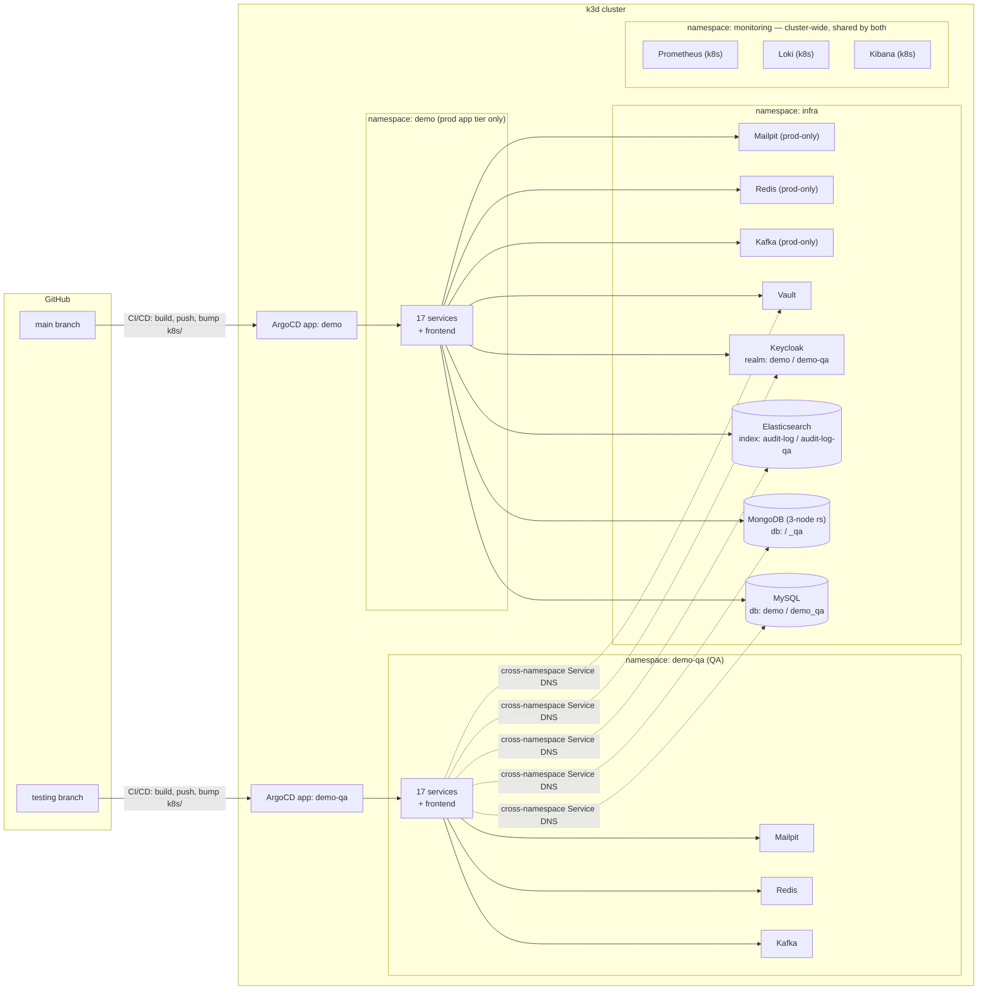

# Demo — Microservices Architecture Playground

This project illustrates a software workflow spanning feature development on the `develop` branch,
automated CI/CD validation in the `testing`/QA environment, and automated continuous delivery to the
production Kubernetes cluster via ArgoCD GitOps — see [Release workflow: local → testing →
production](#release-workflow-local--testing--production) for exactly which of those hops are
automated today and which aren't (`develop` itself isn't wired to any deployed environment yet — see
that section for the honest version). Beyond the workflow, it serves as a from-scratch rebuild of a
single Spring Boot monolith into a full microservices system, built as a hands-on reference for why
you'd reach for a given distributed-systems pattern, not just how to wire it up. Every pattern below
exists because a concrete problem in this domain needed it — see [Patterns
demonstrated](#patterns-demonstrated) for the reasoning behind each one.

**Stack:**
- Spring Boot 4 / Java 26 backend (21 modules)
- Vue 3 + TypeScript + Element Plus frontend, Pinia (state), Vue Router, vue-i18n, axios, ECharts
  (`vue-echarts`, the reporting dashboard's charts), Tailwind CSS, ESLint + `vue-tsc`, Vite
- MySQL
- MongoDB
- Kafka (plus Kafka Streams for `reporting-service`'s materialized views)
- Redis
- Elasticsearch
- Keycloak (OAuth2/OIDC) — `keycloak-js` adapter on the frontend
- Eureka + Spring Cloud Gateway
- springdoc-openapi (per-service Swagger UI, aggregated at the gateway)
- Micrometer + Prometheus registry (every service), AspectJ (`common-audit`'s cross-cutting request
  audit)
- spring-cloud-aws (S3 + Secrets Manager — `product-media-service`'s file storage)
- Prometheus
- Grafana
- Loki
- Kibana
- Docker Compose for local infra
- Kubernetes/GitOps loop
- Mailpit (mock mail)
- Rancher

## Architecture

A choreographed Kafka saga drives an order through payment, shipping, and delivery. Every service
that isn't infrastructure is independently deployable — its own jar, its own Docker image, its own k8s
Deployment.

| Service | Port | Store | Responsibility |
|---|---|---|---|
| `gateway-service` | 8080 | — | Spring Cloud Gateway; routes `/api/**` to backend services by path, CORS |
| `eureka-server` | 8761 | — | Service discovery — every backend registers here |
| `config-server` | 8888 | — | Centralized config (currently minimal; most config is per-service `application.yaml`) |
| `user-service` | 8082 | MongoDB | User profiles; identity fields (username/email/name) are read live from Keycloak, not duplicated locally |
| `product-service` | 8083 | MongoDB | Product catalog; reserve/release stock; Spring Batch CSV bulk import |
| `order-service` | 8084 | MySQL (write) + MongoDB (read) | **Saga initiator** + **CQRS**: `POST /api/orders` hits MySQL directly (ACID), `GET /api/orders*` reads from a Mongo projection kept in sync by the same Kafka listeners the saga needs anyway |
| `payment-service` | 8086 | MongoDB | Saga participant: charges, refunds on downstream failure |
| `shipping-service` | 8088 | MongoDB | Saga participant: carrier selection (UPS/DHL), tracking |
| `delivery-service` | 8087 | MongoDB | Saga participant: last-mile delivery simulation |
| `inventory-service` | 8089 | MongoDB | Per-warehouse stock, called synchronously by `order-service` (the one sync inter-service call in the system, see [Circuit breaker](#circuit-breaker)) |
| `notification-service` | 8085 | — | Kafka consumer on every topic → WebSocket broadcast (`/ws/notifications`) + email via Mailpit |
| `audit-service` | 8090 | Elasticsearch | Consumes the audit trail every service emits; reconstructs field-level diffs and full record history |
| `chat-service` | 8094 | MongoDB | Public per-product chat rooms **and** private user-to-user direct messages (JWT-authenticated WebSocket, delivery/read receipts, typing indicators) |
| `product-comment-service` | 8091 | MongoDB | Product comments, ownership-enforced editing |
| `product-media-service` | 8092 | MongoDB + local disk | Product photos/videos/documents, file upload |
| `product-review-service` | 8093 | MongoDB | Product ratings/reviews |
| `common-service` | 8097 | MongoDB | Deployed reference-data service (countries today) shared by other services over REST — not to be confused with the `common-*` compile-time library modules below |
| `reporting-service` | 8096 | Kafka Streams (materialized state stores) | Consumes every domain event and maintains live aggregates (top products, order revenue, user growth, saga health) for the frontend's reporting dashboard. **Not fully wired into this branch's tooling yet**: absent from `docker-compose.yml` (unreachable via the full-stack Option B), absent from `.github/workflows/ci-cd.yml`'s path-filter/build matrix (never auto-built/deployed here), and its `k8s/reporting-service.yaml` still points at a hand-pushed `demo/reporting-service:1.0.2` image rather than the `ghcr.io`/commit-SHA pattern every other service uses. Runs fine via `./mvnw -pl reporting-service spring-boot:run` (Option A) against the same Kafka/Eureka/config-server as everything else. |
| `common-security` | — | — | Shared JWT resource-server config, reused by every service |
| `common-audit` | — | — | Shared aspect that captures every REST call's request/response for the audit trail |
| `common-model` | — | — | Shared DTOs (e.g. `Address`) |
| `frontend` | 5173 (dev) | — | Vue 3 SPA — the only thing that talks to the gateway; runs in the browser regardless of how the backend is deployed |

Kafka topics: `user-events`, `product-events`, `order-events`, `payment-events`, `shipping-events`,
`delivery-events`. Plain JSON, no schema registry — deliberate simplicity for a demo.

## Patterns demonstrated

### Distributed systems

- **Saga (choreography)** — `order → payment → shipping → delivery`, each step reacting to the
  previous step's Kafka event. No orchestrator. Compensation on failure always flows back through
  `payment-service` (refund) and `product-service` (stock release), regardless of which step failed.
- **CQRS** — scoped to `order-service` only: MySQL write model, Mongo read model, synced by the saga's
  own Kafka listeners rather than a separate change-data-capture pipeline.
- **Circuit breaker** — `order-service → inventory-service` is the *only* synchronous call in the
  system; everything else is async via Kafka, which gets resilience largely for free through consumer
  replay. That's exactly why the one sync call is wrapped in Resilience4j.
- **Outbox / store-and-forward** — Kafka publish failures are persisted and retried rather than
  silently dropped or blocking the request.
- **Sidecar** — demonstrated on `order-service`'s k8s pod (`k8s/order-service.yaml`): an `nginx`
  access-log sidecar in the same pod.
- **GitOps** — ArgoCD watches this repo's `k8s/` path; `kubectl apply` is not how deploys happen once
  the cluster is bootstrapped (see [Kubernetes / GitOps](#kubernetes--gitops)).
- **Audit trail without per-service instrumentation** — `common-audit`'s `RestCallAuditAspect` captures
  every REST request/response generically; `audit-service` reconstructs field-level diffs by comparing
  consecutive snapshots for the same record ID, rather than requiring Envers-style per-entity setup.

### Object-oriented & domain design

These are graded honestly below — only claiming what's actually in the code, including where a pattern
is a partial or pragmatic fit rather than textbook.

**Design patterns**

- **Repository** — every persistence-facing interface (17 `*Repository` interfaces across the reactor)
  is a Spring Data abstraction over MongoDB or JPA; service code never touches a driver or
  `EntityManager` directly.
- **Adapter** — one `*ModelAssembler` per resource (`UserModelAssembler`, `OrderViewModelAssembler`, 12
  in total, including `common-service`'s `CountryModelAssembler`) converts a persistence/domain object
  into its HATEOAS-linked API representation, keeping wire format decoupled from storage format.
- **Strategy** — `user-service`'s national-ID validation (`NationalIdStrategy`): one `@Component` per
  country (`BrazilianCpfStrategy`, `DutchBsnStrategy`, `GermanNationalIdStrategy`), collected by Spring
  into a `Map<countryCode, strategy>` and dispatched by `NationalIdValidationService`. Adding a country
  means adding a class, not editing the dispatcher — a genuine OCP win, see below.
- **Template Method** — `ChatWebSocketHandler`, `DirectMessageWebSocketHandler`, and
  `NotificationWebSocketHandler` all extend Spring's `TextWebSocketHandler`, overriding only the
  lifecycle hooks each one needs (`afterConnectionEstablished`, `handleTextMessage`); the
  connection-bookkeeping skeleton stays in the base class.
- **Interceptor** — `ChatHandshakeInterceptor` / `DirectMessageHandshakeInterceptor` hook into the
  WebSocket handshake to extract and (for direct messages) cryptographically verify identity before
  the handler ever sees a session — the same shape as a servlet filter chain.
- **Factory Method** — `DomainEvent.of(eventType, orderId, payload)` is the only way any saga event
  gets constructed, so the timestamp can't be forgotten at a call site.
- **Aspect-Oriented Programming** — `common-audit`'s `RestCallAuditAspect` captures every REST call's
  request/response with one `@Around` advice, instead of every controller method calling an audit
  helper by hand.

**SOLID**

- **SRP** — each service owns exactly one bounded context (see DDD below); within a service,
  controller/service/repository/assembler are separate classes, each with one reason to change.
- **DIP** — controllers depend on a `*Service` interface (`ConversationService`, `ChatService`,
  `UserService`, ...), never the `*Impl` directly, so an alternate implementation could swap in
  without touching any caller.
- **ISP** — those service interfaces stay narrow and use-case-shaped rather than one god interface per
  service — `ConversationService` is 7 methods, all conversation-lifecycle operations, nothing else.
- **OCP is a mixed fit here, honestly** — most extension still happens by adding an enum constant plus
  an `if`/`switch` (`PaymentMethod`, `MediaType`) rather than a polymorphic strategy class per variant.
  The clean counter-example is `user-service`'s `NationalIdStrategy` (see Strategy, above): don't
  assume the rest of the codebase follows that shape just because one corner of it does.

**Domain-Driven Design**

- **Bounded contexts** — each microservice *is* a bounded context: `order-service` only knows a
  `Shipment` as an event payload field, `chat-service` only knows a `Product` as an opaque ID. The
  service boundary and the Maven module boundary are the same boundary.
- **Domain events** — every Kafka message is a `DomainEvent` (`common-security/.../events/DomainEvent.java`),
  published after a state change and consumed to drive the next saga step — closer to a true DDD domain
  event than to a generic message-bus payload.
- **Value objects** — `Address` (`common-model`) has no identity of its own and is embedded wherever
  needed (a user's default address, an order's shipping snapshot); it's shared *because* both services
  mean the literal same concept, not out of laziness. Caveat: it's Lombok-`@Setter` mutable, not a
  textbook immutable VO — a pragmatic shortcut, not a purist one.
- **Aggregates** — `Order` (order-service, MySQL) and `Conversation` (chat-service, MongoDB) are each
  the aggregate root and consistency boundary for their own writes; `OrderView` and
  `ConversationSummary` are deliberately separate read models, not the aggregate leaking out through
  the API.
- **Ubiquitous language** — service names, event types (`ORDER_CREATED`, `PAYMENT_COMPLETED`,
  `SHIPPED`), and REST paths all use the vocabulary a product owner would use — no translation layer
  between "the business" and "the code."

## Quick start

### Option A — local JVM + npm (fastest inner loop)

Bring up infra only, then run services directly:

```bash
docker compose up -d mysql mongodb kafka keycloak mailpit elasticsearch redis
./mvnw -pl user-service,product-service,order-service,payment-service,shipping-service,delivery-service,inventory-service,notification-service,gateway-service,eureka-server,config-server,audit-service,chat-service,product-comment-service,product-media-service,product-review-service,common-service -am install -DskipTests
# then in separate terminals, per service:
./mvnw -pl <service> spring-boot:run
cd frontend && npm install && npm run dev
```

Frontend: http://localhost:5173

`./start-local.sh` / `./stop-local.sh` automate the above (build, start every service + infra
container in the background, tear down again). Both take `--infra` and/or `--services` to start or
stop just one half — e.g. `./start-local.sh --infra` to bring up only the Docker containers, or
`./stop-local.sh --services` to kill just the local `mvnw`/`npm` processes and leave infra running.
With no flags, both do everything (unchanged default behavior). `stop-local.sh` also takes `-y` to
skip its "stop infra too?" prompt. Every backend module also now has `spring-boot-devtools` on the
classpath, so a rebuild while a service from these scripts (or an IDE run) is running triggers a
fast in-process restart instead of a full relaunch.

### Option B — full Docker Compose stack

```bash
docker compose up -d --build
```

Everything (infra + all 19 backend services + frontend) runs in containers on one network.

### Option C — Kubernetes (k3d) + GitOps

```bash
k3d cluster create demo --servers 1 --agents 2 -p "18090:80@loadbalancer" -p "18453:443@loadbalancer" -p "8081:8081@loadbalancer" -p "9080:9080@loadbalancer" -p "9443:9443@loadbalancer" --api-port 6550
kubectl apply -f k8s/
```

> If you already have a local `demo` cluster from before Rancher moved in-cluster, the two new
> `9080`/`9443` port mappings can only be set at cluster creation — `k3d cluster delete demo` and
> recreate with the command above (this re-seeds all in-cluster PVC data: MySQL, Mongo, Keycloak
> users, etc.).

**One-time secrets you have to create yourself after the first `kubectl apply -f k8s/`** — none of
these are committed (same "imperative, not in git" pattern as every other credential in this repo),
so every pod that needs one sits in `ImagePullBackOff`/`CreateContainerConfigError` until it exists.
Easiest done through Rancher's own **Storage → Secrets** UI (see [Useful URLs](#useful-urls) for the
login) once it's up, so the actual values never pass through a shell/AI session — or via `kubectl`
directly if you'd rather:

| Secret | Namespace | Type | Why | Details |
|---|---|---|---|---|
| `ghcr-pull-secret` | `demo` | Registry (`kubernetes.io/dockerconfigjson`) | all 17 app-service images are private `ghcr.io/wilbertjoosen/demo-*` packages | registry `ghcr.io`, your GitHub username, a PAT with `read:packages` scope as the password |
| `mysql-credentials` | `infra` | Opaque | `k8s/mysql.yaml`'s StatefulSet | keys `MYSQL_ROOT_PASSWORD`/`MYSQL_USER`/`MYSQL_PASSWORD`/`MYSQL_DATABASE` — see `k8s/mysql.yaml`'s comment for the exact demo-scale values |
| `grafana-admin` | `monitoring` | Opaque | `k8s/grafana.yaml`'s Deployment | keys `GF_SECURITY_ADMIN_USER`/`GF_SECURITY_ADMIN_PASSWORD` — see `k8s/grafana.yaml`'s comment |

No pod restart is required after creating `mysql-credentials`/`grafana-admin` (those pods are just
waiting to be scheduled). `ghcr-pull-secret` pods will retry on their own kubelet backoff schedule
too, but `kubectl rollout restart deployment -n demo <name>` (or all of them at once via `kubectl
get deployments -n demo -o name | xargs -I{} kubectl rollout restart {} -n demo`) picks it up
immediately instead of waiting out the backoff.

App: http://demo.localhost:18090 — Kafka, Redis, MySQL, Keycloak, Mailpit, MongoDB, and
Elasticsearch all run in-cluster now (`k8s/kafka.yaml`, `k8s/redis.yaml`, `k8s/mysql.yaml`,
`k8s/keycloak.yaml`, `k8s/mailpit.yaml`, `k8s/mongo.yaml`, `k8s/elasticsearch.yaml`, wired up via
`k8s/configmap-common.yaml`) — the Docker Compose equivalents are still there for host-JVM/IDE dev
flows and host-tool debugging (`kcat`, `redis-cli`, a mysql client), they're just no longer what
the cluster itself depends on. All of this infra deploys into its own `infra` namespace
(`k8s/namespace-infra.yaml`), separate from the `demo` namespace the app microservices/frontend run
in — app services reach it via fully-qualified cross-namespace DNS
(`<service>.infra.svc.cluster.local`, see `k8s/configmap-common.yaml`), same pattern already used
to reach Loki in `monitoring` (below). Grafana, Prometheus, and Kibana now run in-cluster too
(`k8s/grafana.yaml`, `k8s/prometheus.yaml`, `k8s/kibana.yaml`, all in `monitoring` alongside Loki)
— they were removed from Docker Compose entirely rather than kept as unused host copies, since
nothing (host-JVM dev included) ever needed a separate instance of them. The `-p
"8081:8081@loadbalancer"` mapping is load-bearing, not optional: every service's
`KEYCLOAK_ISSUER_URI` (and the frontend's) is hardcoded to `http://localhost:8081`, so in-cluster
Keycloak has to keep answering there too — see `k8s/keycloak.yaml`'s comment for the full
reasoning. See [Kubernetes / GitOps](#kubernetes--gitops) for how ArgoCD takes over from here, and
note the one manual step k3d always needs: **new/changed Docker images must be `k3d image
import`ed** — there's no registry, so ArgoCD only manages manifests, never image builds.

Day-to-day cluster start/stop (the cluster plus the host infra it depends on) is wrapped by
`./k8s-local.sh {start|stop|restart|status}` — e.g. `./k8s-local.sh stop` runs `k3d cluster stop demo`
then `docker compose stop`; `./k8s-local.sh start` runs `docker compose up -d` then
`k3d cluster start demo` and tails `kubectl get pods -A -w` (pass `--no-watch` to skip the tail).
`start`/`stop` only touch the infra pods actually need — which, with Kafka, Redis, MySQL, Keycloak,
Mailpit, MongoDB, and Elasticsearch all in-cluster (and Grafana/Prometheus/Loki/Promtail/Kibana not
in Docker Compose at all any more), is nothing at all (`K8S_INFRASTRUCTURE` in `local-infra.sh` is
empty). Not docker-compose's own app
containers either (Option B, irrelevant when using k8s). Pass `--with-dev` to also start/stop the
full dev-only set, e.g. if `start-local.sh`'s host-JVM services are running against the same
docker-compose stack at the same time.

## Release workflow: local → testing → production

The honest, step-by-step version of what happens to a change, since the mechanics live scattered
across [CI/CD & versioning](#cicd--versioning) and [QA / testing environment](#qa--testing-environment)
below and don't read as one story on their own:

1. **Local dev** — Quick Start Options A/B/C above, entirely on your machine.
2. **Feature branch → `develop`** — genuinely undocumented, and not just here: there's no
   `CONTRIBUTING.md` or PR template anywhere in this repo. In practice this is "open a PR, get it
   merged," with no enforced process behind that.
3. **`develop` → `testing`** — also undocumented, and unlike step 2 this isn't just a missing-docs
   gap: `develop` isn't wired to any deployed environment at all. `main`'s own
   `.github/workflows/ci-cd.yml` says so directly, in its own comment: *"develop/feature branches
   aren't wired to any environment yet."* Work reaches `testing` by some manual/ad-hoc path (its git
   history shows no `develop`-merge commits — just a linear history plus CI's own auto-committed
   manifest bumps), not a repeatable, documented one. If you're picking this project back up, this is
   the actual gap to close, not a wording fix.
4. **Push to `testing` → build once, deploy to QA** — `testing`'s copy of `.github/workflows/ci-cd.yml`
   (a different file than the one on `develop` — see the note in
   [CI/CD & versioning](#cicd--versioning)) runs the real pipeline: test, detect changed services,
   build + push images to GHCR, bump `testing`'s own `k8s/*.yaml`, ArgoCD syncs the `demo-qa`
   namespace. This is the **only** branch that ever builds an image from source.
5. **`testing` → `main` (production)** — a push to `main` never rebuilds. Verified straight from
   `main`'s workflow file: a dedicated `promote-to-production` job instead copies the exact image
   tags `testing` is already running straight into `main`'s own `k8s/*.yaml` and commits — so
   whatever ships to production is bit-for-bit what was already validated in QA, never a fresh build
   of the same source. `workflow_dispatch` is the one deliberate escape hatch that still builds
   directly from `main` (a genuine hotfix with nothing on `testing` to promote from, or a rebuild that
   doesn't touch any single service's own path).
6. **ArgoCD takes it from there** — ArgoCD's own `selfHeal`/`automated` sync (see [Kubernetes /
   GitOps](#kubernetes--gitops)) picks up the manifest commit from step 4 or 5 and reconciles the
   cluster; nothing further is manual once a commit lands on `testing` or `main`.

`develop` (this branch) sits entirely outside that automated chain — its own `ci-cd.yml` (see
[CI/CD & versioning](#cicd--versioning)) only tests and, on push to `main`, builds — a leftover from
before `testing`/`main` grew the promotion pipeline above, not something `develop` itself deploys
anywhere.

## Default credentials

| User | Password | Realm role |
|---|---|---|
| `demo` | `demo` | `user` |
| `admin` | `admin` | `user`, `admin` |
| `manager` | `manager` | `finance`, `product_manager`, `shipping_manager`, `inventory_manager` |

Realm: `demo`. Client: `demo-spa` (public, PKCE).

> **Two separate Keycloak instances, deliberately different hostnames:** docker-compose's own
> Keycloak (used by both local-dev flows — Option A host-JVM and Option B full-compose) answers on
> `http://keycloak.localhost:8181`, while the k3d/k8s cluster's Keycloak answers on
> `http://localhost:8081`. They used to both be bare `localhost`, differing only by port — but
> browser cookies are scoped by domain, not port, so the two instances shared one cookie jar and
> stomped on each other's `KC_RESTART`/session cookies the moment you used both in the same browser
> (reproducible: log into one, and the other's in-flight login breaks with "Restart login cookie not
> found"). `keycloak.localhost` resolves to loopback with zero setup — same `*.localhost` mechanism
> `demo.localhost` already relies on — so this isolates the two instances' cookies for free and lets
> you run both environments in the same browser at once.

## Useful URLs

| Tool | URL | Credentials |
|---|---|---|
| Frontend (dev) | http://localhost:5173 | — |
| Frontend (k8s) | http://demo.localhost:18090 | — |
| Keycloak admin | http://localhost:8081 | `admin` / `admin` (realm: **`demo`**, not `master` — see note below) |
| Swagger UI (aggregated) | http://localhost:8080/swagger-ui.html | — |
| Grafana (k8s, in-cluster) | http://grafana.demo.localhost:18090 | `GF_SECURITY_ADMIN_USER`/`PASSWORD` from the `grafana-admin` Secret (create via Rancher's Secrets UI — see `k8s/grafana.yaml`'s comment) |
| Prometheus (k8s, in-cluster) | http://prometheus.demo.localhost:18090 | — |
| Kibana (k8s, in-cluster) | http://kibana.demo.localhost:18090 | — |
| Kafka UI | http://localhost:8095 | — |
| Mailpit (SMTP inbox) | http://localhost:8025 | — |
| Rancher (k8s, in-cluster) | https://localhost:9443 | bootstrap password `rancherdemo123` (set via `CATTLE_BOOTSTRAP_PASSWORD` in `k8s-rancher/rancher.yaml`) |
| ArgoCD | http://argocd.localhost:18090 (via `k8s-argocd/ingress.yaml`) | `admin` / `kubectl -n argocd get secret argocd-initial-admin-secret -o jsonpath='{.data.password}' \| base64 -d` |

> **Keycloak gotcha:** the admin console defaults to the `master` realm, which only ever contains the
> bootstrap admin. Application users (`demo`, `admin`, `manager`, everyone created through the app)
> live in the **`demo`** realm — switch realms via the dropdown in the top-left before looking for them.

### Infrastructure connection ports

For connecting a DB client, `redis-cli`, `kcat`, etc. directly rather than through a UI. Note that
these host ports back the Docker Compose containers used by the local JVM dev flow and host-tool
debugging only — k8s pods reach their own **in-cluster** Kafka, Redis, MySQL, Keycloak, Mailpit,
MongoDB, and Elasticsearch instead (`k8s/kafka.yaml`, `k8s/redis.yaml`, `k8s/mysql.yaml`,
`k8s/keycloak.yaml`, `k8s/mailpit.yaml`, `k8s/mongo.yaml`, `k8s/elasticsearch.yaml`, all in their own
`infra` namespace, `k8s/namespace-infra.yaml`), addressed via `k8s/configmap-common.yaml`, not the
ports below:

| Service | Host:Port | Notes |
|---|---|---|
| MySQL | `localhost:3306` | `order-service`'s write model (db `demo`, user/pass `demo`/`demo`); dev-only, see above |
| MongoDB | `localhost:27017` | every other service's store, one logical DB per service; dev-only, see above |
| Kafka (host clients) | `localhost:9092` | `PLAINTEXT` listener for local JVM services / host tools; dev-only, see above |
| Redis | `localhost:6379` | Resilience4j response caching (host-JVM/IDE dev flow, `redis-cli`); dev-only, see above |
| Elasticsearch | `localhost:9200` | `audit-service`'s store; dev-only, see above |
| Mailpit SMTP | `localhost:1025` | what `notification-service` actually sends to; `:8025` above is its web inbox; dev-only, see above |

k3d cluster ports (`k3d cluster create`, see [Kubernetes / GitOps](#kubernetes--gitops)): `18090` →
Traefik HTTP (frontend, ArgoCD, Loki, Grafana, Prometheus, and Kibana ingresses — all host-routed
through this one port, no new port mapping needed per service), `18453` → Traefik HTTPS, `8081` → in-cluster Keycloak
specifically (load-bearing, not a convenience port — see `k8s/keycloak.yaml`'s comment), `9080`/`9443`
→ in-cluster Rancher specifically, same hostPort/nodeSelector reasoning as Keycloak's `8081` — see
`k8s-rancher/rancher.yaml`'s comment, `6550` → the k8s API server (`kubectl` uses this automatically
via your kubeconfig context, not something you visit directly).

## CI/CD & versioning

`.github/workflows/ci-cd.yml` on **this branch** is single-environment, build-on-push:  a push to
`main` runs the full pipeline straight from source — there's no `testing` → `main` promotion step
here (that more mature build-once/promote-many model, where `main` deploys whichever images
`testing` already validated in QA instead of rebuilding, exists on the `main`/`testing` branches'
own `ci-cd.yml` — see [QA / testing environment](#qa--testing-environment) for that branch model).
`develop` hasn't picked that pipeline up yet; treat this section as "what actually runs if you push
this branch's own workflow file," not as a description of `main`'s.

On a push to `main` (or a PR against it, test-only — nothing downstream runs for a PR):

1. **Test** — full Maven reactor `verify` (Checkstyle, SpotBugs, and any Testcontainers-backed
   integration tests) and the frontend's `lint` + typecheck + build. Nothing downstream runs if this
   fails.
2. **Detect changed services** — path-filters the diff against the previous commit on `main` (needs
   real history, `fetch-depth: 0`) so only services whose own directory changed get rebuilt; a shared
   module, the root `pom.xml`/`mvnw`, or `Dockerfile.service` changing forces a full rebuild instead,
   since every image build is `mvnw -pl <service> -am`.
3. **Build & push** — each changed service's image goes to GHCR (`ghcr.io/<owner>/demo-<service>`),
   tagged two ways: the commit SHA (what the k8s manifests actually deploy by — immutable, guarantees
   a rollout even if the version wasn't bumped) and the service's own `pom.xml`/`package.json` version
   (each service versions independently, for human-readable release tracking). Images are
   `linux/arm64` only, matching this k3d cluster's nodes.
4. **Update manifests** — bumps the changed services' `image:` lines in `k8s/*.yaml` to the SHA tag
   and commits straight back to `main` (`[skip ci]`), gated behind the build job(s) having actually
   succeeded, so ArgoCD's `selfHeal` never syncs a manifest pointing at an unpullable image.

GHCR packages are private, so every Deployment references `imagePullSecrets: ghcr-pull-secret` — a
`kubernetes.io/dockerconfigjson` Secret created directly in the `demo` namespace via `kubectl create
secret docker-registry`, never committed to git (see [Kubernetes / GitOps](#kubernetes--gitops)).

## Kubernetes / GitOps

`k8s/` holds every application manifest. ArgoCD itself is installed once into an `argocd` namespace
(`kubectl apply -n argocd -f https://raw.githubusercontent.com/argoproj/argo-cd/stable/manifests/install.yaml`),
then `k8s-argocd/application.yaml` is applied to point it at this repo's `k8s/` path with auto-sync +
self-heal enabled. From there ArgoCD watches `main` on its own. Rancher is bootstrapped the same
manual, one-time way: `kubectl apply -f k8s-rancher/` brings up an in-cluster Rancher in the
`cattle-system` namespace (see `k8s-rancher/rancher.yaml`'s comment for why it's plain YAML, not the
Helm chart, and for the RBAC it needs to self-register the cluster it's running in as "local" —
running in-cluster, it does this automatically on first boot, unlike the old docker-compose
container which needed a manual "Import Existing" click). Like ArgoCD, it's deliberately kept
outside ArgoCD's own sync path — a tool shouldn't be managed by the thing it manages — so it isn't
part of the `k8s/` loop below. Loop once
bootstrapped:

1. Edit a manifest in `k8s/`, or push code that needs a new image
2. If code changed, build+import locally, tagged with that service's own real version number —
   not a placeholder like `:local` — read from its `pom.xml` (backend) or `package.json`
   (frontend), matching exactly what CI publishes as the semver tag alongside the SHA tag:
   - Backend: `docker build -f Dockerfile.service --build-arg SERVICE=<name> -t demo/<name>:<version-from-pom.xml> .`
     then `k3d image import demo/<name>:<version> -c demo`
   - Frontend: `docker build --build-arg MODE=k8s -t demo/frontend:<version-from-package.json> frontend/`
     then `k3d image import demo/frontend:<version> -c demo` — `MODE=k8s` matters here (see
     `frontend/Dockerfile`'s comment): the default `production` mode bakes in `localhost:*` URLs
     for the docker-compose/host-JVM dev flow, which don't work through the k8s Traefik ingress.
   - Images aren't in a registry for local iteration — this import step doesn't happen automatically
3. Update the manifest's `image:` field to match the tag you just imported
4. `git push` — ArgoCD picks up manifest changes on its own; a changed image still needs
   `kubectl -n demo rollout restart deployment/<name>` to actually pick up the freshly-imported image
   (the tag alone doesn't change just because the image content did)

`Dockerfile.service` (repo root) is a single parameterized Dockerfile (`--build-arg SERVICE=<module>`) shared
by every backend service — build context is the repo root so the multi-module Maven build can see
sibling modules. `frontend/Dockerfile` is its own separate file (different toolchain, npm/Vite not
Maven) — see its `MODE` build-arg comment for why the frontend specifically needs a build variant
the backend services don't.

CI's own bootstrap-correction step (`.github/workflows/ci-cd.yml`'s `update-manifests` job) rewrites
any manifest still pointing at a local `demo/<name>:<tag>` image to the real `ghcr.io` SHA tag
automatically, the first time that service's CI build succeeds after being deployed this way — no
manual cleanup needed once a service's pipeline has run at least once post-bootstrap.

## QA / testing environment

A second, fully independent deploy target — same cluster, same shared stateful infra, separate
namespace and separate ArgoCD Application from production:



- **Branch model**: `main` is production (bugfixes branch from here); `develop` is where feature
  branches merge; `testing` is the QA environment itself — merging `develop` → `testing` and pushing
  deploys to QA the same way pushing to `main` deploys to prod.
- **k8s**: namespace `demo-qa`, ArgoCD Application `demo-qa` (tracks the `testing` branch's own
  `k8s/` path), ingress at `qa.demo.localhost` — same port (`18090`) as prod, routed by hostname.
- **Infra**: MySQL, MongoDB, Elasticsearch, Keycloak, and Vault run **in-cluster in their own `infra`
  namespace** (`k8s/namespace-infra.yaml`; `k8s/mysql.yaml`, `k8s/mongo.yaml`,
  `k8s/elasticsearch.yaml`, `k8s/keycloak.yaml`, `k8s/vault.yaml`) — QA reaches them
  **cross-namespace** (`mysql.infra.svc.cluster.local` etc. — k8s Services are reachable across
  namespaces by default, no NetworkPolicy restricting it here) instead of getting duplicate
  containers, same "one shared instance, environment-scoped by name" reasoning as before (QA gets
  its own `demo_qa` database / `<service>_qa` Mongo databases / `audit-log-qa` index / `demo-qa`
  Keycloak realm). Kafka, Redis, and Mailpit run **in-cluster and genuinely separate per
  environment** — prod's own copies also live in `infra` now (`k8s/kafka.yaml`, `k8s/redis.yaml`,
  `k8s/mailpit.yaml`), while QA's stay in `demo-qa` itself, matching how they were never
  meant to be shared in the first place: Kafka/Redis because shared topics would mean QA test
  traffic triggering production's saga, Mailpit because it was always a separate instance per
  environment even on the host — `infra` is just where MySQL/Mongo/ES/Keycloak/Vault's genuine
  cross-environment sharing pulled everything else along with it. Prometheus, Loki, and Kibana run
  **in-cluster in their own `monitoring` namespace**, shared by both `demo` and `demo-qa`
  (`k8s/namespace-monitoring.yaml`; `k8s/prometheus.yaml`, `k8s/loki.yaml`, `k8s/kibana.yaml`) — see
  [Observability](#observability). Every one of these has a host-based equivalent in
  `docker-compose.yml`/`docker-compose.qa.yml` still, kept purely for host-JVM debugging (`kcat`,
  `redis-cli`, a mysql client, a local IDE run) — the k8s namespaces themselves don't depend on any
  of them anymore.
- **One frontend image, two Keycloak realms**: Vite bakes `VITE_KEYCLOAK_REALM` in at build time, but
  the same built image is deployed to both `demo` and `demo-qa` — a build-time value can't vary per
  environment. `frontend/src/auth/keycloak.ts` instead resolves the realm at runtime from the
  hostname (`qa.` prefix → `demo-qa`, anything else → the build-time default), matching the
  `demo.localhost` / `qa.demo.localhost` ingress split above.
- **`demo_qa` database creation** on the shared in-cluster MySQL is handled automatically by a Job
  (`mysql-create-qa-db` in `k8s/mysql.yaml`) rather than a manual step. MongoDB and Elasticsearch
  need no equivalent step — both auto-create on first write.
- **Excluded from QA on purpose**: `promtail-daemonset.yaml`, `prometheus.yaml`, `loki.yaml`, and
  `kibana.yaml` are cluster-wide, single-shared-instance resources (see
  [Observability](#observability)) — duplicating them per environment would just make the `demo`
  and `demo-qa` Applications fight over the same ClusterRole/ClusterRoleBinding names
  (`promtail-daemonset.yaml`, `prometheus.yaml`) or the same `infra`/`monitoring` Namespace objects
  (`namespace-infra.yaml`, `namespace-monitoring.yaml`).


## Observability

Grafana/Prometheus/Loki/Promtail/Kibana all run in-cluster only — there's no Docker Compose copy of
any of them (removed entirely rather than kept as an unused host copy, since neither the host-JVM
nor the k8s dev flow ever needed a separate instance).

- **Metrics**: every service exposes `/actuator/prometheus`. `k8s/prometheus.yaml` scrapes it via
  native Kubernetes service discovery (no Operator, no Helm) — every Service labeled
  `monitored: "true"`. Feeds a Grafana (`k8s/grafana.yaml`) with a pre-provisioned "Services
  Overview" dashboard (`docker/grafana/dashboards/services-overview.json`).
- **Logs**: services log to stdout. In k8s, Promtail (`k8s/promtail-daemonset.yaml`, namespace
  `infra`) ships every pod's logs to Loki (`k8s/loki.yaml`, namespace `monitoring`) — query through
  Grafana's Explore tab (the **Loki** datasource) or directly at
  `http://grafana.demo.localhost:18090`. In the host-JVM dev flow, logs just go to the terminal.
- **Audit trail**: every REST call across every service is captured (who, what, when, request/response
  bodies with secrets redacted) and shipped to Elasticsearch (in-cluster, `k8s/elasticsearch.yaml`,
  namespace `infra`), viewable in Kibana (`k8s/kibana.yaml`).
  The admin UI's history icons (Users, Products, Media, Chat) show the full change timeline with
  before/after diffs per field, powered by `audit-service`'s `RecordHistoryService` — a Kibana
  dashboard (`docker/kibana/audit-trail-dashboard.ndjson`) covers the same data for ad-hoc
  querying. Both Kibana instances now point at the same in-cluster Elasticsearch instance
  (`k8s/kibana.yaml`'s Kibana reaches it directly via `elasticsearch.infra.svc.cluster.local`; the
  docker-compose one still uses its own separate dev-only Elasticsearch) — dashboard import handled
  by `k8s/kibana.yaml`'s `kibana-dashboard-init` Job, same NDJSON as docker-compose's own
  `kibana-dashboard-init` container.

## Repo layout

```
demo/
├── common-security/, common-audit/, common-model/   # shared library modules
├── eureka-server/, config-server/, gateway-service/  # platform services
├── user-service/, product-service/, order-service/, payment-service/,
│   shipping-service/, delivery-service/, inventory-service/,
│   notification-service/, audit-service/, chat-service/,
│   product-comment-service/, product-media-service/, product-review-service/,
│   common-service/
├── frontend/                # Vue 3 SPA
├── docker/                  # Keycloak realm, Grafana/Kibana/Prometheus provisioning
├── k8s/                     # Kubernetes manifests (ArgoCD-synced), incl. kafka.yaml/redis.yaml
│                             #   for the in-cluster infra those pods depend on
├── docker-compose.yml       # full local stack (infra + every service + frontend)
├── start-local.sh, stop-local.sh  # host-JVM/npm dev flow — each takes --infra and/or --services
├── k8s-local.sh             # k3d cluster + its host infra: start/stop/restart/status
└── pom.xml                  # Maven reactor parent
```

Each backend service module follows the same internal package layout under its base package
(`com.example.<service>`): `config/` (Spring `@Configuration`/security config), `controller/`
(REST endpoints), `enums/` (status/type enums), `model/` (entities, DTOs, `*ModelAssembler`s),
`repository/` (Spring Data repositories), `saga/` (`@KafkaListener` domain-event consumers,
including the choreographed-saga participants), `service/` (business logic, external clients).
Modules with a WebSocket surface (`chat-service`, `notification-service`) add a `websocket/`
package for handlers/interceptors. The `*ServiceApplication` bootstrap class stays directly in the
base package, not in any sub-package.
